# Basic布局

## 1. Layout布局

### 基础布局

通过 row 和 col 组件，并通过 col 组件的 `span` 属性我们就可以自由地组合布局。


```html
<el-row>
  <el-col :span="24"><div class="grid-content bg-purple-dark"></div></el-col>
</el-row>
<el-row>
  <el-col :span="12"><div class="grid-content bg-purple"></div></el-col>
  <el-col :span="12"><div class="grid-content bg-purple-light"></div></el-col>
</el-row>
<el-row>
  <el-col :span="8"><div class="grid-content bg-purple"></div></el-col>
  <el-col :span="8"><div class="grid-content bg-purple-light"></div></el-col>
  <el-col :span="8"><div class="grid-content bg-purple"></div></el-col>
</el-row>
<el-row>
  <el-col :span="6"><div class="grid-content bg-purple"></div></el-col>
  <el-col :span="6"><div class="grid-content bg-purple-light"></div></el-col>
  <el-col :span="6"><div class="grid-content bg-purple"></div></el-col>
  <el-col :span="6"><div class="grid-content bg-purple-light"></div></el-col>
</el-row>
<el-row>
  <el-col :span="4"><div class="grid-content bg-purple"></div></el-col>
  <el-col :span="4"><div class="grid-content bg-purple-light"></div></el-col>
  <el-col :span="4"><div class="grid-content bg-purple"></div></el-col>
  <el-col :span="4"><div class="grid-content bg-purple-light"></div></el-col>
  <el-col :span="4"><div class="grid-content bg-purple"></div></el-col>
  <el-col :span="4"><div class="grid-content bg-purple-light"></div></el-col>
</el-row>

<style>
  .el-row {
    margin-bottom: 20px;
    &:last-child {
      margin-bottom: 0;
    }
  }
  .el-col {
    border-radius: 4px;
  }
  .bg-purple-dark {
    background: #99a9bf;
  }
  .bg-purple {
    background: #d3dce6;
  }
  .bg-purple-light {
    background: #e5e9f2;
  }
  .grid-content {
    border-radius: 4px;
    min-height: 36px;
  }
  .row-bg {
    padding: 10px 0;
    background-color: #f9fafc;
  }
</style>
```


### 分栏间隔

Row 组件 提供 `gutter` 属性来指定每一栏之间的间隔，默认间隔为 0。


```html
<el-row :gutter="20">
  <el-col :span="6"><div class="grid-content bg-purple"></div></el-col>
  <el-col :span="6"><div class="grid-content bg-purple"></div></el-col>
  <el-col :span="6"><div class="grid-content bg-purple"></div></el-col>
  <el-col :span="6"><div class="grid-content bg-purple"></div></el-col>
</el-row>

<style>
  .el-row {
    margin-bottom: 20px;
    &:last-child {
      margin-bottom: 0;
    }
  }
  .el-col {
    border-radius: 4px;
  }
  .bg-purple-dark {
    background: #99a9bf;
  }
  .bg-purple {
    background: #d3dce6;
  }
  .bg-purple-light {
    background: #e5e9f2;
  }
  .grid-content {
    border-radius: 4px;
    min-height: 36px;
  }
  .row-bg {
    padding: 10px 0;
    background-color: #f9fafc;
  }
</style>
```


### 混合布局

通过基础的 1/24 分栏任意扩展组合形成较为复杂的混合布局。


```html
<el-row :gutter="20">
  <el-col :span="16"><div class="grid-content bg-purple"></div></el-col>
  <el-col :span="8"><div class="grid-content bg-purple"></div></el-col>
</el-row>
<el-row :gutter="20">
  <el-col :span="8"><div class="grid-content bg-purple"></div></el-col>
  <el-col :span="8"><div class="grid-content bg-purple"></div></el-col>
  <el-col :span="4"><div class="grid-content bg-purple"></div></el-col>
  <el-col :span="4"><div class="grid-content bg-purple"></div></el-col>
</el-row>
<el-row :gutter="20">
  <el-col :span="4"><div class="grid-content bg-purple"></div></el-col>
  <el-col :span="16"><div class="grid-content bg-purple"></div></el-col>
  <el-col :span="4"><div class="grid-content bg-purple"></div></el-col>
</el-row>

<style>
  .el-row {
    margin-bottom: 20px;
    &:last-child {
      margin-bottom: 0;
    }
  }
  .el-col {
    border-radius: 4px;
  }
  .bg-purple-dark {
    background: #99a9bf;
  }
  .bg-purple {
    background: #d3dce6;
  }
  .bg-purple-light {
    background: #e5e9f2;
  }
  .grid-content {
    border-radius: 4px;
    min-height: 36px;
  }
  .row-bg {
    padding: 10px 0;
    background-color: #f9fafc;
  }
</style>
```

### 分栏偏移

通过制定 col 组件的 `offset` 属性可以指定分栏偏移的栏数。


```html
<el-row :gutter="20">
  <el-col :span="6"><div class="grid-content bg-purple"></div></el-col>
  <el-col :span="6" :offset="6"><div class="grid-content bg-purple"></div></el-col>
</el-row>
<el-row :gutter="20">
  <el-col :span="6" :offset="6"><div class="grid-content bg-purple"></div></el-col>
  <el-col :span="6" :offset="6"><div class="grid-content bg-purple"></div></el-col>
</el-row>
<el-row :gutter="20">
  <el-col :span="12" :offset="6"><div class="grid-content bg-purple"></div></el-col>
</el-row>

<style>
  .el-row {
    margin-bottom: 20px;
    &:last-child {
      margin-bottom: 0;
    }
  }
  .el-col {
    border-radius: 4px;
  }
  .bg-purple-dark {
    background: #99a9bf;
  }
  .bg-purple {
    background: #d3dce6;
  }
  .bg-purple-light {
    background: #e5e9f2;
  }
  .grid-content {
    border-radius: 4px;
    min-height: 36px;
  }
  .row-bg {
    padding: 10px 0;
    background-color: #f9fafc;
  }
</style>
```

### 对齐方式

通过 `flex` 布局来对分栏进行灵活的对齐。

将 `type` 属性赋值为 'flex'，可以启用 flex 布局，并可通过 `justify` 属性来指定 start, center, end, space-between, space-around 其中的值来定义子元素的排版方式。


```html
<el-row type="flex" class="row-bg">
  <el-col :span="6"><div class="grid-content bg-purple"></div></el-col>
  <el-col :span="6"><div class="grid-content bg-purple-light"></div></el-col>
  <el-col :span="6"><div class="grid-content bg-purple"></div></el-col>
</el-row>
<el-row type="flex" class="row-bg" justify="center">
  <el-col :span="6"><div class="grid-content bg-purple"></div></el-col>
  <el-col :span="6"><div class="grid-content bg-purple-light"></div></el-col>
  <el-col :span="6"><div class="grid-content bg-purple"></div></el-col>
</el-row>
<el-row type="flex" class="row-bg" justify="end">
  <el-col :span="6"><div class="grid-content bg-purple"></div></el-col>
  <el-col :span="6"><div class="grid-content bg-purple-light"></div></el-col>
  <el-col :span="6"><div class="grid-content bg-purple"></div></el-col>
</el-row>
<el-row type="flex" class="row-bg" justify="space-between">
  <el-col :span="6"><div class="grid-content bg-purple"></div></el-col>
  <el-col :span="6"><div class="grid-content bg-purple-light"></div></el-col>
  <el-col :span="6"><div class="grid-content bg-purple"></div></el-col>
</el-row>
<el-row type="flex" class="row-bg" justify="space-around">
  <el-col :span="6"><div class="grid-content bg-purple"></div></el-col>
  <el-col :span="6"><div class="grid-content bg-purple-light"></div></el-col>
  <el-col :span="6"><div class="grid-content bg-purple"></div></el-col>
</el-row>

<style>
  .el-row {
    margin-bottom: 20px;
    &:last-child {
      margin-bottom: 0;
    }
  }
  .el-col {
    border-radius: 4px;
  }
  .bg-purple-dark {
    background: #99a9bf;
  }
  .bg-purple {
    background: #d3dce6;
  }
  .bg-purple-light {
    background: #e5e9f2;
  }
  .grid-content {
    border-radius: 4px;
    min-height: 36px;
  }
  .row-bg {
    padding: 10px 0;
    background-color: #f9fafc;
  }
</style>
```

### 响应式布局

参照了 Bootstrap 的 响应式设计，预设了五个响应尺寸：`xs`、`sm`、`md`、`lg` 和 `xl`。


```html
<el-row :gutter="10">
  <el-col :xs="8" :sm="6" :md="4" :lg="3" :xl="1"><div class="grid-content bg-purple"></div></el-col>
  <el-col :xs="4" :sm="6" :md="8" :lg="9" :xl="11"><div class="grid-content bg-purple-light"></div></el-col>
  <el-col :xs="4" :sm="6" :md="8" :lg="9" :xl="11"><div class="grid-content bg-purple"></div></el-col>
  <el-col :xs="8" :sm="6" :md="4" :lg="3" :xl="1"><div class="grid-content bg-purple-light"></div></el-col>
</el-row>

<style>
  .el-col {
    border-radius: 4px;
  }
  .bg-purple-dark {
    background: #99a9bf;
  }
  .bg-purple {
    background: #d3dce6;
  }
  .bg-purple-light {
    background: #e5e9f2;
  }
  .grid-content {
    border-radius: 4px;
    min-height: 36px;
  }
</style>
```

### 基于断点的隐藏类

Element 额外提供了一系列类名，用于在某些条件下隐藏元素。这些类名可以添加在任何 DOM 元素或自定义组件上。如果需要，请自行引入以下文件：

```js
import 'element-ui/lib/theme-chalk/display.css';
```

包含的类名及其含义为：

- `hidden-xs-only` - 当视口在 `xs` 尺寸时隐藏
- `hidden-sm-only` - 当视口在 `sm` 尺寸时隐藏
- `hidden-sm-and-down` - 当视口在 `sm` 及以下尺寸时隐藏
- `hidden-sm-and-up` - 当视口在 `sm` 及以上尺寸时隐藏
- `hidden-md-only` - 当视口在 `md` 尺寸时隐藏
- `hidden-md-and-down` - 当视口在 `md` 及以下尺寸时隐藏
- `hidden-md-and-up` - 当视口在 `md` 及以上尺寸时隐藏
- `hidden-lg-only` - 当视口在 `lg` 尺寸时隐藏
- `hidden-lg-and-down` - 当视口在 `lg` 及以下尺寸时隐藏
- `hidden-lg-and-up` - 当视口在 `lg` 及以上尺寸时隐藏
- `hidden-xl-only` - 当视口在 `xl` 尺寸时隐藏

### Row Attributes

| 参数    | 说明                                  | 类型   | 可选值                                      | 默认值 |
| :------ | :------------------------------------ | :----- | :------------------------------------------ | :----- |
| gutter  | 栅格间隔                              | number | —                                           | 0      |
| type    | 布局模式，可选 flex，现代浏览器下有效 | string | —                                           | —      |
| justify | flex 布局下的水平排列方式             | string | start/end/center/space-around/space-between | start  |
| align   | flex 布局下的垂直排列方式             | string | top/middle/bottom                           | —      |
| tag     | 自定义元素标签                        | string | *                                           | div    |

### Col Attributes

| 参数   | 说明                                   | 类型                                        | 可选值 | 默认值 |
| :----- | :------------------------------------- | :------------------------------------------ | :----- | :----- |
| span   | 栅格占据的列数                         | number                                      | —      | 24     |
| offset | 栅格左侧的间隔格数                     | number                                      | —      | 0      |
| push   | 栅格向右移动格数                       | number                                      | —      | 0      |
| pull   | 栅格向左移动格数                       | number                                      | —      | 0      |
| xs     | `<768px` 响应式栅格数或者栅格属性对象  | number/object (例如： {span: 4, offset: 4}) | —      | —      |
| sm     | `≥768px` 响应式栅格数或者栅格属性对象  | number/object (例如： {span: 4, offset: 4}) | —      | —      |
| md     | `≥992px` 响应式栅格数或者栅格属性对象  | number/object (例如： {span: 4, offset: 4}) | —      | —      |
| lg     | `≥1200px` 响应式栅格数或者栅格属性对象 | number/object (例如： {span: 4, offset: 4}) | —      | —      |
| xl     | `≥1920px` 响应式栅格数或者栅格属性对象 | number/object (例如： {span: 4, offset: 4}) | —      | —      |
| tag    | 自定义元素标签                         | string                                      | *      | div    |


## 2. Container 布局容器

用于布局的容器组件，方便快速搭建页面的基本结构：

`<el-container>`：外层容器。当子元素中包含 `<el-header>` 或 `<el-footer>` 时，全部子元素会垂直上下排列，否则会水平左右排列。

`<el-header>`：顶栏容器。

`<el-aside>`：侧边栏容器。

`<el-main>`：主要区域容器。

`<el-footer>`：底栏容器。

以上组件采用了 flex 布局，使用前请确定目标浏览器是否兼容。此外，`<el-container>` 的子元素只能是后四者，后四者的父元素也只能是 `<el-container>`。

### [¶](https://element.eleme.cn/#/zh-CN/component/container#chang-jian-ye-mian-bu-ju)常见页面布局


### [¶](https://element.eleme.cn/#/zh-CN/component/container#container-attributes)Container Attributes

| 参数      | 说明             | 类型   | 可选值                | 默认值                                                       |
| :-------- | :--------------- | :----- | :-------------------- | :----------------------------------------------------------- |
| direction | 子元素的排列方向 | string | horizontal / vertical | 子元素中有 `el-header` 或 `el-footer` 时为 vertical，否则为 horizontal |

### [¶](https://element.eleme.cn/#/zh-CN/component/container#header-attributes)Header Attributes

| 参数   | 说明     | 类型   | 可选值 | 默认值 |
| :----- | :------- | :----- | :----- | :----- |
| height | 顶栏高度 | string | —      | 60px   |

### [¶](https://element.eleme.cn/#/zh-CN/component/container#aside-attributes)Aside Attributes

| 参数  | 说明       | 类型   | 可选值 | 默认值 |
| :---- | :--------- | :----- | :----- | :----- |
| width | 侧边栏宽度 | string | —      | 300px  |

### [¶](https://element.eleme.cn/#/zh-CN/component/container#footer-attributes)Footer Attributes

| 参数   | 说明     | 类型   | 可选值 | 默认值 |
| :----- | :------- | :----- | :----- | :----- |
| height | 底栏高度 | string | —      | 60px   |


## 3. Color色彩


## 4. Typography字体


## 5. Border边框

我们对边框进行统一规范，可用于按钮、卡片、弹窗等组件里。

### [¶](https://element.eleme.cn/#/zh-CN/component/border#bian-kuang)边框

我们提供了以下几种边框样式，以供选择。

| 名称 | 粗细 | 举例 |
| ---- | ---- | ---- |
| 实线 | 1px  |      |
| 虚线 | 2px  |      |

### [¶](https://element.eleme.cn/#/zh-CN/component/border#yuan-jiao)圆角

我们提供了以下几种圆角样式，以供选择。

无圆角

border-radius: 0px

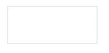

小圆角

border-radius: 2px

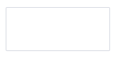

大圆角

border-radius: 4px

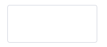

圆形圆角

border-radius: 30px

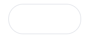

### [¶](https://element.eleme.cn/#/zh-CN/component/border#tou-ying)投影

我们提供了以下几种投影样式，以供选择。

基础投影 box-shadow: 0 2px 4px rgba(0, 0, 0, .12), 0 0 6px rgba(0, 0, 0, .04)

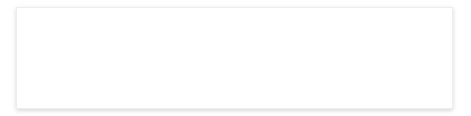

浅色投影 box-shadow: 0 2px 12px 0 rgba(0, 0, 0, 0.1)

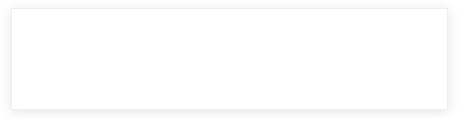


## 6. Icon图标

> 使用方法：直接通过设置类名为`el-icon-iconName`来使用即可，例如

```html
<i class="el-icon-edit"></i>
<i class="el-icon-share"></i>
<i class="el-icon-delete"></i>
<el-button type="primary" icon="el-icon-search">搜索</el-button>
```


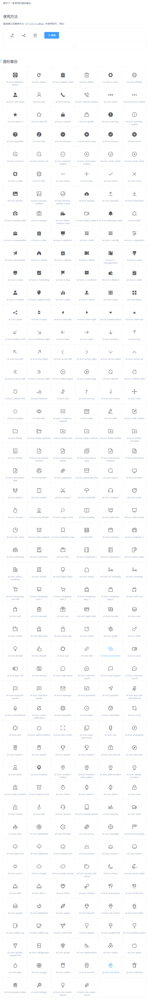


## 7. Button 按钮

### 基础用法

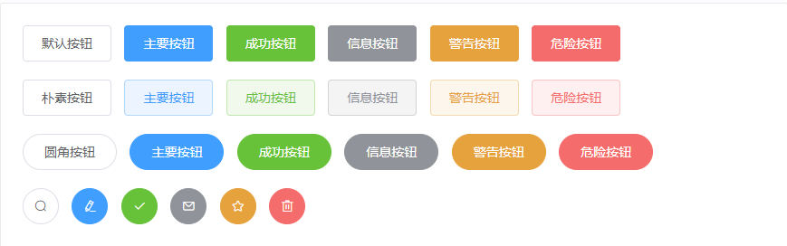

> 使用`type`、`plain`、`round`和`circle`属性来定义 Button 的样式。

```html
<el-row>
  <el-button>默认按钮</el-button>
  <el-button type="primary">主要按钮</el-button>
  <el-button type="success">成功按钮</el-button>
  <el-button type="info">信息按钮</el-button>
  <el-button type="warning">警告按钮</el-button>
  <el-button type="danger">危险按钮</el-button>
</el-row>

<el-row>
  <el-button plain>朴素按钮</el-button>
  <el-button type="primary" plain>主要按钮</el-button>
  <el-button type="success" plain>成功按钮</el-button>
  <el-button type="info" plain>信息按钮</el-button>
  <el-button type="warning" plain>警告按钮</el-button>
  <el-button type="danger" plain>危险按钮</el-button>
</el-row>

<el-row>
  <el-button round>圆角按钮</el-button>
  <el-button type="primary" round>主要按钮</el-button>
  <el-button type="success" round>成功按钮</el-button>
  <el-button type="info" round>信息按钮</el-button>
  <el-button type="warning" round>警告按钮</el-button>
  <el-button type="danger" round>危险按钮</el-button>
</el-row>

<el-row>
  <el-button icon="el-icon-search" circle></el-button>
  <el-button type="primary" icon="el-icon-edit" circle></el-button>
  <el-button type="success" icon="el-icon-check" circle></el-button>
  <el-button type="info" icon="el-icon-message" circle></el-button>
  <el-button type="warning" icon="el-icon-star-off" circle></el-button>
  <el-button type="danger" icon="el-icon-delete" circle></el-button>
</el-row>
```

### 禁用状态

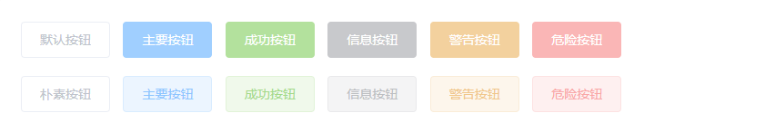

>  你可以使用`disabled`属性来定义按钮是否可用，它接受一个`Boolean`值。

```html
<el-row>
  <el-button disabled>默认按钮</el-button>
  <el-button type="primary" disabled>主要按钮</el-button>
  <el-button type="success" disabled>成功按钮</el-button>
  <el-button type="info" disabled>信息按钮</el-button>
  <el-button type="warning" disabled>警告按钮</el-button>
  <el-button type="danger" disabled>危险按钮</el-button>
</el-row>

<el-row>
  <el-button plain disabled>朴素按钮</el-button>
  <el-button type="primary" plain disabled>主要按钮</el-button>
  <el-button type="success" plain disabled>成功按钮</el-button>
  <el-button type="info" plain disabled>信息按钮</el-button>
  <el-button type="warning" plain disabled>警告按钮</el-button>
  <el-button type="danger" plain disabled>危险按钮</el-button>
</el-row>
```

### 文字按钮

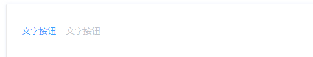

```html
<el-button type="text">文字按钮</el-button>
<el-button type="text" disabled>文字按钮</el-button>
```

### 图标按钮

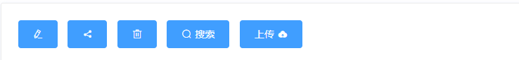

> 设置`icon`属性即可，icon 的列表可以参考 Element 的 icon 组件，也可以设置在文字右边的 icon ，只要使用`i`标签即可，可以使用自定义图标。

```html
<el-button type="primary" icon="el-icon-edit"></el-button>
<el-button type="primary" icon="el-icon-share"></el-button>
<el-button type="primary" icon="el-icon-delete"></el-button>
<el-button type="primary" icon="el-icon-search">搜索</el-button>
<el-button type="primary">上传<i class="el-icon-upload el-icon--right"></i></el-button>
```

### 按钮组

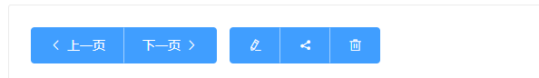

> 使用`<el-button-group>`标签来嵌套你的按钮。

```html
<el-button-group>
  <el-button type="primary" icon="el-icon-arrow-left">上一页</el-button>
  <el-button type="primary">下一页<i class="el-icon-arrow-right el-icon--right"></i></el-button>
</el-button-group>
<el-button-group>
  <el-button type="primary" icon="el-icon-edit"></el-button>
  <el-button type="primary" icon="el-icon-share"></el-button>
  <el-button type="primary" icon="el-icon-delete"></el-button>
</el-button-group>
```

### 加载中

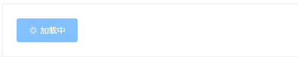

> 要设置为 loading 状态，只要设置`loading`属性为`true`即可。

```html
<el-button type="primary" :loading="true">加载中</el-button>
```

### 不同尺寸

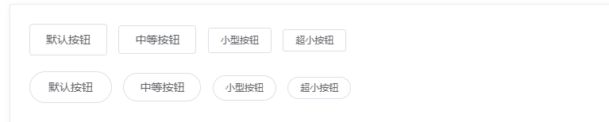

> 额外的尺寸：`medium`、`small`、`mini`，通过设置`size`属性来配置它们。

```html
<el-row>
  <el-button>默认按钮</el-button>
  <el-button size="medium">中等按钮</el-button>
  <el-button size="small">小型按钮</el-button>
  <el-button size="mini">超小按钮</el-button>
</el-row>
<el-row>
  <el-button round>默认按钮</el-button>
  <el-button size="medium" round>中等按钮</el-button>
  <el-button size="small" round>小型按钮</el-button>
  <el-button size="mini" round>超小按钮</el-button>
</el-row>
```

### Attributes

| 参数        | 说明           | 类型    | 可选值                                             | 默认值 |
| :---------- | :------------- | :------ | :------------------------------------------------- | :----- |
| size        | 尺寸           | string  | medium / small / mini                              | —      |
| type        | 类型           | string  | primary / success / warning / danger / info / text | —      |
| plain       | 是否朴素按钮   | boolean | —                                                  | false  |
| round       | 是否圆角按钮   | boolean | —                                                  | false  |
| circle      | 是否圆形按钮   | boolean | —                                                  | false  |
| loading     | 是否加载中状态 | boolean | —                                                  | false  |
| disabled    | 是否禁用状态   | boolean | —                                                  | false  |
| icon        | 图标类名       | string  | —                                                  | —      |
| autofocus   | 是否默认聚焦   | boolean | —                                                  | false  |
| native-type | 原生 type 属性 | string  | button / submit / reset                            | button |


## 8. 文字链接

### 基础用法

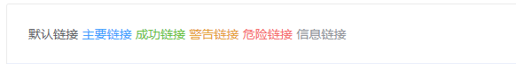

```html
<div>
  <el-link href="https://element.eleme.io" target="_blank">默认链接</el-link>
  <el-link type="primary">主要链接</el-link>
  <el-link type="success">成功链接</el-link>
  <el-link type="warning">警告链接</el-link>
  <el-link type="danger">危险链接</el-link>
  <el-link type="info">信息链接</el-link>
</div>
```

### 禁用状态

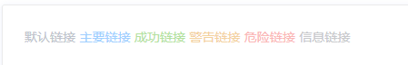

```html
<div>
  <el-link disabled>默认链接</el-link>
  <el-link type="primary" disabled>主要链接</el-link>
  <el-link type="success" disabled>成功链接</el-link>
  <el-link type="warning" disabled>警告链接</el-link>
  <el-link type="danger" disabled>危险链接</el-link>
  <el-link type="info" disabled>信息链接</el-link>
</div>
```

### 下划线

文字有无下划线

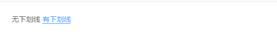

```html
<div>
  <el-link :underline="false">无下划线</el-link>
  <el-link>有下划线</el-link>
</div>
```

### 图标

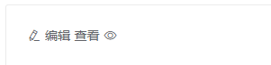

```html
<div>
  <el-link icon="el-icon-edit">编辑</el-link>
  <el-link>查看<i class="el-icon-view el-icon--right"></i> </el-link>
</div>
```

### Attributes

| 参数      | 说明           | 类型    | 可选值                                      | 默认值  |
| :-------- | :------------- | :------ | :------------------------------------------ | :------ |
| type      | 类型           | string  | primary / success / warning / danger / info | default |
| underline | 是否下划线     | boolean | —                                           | true    |
| disabled  | 是否禁用状态   | boolean | —                                           | false   |
| href      | 原生 href 属性 | string  | —                                           | -       |
| icon      | 图标类名       | string  | —                                           | -       |
