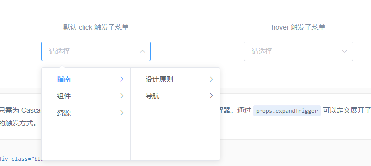
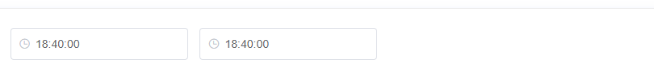
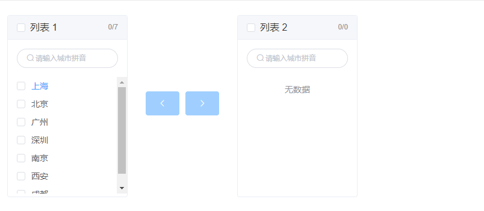
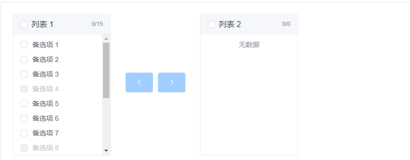

# Form 表单组件

## 一. Radio单选框

### 基础用法

由于选项默认可见，不宜过多，若选项过多，建议使用 Select 选择器。


> 要使用 Radio 组件，只需要设置`v-model`绑定变量，选中意味着变量的值为相应 Radio `label`属性的值，`label`可以是`String`、`Number`或`Boolean`。

```html
<template>
  <el-radio v-model="radio" label="1">备选项</el-radio>
  <el-radio v-model="radio" label="2">备选项</el-radio>
</template>

<script>
  export default {
    data () {
      return {
        radio: '1'
      };
    }
  }
</script>
```

### 禁用状态

单选框不可用的状态。


> 只要在`el-radio`元素中设置`disabled`属性即可，它接受一个`Boolean`，`true`为禁用。

```html
<template>
  <el-radio disabled v-model="radio" label="禁用">备选项</el-radio>
  <el-radio disabled v-model="radio" label="选中且禁用">备选项</el-radio>
</template>

<script>
  export default {
    data () {
      return {
        radio: '选中且禁用'
      };
    }
  }
</script>
```

### 单选框组

适用于在多个互斥的选项中选择的场景


> 结合`el-radio-group`元素和子元素`el-radio`可以实现单选组，在`el-radio-group`中绑定`v-model`，在`el-radio`中设置好`label`即可，无需再给每一个`el-radio`绑定变量，另外，还提供了`change`事件来响应变化，它会传入一个参数`value`。

```html
<template>
  <el-radio-group v-model="radio">
    <el-radio :label="3">备选项</el-radio>
    <el-radio :label="6">备选项</el-radio>
    <el-radio :label="9">备选项</el-radio>
  </el-radio-group>
</template>

<script>
  export default {
    data () {
      return {
        radio: 3
      };
    }
  }
</script>
```

### 按钮样式

按钮样式的单选组合。


> 只需要把`el-radio`元素换成`el-radio-button`元素即可，此外，Element 还提供了`size`属性。

```html
<template>
  <div>
    <el-radio-group v-model="radio1">
      <el-radio-button label="上海"></el-radio-button>
      <el-radio-button label="北京"></el-radio-button>
      <el-radio-button label="广州"></el-radio-button>
      <el-radio-button label="深圳"></el-radio-button>
    </el-radio-group>
  </div>
  <div style="margin-top: 20px">
    <el-radio-group v-model="radio2" size="medium">
      <el-radio-button label="上海" ></el-radio-button>
      <el-radio-button label="北京"></el-radio-button>
      <el-radio-button label="广州"></el-radio-button>
      <el-radio-button label="深圳"></el-radio-button>
    </el-radio-group>
  </div>
  <div style="margin-top: 20px">
    <el-radio-group v-model="radio3" size="small">
      <el-radio-button label="上海"></el-radio-button>
      <el-radio-button label="北京" disabled ></el-radio-button>
      <el-radio-button label="广州"></el-radio-button>
      <el-radio-button label="深圳"></el-radio-button>
    </el-radio-group>
  </div>
  <div style="margin-top: 20px">
    <el-radio-group v-model="radio4" disabled size="mini">
      <el-radio-button label="上海"></el-radio-button>
      <el-radio-button label="北京"></el-radio-button>
      <el-radio-button label="广州"></el-radio-button>
      <el-radio-button label="深圳"></el-radio-button>
    </el-radio-group>
  </div>
</template>

<script>
  export default {
    data () {
      return {
        radio1: '上海',
        radio2: '上海',
        radio3: '上海',
        radio4: '上海'
      };
    }
  }
</script>
```

### 带有边框


> 设置`border`属性可以渲染为带有边框的单选框。

```html
<template>
  <div>
    <el-radio v-model="radio1" label="1" border>备选项1</el-radio>
    <el-radio v-model="radio1" label="2" border>备选项2</el-radio>
  </div>
  <div style="margin-top: 20px">
    <el-radio v-model="radio2" label="1" border size="medium">备选项1</el-radio>
    <el-radio v-model="radio2" label="2" border size="medium">备选项2</el-radio>
  </div>
  <div style="margin-top: 20px">
    <el-radio-group v-model="radio3" size="small">
      <el-radio label="1" border>备选项1</el-radio>
      <el-radio label="2" border disabled>备选项2</el-radio>
    </el-radio-group>
  </div>
  <div style="margin-top: 20px">
    <el-radio-group v-model="radio4" size="mini" disabled>
      <el-radio label="1" border>备选项1</el-radio>
      <el-radio label="2" border>备选项2</el-radio>
    </el-radio-group>
  </div>
</template>

<script>
  export default {
    data () {
      return {
        radio1: '1',
        radio2: '1',
        radio3: '1',
        radio4: '1'
      };
    }
  }
</script>
```

### Radio Attributes

| 参数            | 说明                                 | 类型                      | 可选值                | 默认值 |
| :-------------- | :----------------------------------- | :------------------------ | :-------------------- | :----- |
| value / v-model | 绑定值                               | string / number / boolean | —                     | —      |
| label           | Radio 的 value                       | string / number / boolean | —                     | —      |
| disabled        | 是否禁用                             | boolean                   | —                     | false  |
| border          | 是否显示边框                         | boolean                   | —                     | false  |
| size            | Radio 的尺寸，仅在 border 为真时有效 | string                    | medium / small / mini | —      |
| name            | 原生 name 属性                       | string                    | —                     | —      |

### Radio Events

| 事件名称 | 说明                   | 回调参数              |
| :------- | :--------------------- | :-------------------- |
| input    | 绑定值变化时触发的事件 | 选中的 Radio label 值 |

### [¶](https://element.eleme.cn/#/zh-CN/component/radio#radio-group-attributes)Radio-group Attributes

| 参数            | 说明                                                       | 类型                      | 可选值                | 默认值  |
| :-------------- | :--------------------------------------------------------- | :------------------------ | :-------------------- | :------ |
| value / v-model | 绑定值                                                     | string / number / boolean | —                     | —       |
| size            | 单选框组尺寸，仅对按钮形式的 Radio 或带有边框的 Radio 有效 | string                    | medium / small / mini | —       |
| disabled        | 是否禁用                                                   | boolean                   | —                     | false   |
| text-color      | 按钮形式的 Radio 激活时的文本颜色                          | string                    | —                     | #ffffff |
| fill            | 按钮形式的 Radio 激活时的填充色和边框色                    | string                    | —                     | #409EFF |

### [¶](https://element.eleme.cn/#/zh-CN/component/radio#radio-group-events)Radio-group Events

| 事件名称 | 说明                   | 回调参数              |
| :------- | :--------------------- | :-------------------- |
| input    | 绑定值变化时触发的事件 | 选中的 Radio label 值 |

### [¶](https://element.eleme.cn/#/zh-CN/component/radio#radio-button-attributes)Radio-button Attributes

| 参数     | 说明           | 类型            | 可选值 | 默认值 |
| :------- | :------------- | :-------------- | :----- | :----- |
| label    | Radio 的 value | string / number | —      | —      |
| disabled | 是否禁用       | boolean         | —      | false  |
| name     | 原生 name 属性 | string          | —      | —      |


## 二. Checkbox多选框

### 基础用法

单独使用可以表示两种状态之间的切换，写在标签中的内容为 checkbox 按钮后的介绍。


> 在`el-checkbox`元素中定义`v-model`绑定变量，单一的`checkbox`中，默认绑定变量的值会是`Boolean`，选中为`true`。

```html
<template>
  <!-- `checked` 为 true 或 false -->
  <el-checkbox v-model="checked">备选项</el-checkbox>
</template>
<script>
  export default {
    data() {
      return {
        checked: true
      };
    }
  };
</script>
```

### 禁用状态

多选框不可用状态。


> 设置`disabled`属性即可。

```html
<template>
  <el-checkbox v-model="checked1" disabled>备选项1</el-checkbox>
  <el-checkbox v-model="checked2" disabled>备选项</el-checkbox>
</template>
<script>
  export default {
    data() {
      return {
        checked1: false,
        checked2: true
      };
    }
  };
</script>
```

### 多选框组

适用于多个勾选框绑定到同一个数组的情景，通过是否勾选来表示这一组选项中选中的项。


> `checkbox-group`元素能把多个 checkbox 管理为一组，只需要在 Group 中使用`v-model`绑定`Array`类型的变量即可。 `el-checkbox` 的 `label`属性是该 checkbox 对应的值，若该标签中无内容，则该属性也充当 checkbox 按钮后的介绍。`label`与数组中的元素值相对应，如果存在指定的值则为选中状态，否则为不选中。

```html
<template>
  <el-checkbox-group v-model="checkList">
    <el-checkbox label="复选框 A"></el-checkbox>
    <el-checkbox label="复选框 B"></el-checkbox>
    <el-checkbox label="复选框 C"></el-checkbox>
    <el-checkbox label="禁用" disabled></el-checkbox>
    <el-checkbox label="选中且禁用" disabled></el-checkbox>
  </el-checkbox-group>
</template>

<script>
  export default {
    data () {
      return {
        checkList: ['选中且禁用','复选框 A']
      };
    }
  };
</script>
```

### indeterminate 状态

`indeterminate` 属性用以表示 checkbox 的不确定状态，一般用于实现全选的效果


```html
<template>
  <el-checkbox :indeterminate="isIndeterminate" v-model="checkAll" @change="handleCheckAllChange">全选</el-checkbox>
  <div style="margin: 15px 0;"></div>
  <el-checkbox-group v-model="checkedCities" @change="handleCheckedCitiesChange">
    <el-checkbox v-for="city in cities" :label="city" :key="city">{{city}}</el-checkbox>
  </el-checkbox-group>
</template>
<script>
  const cityOptions = ['上海', '北京', '广州', '深圳'];
  export default {
    data() {
      return {
        checkAll: false,
        checkedCities: ['上海', '北京'],
        cities: cityOptions,
        isIndeterminate: true
      };
    },
    methods: {
      handleCheckAllChange(val) {
        this.checkedCities = val ? cityOptions : [];
        this.isIndeterminate = false;
      },
      handleCheckedCitiesChange(value) {
        let checkedCount = value.length;
        this.checkAll = checkedCount === this.cities.length;
        this.isIndeterminate = checkedCount > 0 && checkedCount < this.cities.length;
      }
    }
  };
</script>
```

### 可选项目数量的限制

使用 `min` 和 `max` 属性能够限制可以被勾选的项目的数量。


```html
<template>
  <el-checkbox-group 
    v-model="checkedCities"
    :min="1"
    :max="2">
    <el-checkbox v-for="city in cities" :label="city" :key="city">{{city}}</el-checkbox>
  </el-checkbox-group>
</template>
<script>
  const cityOptions = ['上海', '北京', '广州', '深圳'];
  export default {
    data() {
      return {
        checkedCities: ['上海', '北京'],
        cities: cityOptions
      };
    }
  };
</script>
```

### 按钮样式

按钮样式的多选组合。


> 只需要把`el-checkbox`元素替换为`el-checkbox-button`元素即可。此外，Element 还提供了`size`属性。

```html
<template>
  <div>
    <el-checkbox-group v-model="checkboxGroup1">
      <el-checkbox-button v-for="city in cities" :label="city" :key="city">{{city}}</el-checkbox-button>
    </el-checkbox-group>
  </div>
  <div style="margin-top: 20px">
    <el-checkbox-group v-model="checkboxGroup2" size="medium">
      <el-checkbox-button v-for="city in cities" :label="city" :key="city">{{city}}</el-checkbox-button>
    </el-checkbox-group>
  </div>
  <div style="margin-top: 20px">
    <el-checkbox-group v-model="checkboxGroup3" size="small">
      <el-checkbox-button v-for="city in cities" :label="city" :disabled="city === '北京'" :key="city">{{city}}</el-checkbox-button>
    </el-checkbox-group>
  </div>
  <div style="margin-top: 20px">
    <el-checkbox-group v-model="checkboxGroup4" size="mini" disabled>
      <el-checkbox-button v-for="city in cities" :label="city" :key="city">{{city}}</el-checkbox-button>
    </el-checkbox-group>
  </div>
</template>
<script>
  const cityOptions = ['上海', '北京', '广州', '深圳'];
  export default {
    data () {
      return {
        checkboxGroup1: ['上海'],
        checkboxGroup2: ['上海'],
        checkboxGroup3: ['上海'],
        checkboxGroup4: ['上海'],
        cities: cityOptions
      };
    }
  }
</script>
```

### 带有边框


> 设置`border`属性可以渲染为带有边框的多选框。

```html
<template>
  <div>
    <el-checkbox v-model="checked1" label="备选项1" border></el-checkbox>
    <el-checkbox v-model="checked2" label="备选项2" border></el-checkbox>
  </div>
  <div style="margin-top: 20px">
    <el-checkbox v-model="checked3" label="备选项1" border size="medium"></el-checkbox>
    <el-checkbox v-model="checked4" label="备选项2" border size="medium"></el-checkbox>
  </div>
  <div style="margin-top: 20px">
    <el-checkbox-group v-model="checkboxGroup1" size="small">
      <el-checkbox label="备选项1" border></el-checkbox>
      <el-checkbox label="备选项2" border disabled></el-checkbox>
    </el-checkbox-group>
  </div>
  <div style="margin-top: 20px">
    <el-checkbox-group v-model="checkboxGroup2" size="mini" disabled>
      <el-checkbox label="备选项1" border></el-checkbox>
      <el-checkbox label="备选项2" border></el-checkbox>
    </el-checkbox-group>
  </div>
</template>

<script>
  export default {
    data () {
      return {
        checked1: true,
        checked2: false,
        checked3: false,
        checked4: true,
        checkboxGroup1: [],
        checkboxGroup2: []
      };
    }
  }
</script>
```

### Checkbox Attributes

| 参数            | 说明                                                         | 类型                      | 可选值                | 默认值 |
| :-------------- | :----------------------------------------------------------- | :------------------------ | :-------------------- | :----- |
| value / v-model | 绑定值                                                       | string / number / boolean | —                     | —      |
| label           | 选中状态的值（只有在`checkbox-group`或者绑定对象类型为`array`时有效） | string / number / boolean | —                     | —      |
| true-label      | 选中时的值                                                   | string / number           | —                     | —      |
| false-label     | 没有选中时的值                                               | string / number           | —                     | —      |
| disabled        | 是否禁用                                                     | boolean                   | —                     | false  |
| border          | 是否显示边框                                                 | boolean                   | —                     | false  |
| size            | Checkbox 的尺寸，仅在 border 为真时有效                      | string                    | medium / small / mini | —      |
| name            | 原生 name 属性                                               | string                    | —                     | —      |
| checked         | 当前是否勾选                                                 | boolean                   | —                     | false  |
| indeterminate   | 设置 indeterminate 状态，只负责样式控制                      | boolean                   | —                     | false  |

### [¶](https://element.eleme.cn/#/zh-CN/component/checkbox#checkbox-events)Checkbox Events

| 事件名称 | 说明                     | 回调参数   |
| :------- | :----------------------- | :--------- |
| change   | 当绑定值变化时触发的事件 | 更新后的值 |

### [¶](https://element.eleme.cn/#/zh-CN/component/checkbox#checkbox-group-attributes)Checkbox-group Attributes

| 参数            | 说明                                                         | 类型    | 可选值                | 默认值  |
| :-------------- | :----------------------------------------------------------- | :------ | :-------------------- | :------ |
| value / v-model | 绑定值                                                       | array   | —                     | —       |
| size            | 多选框组尺寸，仅对按钮形式的 Checkbox 或带有边框的 Checkbox 有效 | string  | medium / small / mini | —       |
| disabled        | 是否禁用                                                     | boolean | —                     | false   |
| min             | 可被勾选的 checkbox 的最小数量                               | number  | —                     | —       |
| max             | 可被勾选的 checkbox 的最大数量                               | number  | —                     | —       |
| text-color      | 按钮形式的 Checkbox 激活时的文本颜色                         | string  | —                     | #ffffff |
| fill            | 按钮形式的 Checkbox 激活时的填充色和边框色                   | string  | —                     | #409EFF |

### [¶](https://element.eleme.cn/#/zh-CN/component/checkbox#checkbox-group-events)Checkbox-group Events

| 事件名称 | 说明                     | 回调参数   |
| :------- | :----------------------- | :--------- |
| change   | 当绑定值变化时触发的事件 | 更新后的值 |

### [¶](https://element.eleme.cn/#/zh-CN/component/checkbox#checkbox-button-attributes)Checkbox-button Attributes

| 参数        | 说明                                                         | 类型                      | 可选值 | 默认值 |
| :---------- | :----------------------------------------------------------- | :------------------------ | :----- | :----- |
| label       | 选中状态的值（只有在`checkbox-group`或者绑定对象类型为`array`时有效） | string / number / boolean | —      | —      |
| true-label  | 选中时的值                                                   | string / number           | —      | —      |
| false-label | 没有选中时的值                                               | string / number           | —      | —      |
| disabled    | 是否禁用                                                     | boolean                   | —      | false  |
| name        | 原生 name 属性                                               | string                    | —      | —      |
| checked     | 当前是否勾选                                                 | boolean                   | —      | false  |


## 三. Input输入框

通过鼠标或键盘输入字符

>Input 为受控组件，它**总会显示 Vue 绑定值**。
>
>通常情况下，应当处理 `input` 事件，并更新组件的绑定值（或使用`v-model`）。否则，输入框内显示的值将不会改变。
>
>不支持 `v-model` 修饰符。

### 基础用法


```html
<el-input v-model="input" placeholder="请输入内容"></el-input>

<script>
export default {
  data() {
    return {
      input: ''
    }
  }
}
</script>
```

### 禁用状态


> 通过 `disabled` 属性指定是否禁用 input 组件

```html
<el-input
  placeholder="请输入内容"
  v-model="input"
  :disabled="true">
</el-input>

<script>
export default {
  data() {
    return {
      input: ''
    }
  }
}
</script>
```

### 可清空


> 使用`clearable`属性即可得到一个可清空的输入框

```html
<el-input
  placeholder="请输入内容"
  v-model="input"
  clearable>
</el-input>

<script>
  export default {
    data() {
      return {
        input: ''
      }
    }
  }
</script>
```

###  密码框


> 使用`show-password`属性即可得到一个可切换显示隐藏的密码框

```html
<el-input placeholder="请输入密码" v-model="input" show-password></el-input>

<script>
  export default {
    data() {
      return {
        input: ''
      }
    }
  }
</script>
```

### 带 icon 的输入框

带有图标标记输入类型


> 可以通过 `prefix-icon` 和 `suffix-icon` 属性在 input 组件首部和尾部增加显示图标，也可以通过 slot 来放置图标。

```html
<div class="demo-input-suffix">
  属性方式：
  <el-input
    placeholder="请选择日期"
    suffix-icon="el-icon-date"
    v-model="input1">
  </el-input>
  <el-input
    placeholder="请输入内容"
    prefix-icon="el-icon-search"
    v-model="input2">
  </el-input>
</div>
<div class="demo-input-suffix">
  slot 方式：
  <el-input
    placeholder="请选择日期"
    v-model="input3">
    <i slot="suffix" class="el-input__icon el-icon-date"></i>
  </el-input>
  <el-input
    placeholder="请输入内容"
    v-model="input4">
    <i slot="prefix" class="el-input__icon el-icon-search"></i>
  </el-input>
</div>

<script>
export default {
  data() {
    return {
      input1: '',
      input2: '',
      input3: '',
      input4: ''
    }
  }
}
</script>
```

### 文本域

用于输入多行文本信息，通过将 `type` 属性的值指定为 textarea。


> 文本域高度可通过 `rows` 属性控制

```html
<el-input
  type="textarea"
  :rows="2"
  placeholder="请输入内容"
  v-model="textarea">
</el-input>

<script>
export default {
  data() {
    return {
      textarea: ''
    }
  }
}
</script>
```

### 可自适应文本高度的文本域

通过设置 `autosize` 属性可以使得文本域的高度能够根据文本内容自动进行调整，并且 `autosize` 还可以设定为一个对象，指定最小行数和最大行数。


```html
<el-input
  type="textarea"
  autosize
  placeholder="请输入内容"
  v-model="textarea1">
</el-input>
<div style="margin: 20px 0;"></div>
<el-input
  type="textarea"
  :autosize="{ minRows: 2, maxRows: 4}"
  placeholder="请输入内容"
  v-model="textarea2">
</el-input>

<script>
export default {
  data() {
    return {
      textarea1: '',
      textarea2: ''
    }
  }
}
</script>
```

### 复合型输入框

可前置或后置元素，一般为标签或按钮


> 可通过 slot 来指定在 input 中前置或者后置内容。

```html
<div>
  <el-input placeholder="请输入内容" v-model="input1">
    <template slot="prepend">Http://</template>
  </el-input>
</div>
<div style="margin-top: 15px;">
  <el-input placeholder="请输入内容" v-model="input2">
    <template slot="append">.com</template>
  </el-input>
</div>
<div style="margin-top: 15px;">
  <el-input placeholder="请输入内容" v-model="input3" class="input-with-select">
    <el-select v-model="select" slot="prepend" placeholder="请选择">
      <el-option label="餐厅名" value="1"></el-option>
      <el-option label="订单号" value="2"></el-option>
      <el-option label="用户电话" value="3"></el-option>
    </el-select>
    <el-button slot="append" icon="el-icon-search"></el-button>
  </el-input>
</div>
<style>
  .el-select .el-input {
    width: 130px;
  }
  .input-with-select .el-input-group__prepend {
    background-color: #fff;
  }
</style>
<script>
export default {
  data() {
    return {
      input1: '',
      input2: '',
      input3: '',
      select: ''
    }
  }
}
</script>
```

### 尺寸


> 可通过 `size` 属性指定输入框的尺寸，除了默认的大小外，还提供了 medium、small 和 mini 三种尺寸。

```html
<div class="demo-input-size">
  <el-input
    placeholder="请输入内容"
    suffix-icon="el-icon-date"
    v-model="input1">
  </el-input>
  <el-input
    size="medium"
    placeholder="请输入内容"
    suffix-icon="el-icon-date"
    v-model="input2">
  </el-input>
  <el-input
    size="small"
    placeholder="请输入内容"
    suffix-icon="el-icon-date"
    v-model="input3">
  </el-input>
  <el-input
    size="mini"
    placeholder="请输入内容"
    suffix-icon="el-icon-date"
    v-model="input4">
  </el-input>
</div>

<script>
export default {
  data() {
    return {
      input1: '',
      input2: '',
      input3: '',
      input4: ''
    }
  }
}
</script>
```

### 带输入建议

根据输入内容提供对应的输入建议


> autocomplete 是一个可带输入建议的输入框组件，`fetch-suggestions` 是一个返回输入建议的方法属性，如 querySearch(queryString, cb)，在该方法中你可以在你的输入建议数据准备好时通过 cb(data) 返回到 autocomplete 组件中。

```html
<el-row class="demo-autocomplete">
  <el-col :span="12">
    <div class="sub-title">激活即列出输入建议</div>
    <el-autocomplete
      class="inline-input"
      v-model="state1"
      :fetch-suggestions="querySearch"
      placeholder="请输入内容"
      @select="handleSelect"
    ></el-autocomplete>
  </el-col>
  <el-col :span="12">
    <div class="sub-title">输入后匹配输入建议</div>
    <el-autocomplete
      class="inline-input"
      v-model="state2"
      :fetch-suggestions="querySearch"
      placeholder="请输入内容"
      :trigger-on-focus="false"
      @select="handleSelect"
    ></el-autocomplete>
  </el-col>
</el-row>
<script>
  export default {
    data() {
      return {
        restaurants: [],
        state1: '',
        state2: ''
      };
    },
    methods: {
      querySearch(queryString, cb) {
        var restaurants = this.restaurants;
        var results = queryString ? restaurants.filter(this.createFilter(queryString)) : restaurants;
        // 调用 callback 返回建议列表的数据
        cb(results);
      },
      createFilter(queryString) {
        return (restaurant) => {
          return (restaurant.value.toLowerCase().indexOf(queryString.toLowerCase()) === 0);
        };
      },
      loadAll() {
        return [
          { "value": "三全鲜食（北新泾店）", "address": "长宁区新渔路144号" },
          { "value": "Hot honey 首尔炸鸡（仙霞路）", "address": "上海市长宁区淞虹路661号" },
          { "value": "新旺角茶餐厅", "address": "上海市普陀区真北路988号创邑金沙谷6号楼113" },
          { "value": "泷千家(天山西路店)", "address": "天山西路438号" },
          { "value": "胖仙女纸杯蛋糕（上海凌空店）", "address": "上海市长宁区金钟路968号1幢18号楼一层商铺18-101" },
          { "value": "贡茶", "address": "上海市长宁区金钟路633号" },
          { "value": "豪大大香鸡排超级奶爸", "address": "上海市嘉定区曹安公路曹安路1685号" },
          { "value": "茶芝兰（奶茶，手抓饼）", "address": "上海市普陀区同普路1435号" },
          { "value": "十二泷町", "address": "上海市北翟路1444弄81号B幢-107" },
          { "value": "星移浓缩咖啡", "address": "上海市嘉定区新郁路817号" },
          { "value": "阿姨奶茶/豪大大", "address": "嘉定区曹安路1611号" },
          { "value": "新麦甜四季甜品炸鸡", "address": "嘉定区曹安公路2383弄55号" },
          { "value": "Monica摩托主题咖啡店", "address": "嘉定区江桥镇曹安公路2409号1F，2383弄62号1F" },
          { "value": "浮生若茶（凌空soho店）", "address": "上海长宁区金钟路968号9号楼地下一层" },
          { "value": "NONO JUICE  鲜榨果汁", "address": "上海市长宁区天山西路119号" },
          { "value": "CoCo都可(北新泾店）", "address": "上海市长宁区仙霞西路" },
          { "value": "快乐柠檬（神州智慧店）", "address": "上海市长宁区天山西路567号1层R117号店铺" },
          { "value": "Merci Paul cafe", "address": "上海市普陀区光复西路丹巴路28弄6号楼819" },
          { "value": "猫山王（西郊百联店）", "address": "上海市长宁区仙霞西路88号第一层G05-F01-1-306" },
          { "value": "枪会山", "address": "上海市普陀区棕榈路" },
          { "value": "纵食", "address": "元丰天山花园(东门) 双流路267号" },
          { "value": "钱记", "address": "上海市长宁区天山西路" },
          { "value": "壹杯加", "address": "上海市长宁区通协路" },
          { "value": "唦哇嘀咖", "address": "上海市长宁区新泾镇金钟路999号2幢（B幢）第01层第1-02A单元" },
          { "value": "爱茜茜里(西郊百联)", "address": "长宁区仙霞西路88号1305室" },
          { "value": "爱茜茜里(近铁广场)", "address": "上海市普陀区真北路818号近铁城市广场北区地下二楼N-B2-O2-C商铺" },
          { "value": "鲜果榨汁（金沙江路和美广店）", "address": "普陀区金沙江路2239号金沙和美广场B1-10-6" },
          { "value": "开心丽果（缤谷店）", "address": "上海市长宁区威宁路天山路341号" },
          { "value": "超级鸡车（丰庄路店）", "address": "上海市嘉定区丰庄路240号" },
          { "value": "妙生活果园（北新泾店）", "address": "长宁区新渔路144号" },
          { "value": "香宜度麻辣香锅", "address": "长宁区淞虹路148号" },
          { "value": "凡仔汉堡（老真北路店）", "address": "上海市普陀区老真北路160号" },
          { "value": "港式小铺", "address": "上海市长宁区金钟路968号15楼15-105室" },
          { "value": "蜀香源麻辣香锅（剑河路店）", "address": "剑河路443-1" },
          { "value": "北京饺子馆", "address": "长宁区北新泾街道天山西路490-1号" },
          { "value": "饭典*新简餐（凌空SOHO店）", "address": "上海市长宁区金钟路968号9号楼地下一层9-83室" },
          { "value": "焦耳·川式快餐（金钟路店）", "address": "上海市金钟路633号地下一层甲部" },
          { "value": "动力鸡车", "address": "长宁区仙霞西路299弄3号101B" },
          { "value": "浏阳蒸菜", "address": "天山西路430号" },
          { "value": "四海游龙（天山西路店）", "address": "上海市长宁区天山西路" },
          { "value": "樱花食堂（凌空店）", "address": "上海市长宁区金钟路968号15楼15-105室" },
          { "value": "壹分米客家传统调制米粉(天山店)", "address": "天山西路428号" },
          { "value": "福荣祥烧腊（平溪路店）", "address": "上海市长宁区协和路福泉路255弄57-73号" },
          { "value": "速记黄焖鸡米饭", "address": "上海市长宁区北新泾街道金钟路180号1层01号摊位" },
          { "value": "红辣椒麻辣烫", "address": "上海市长宁区天山西路492号" },
          { "value": "(小杨生煎)西郊百联餐厅", "address": "长宁区仙霞西路88号百联2楼" },
          { "value": "阳阳麻辣烫", "address": "天山西路389号" },
          { "value": "南拳妈妈龙虾盖浇饭", "address": "普陀区金沙江路1699号鑫乐惠美食广场A13" }
        ];
      },
      handleSelect(item) {
        console.log(item);
      }
    },
    mounted() {
      this.restaurants = this.loadAll();
    }
  }
</script> 
```

### 自定义模板

可自定义输入建议的显示


> 使用`scoped slot`自定义输入建议的模板。该 scope 的参数为`item`，表示当前输入建议对象。

```html
<el-autocomplete
  popper-class="my-autocomplete"
  v-model="state"
  :fetch-suggestions="querySearch"
  placeholder="请输入内容"
  @select="handleSelect">
  <i
    class="el-icon-edit el-input__icon"
    slot="suffix"
    @click="handleIconClick">
  </i>
  <template slot-scope="{ item }">
    <div class="name">{{ item.value }}</div>
    <span class="addr">{{ item.address }}</span>
  </template>
</el-autocomplete>

<style>
.my-autocomplete {
  li {
    line-height: normal;
    padding: 7px;

    .name {
      text-overflow: ellipsis;
      overflow: hidden;
    }
    .addr {
      font-size: 12px;
      color: #b4b4b4;
    }

    .highlighted .addr {
      color: #ddd;
    }
  }
}
</style>

<script>
  export default {
    data() {
      return {
        restaurants: [],
        state: ''
      };
    },
    methods: {
      querySearch(queryString, cb) {
        var restaurants = this.restaurants;
        var results = queryString ? restaurants.filter(this.createFilter(queryString)) : restaurants;
        // 调用 callback 返回建议列表的数据
        cb(results);
      },
      createFilter(queryString) {
        return (restaurant) => {
          return (restaurant.value.toLowerCase().indexOf(queryString.toLowerCase()) === 0);
        };
      },
      loadAll() {
        return [
          { "value": "三全鲜食（北新泾店）", "address": "长宁区新渔路144号" },
          { "value": "Hot honey 首尔炸鸡（仙霞路）", "address": "上海市长宁区淞虹路661号" },
          { "value": "新旺角茶餐厅", "address": "上海市普陀区真北路988号创邑金沙谷6号楼113" },
          { "value": "泷千家(天山西路店)", "address": "天山西路438号" },
          { "value": "胖仙女纸杯蛋糕（上海凌空店）", "address": "上海市长宁区金钟路968号1幢18号楼一层商铺18-101" },
          { "value": "贡茶", "address": "上海市长宁区金钟路633号" },
          { "value": "豪大大香鸡排超级奶爸", "address": "上海市嘉定区曹安公路曹安路1685号" },
          { "value": "茶芝兰（奶茶，手抓饼）", "address": "上海市普陀区同普路1435号" },
          { "value": "十二泷町", "address": "上海市北翟路1444弄81号B幢-107" },
          { "value": "星移浓缩咖啡", "address": "上海市嘉定区新郁路817号" },
          { "value": "阿姨奶茶/豪大大", "address": "嘉定区曹安路1611号" },
          { "value": "新麦甜四季甜品炸鸡", "address": "嘉定区曹安公路2383弄55号" },
          { "value": "Monica摩托主题咖啡店", "address": "嘉定区江桥镇曹安公路2409号1F，2383弄62号1F" },
          { "value": "浮生若茶（凌空soho店）", "address": "上海长宁区金钟路968号9号楼地下一层" },
          { "value": "NONO JUICE  鲜榨果汁", "address": "上海市长宁区天山西路119号" },
          { "value": "CoCo都可(北新泾店）", "address": "上海市长宁区仙霞西路" },
          { "value": "快乐柠檬（神州智慧店）", "address": "上海市长宁区天山西路567号1层R117号店铺" },
          { "value": "Merci Paul cafe", "address": "上海市普陀区光复西路丹巴路28弄6号楼819" },
          { "value": "猫山王（西郊百联店）", "address": "上海市长宁区仙霞西路88号第一层G05-F01-1-306" },
          { "value": "枪会山", "address": "上海市普陀区棕榈路" },
          { "value": "纵食", "address": "元丰天山花园(东门) 双流路267号" },
          { "value": "钱记", "address": "上海市长宁区天山西路" },
          { "value": "壹杯加", "address": "上海市长宁区通协路" },
          { "value": "唦哇嘀咖", "address": "上海市长宁区新泾镇金钟路999号2幢（B幢）第01层第1-02A单元" },
          { "value": "爱茜茜里(西郊百联)", "address": "长宁区仙霞西路88号1305室" },
          { "value": "爱茜茜里(近铁广场)", "address": "上海市普陀区真北路818号近铁城市广场北区地下二楼N-B2-O2-C商铺" },
          { "value": "鲜果榨汁（金沙江路和美广店）", "address": "普陀区金沙江路2239号金沙和美广场B1-10-6" },
          { "value": "开心丽果（缤谷店）", "address": "上海市长宁区威宁路天山路341号" },
          { "value": "超级鸡车（丰庄路店）", "address": "上海市嘉定区丰庄路240号" },
          { "value": "妙生活果园（北新泾店）", "address": "长宁区新渔路144号" },
          { "value": "香宜度麻辣香锅", "address": "长宁区淞虹路148号" },
          { "value": "凡仔汉堡（老真北路店）", "address": "上海市普陀区老真北路160号" },
          { "value": "港式小铺", "address": "上海市长宁区金钟路968号15楼15-105室" },
          { "value": "蜀香源麻辣香锅（剑河路店）", "address": "剑河路443-1" },
          { "value": "北京饺子馆", "address": "长宁区北新泾街道天山西路490-1号" },
          { "value": "饭典*新简餐（凌空SOHO店）", "address": "上海市长宁区金钟路968号9号楼地下一层9-83室" },
          { "value": "焦耳·川式快餐（金钟路店）", "address": "上海市金钟路633号地下一层甲部" },
          { "value": "动力鸡车", "address": "长宁区仙霞西路299弄3号101B" },
          { "value": "浏阳蒸菜", "address": "天山西路430号" },
          { "value": "四海游龙（天山西路店）", "address": "上海市长宁区天山西路" },
          { "value": "樱花食堂（凌空店）", "address": "上海市长宁区金钟路968号15楼15-105室" },
          { "value": "壹分米客家传统调制米粉(天山店)", "address": "天山西路428号" },
          { "value": "福荣祥烧腊（平溪路店）", "address": "上海市长宁区协和路福泉路255弄57-73号" },
          { "value": "速记黄焖鸡米饭", "address": "上海市长宁区北新泾街道金钟路180号1层01号摊位" },
          { "value": "红辣椒麻辣烫", "address": "上海市长宁区天山西路492号" },
          { "value": "(小杨生煎)西郊百联餐厅", "address": "长宁区仙霞西路88号百联2楼" },
          { "value": "阳阳麻辣烫", "address": "天山西路389号" },
          { "value": "南拳妈妈龙虾盖浇饭", "address": "普陀区金沙江路1699号鑫乐惠美食广场A13" }
        ];
      },
      handleSelect(item) {
        console.log(item);
      },
      handleIconClick(ev) {
        console.log(ev);
      }
    },
    mounted() {
      this.restaurants = this.loadAll();
    }
  }
</script>
```

### 远程搜索

从服务端搜索数据


```html
<el-autocomplete
  v-model="state"
  :fetch-suggestions="querySearchAsync"
  placeholder="请输入内容"
  @select="handleSelect"
></el-autocomplete>
<script>
  export default {
    data() {
      return {
        restaurants: [],
        state: '',
        timeout:  null
      };
    },
    methods: {
      loadAll() {
        return [
          { "value": "三全鲜食（北新泾店）", "address": "长宁区新渔路144号" },
          { "value": "Hot honey 首尔炸鸡（仙霞路）", "address": "上海市长宁区淞虹路661号" },
          { "value": "新旺角茶餐厅", "address": "上海市普陀区真北路988号创邑金沙谷6号楼113" },
          { "value": "泷千家(天山西路店)", "address": "天山西路438号" },
          { "value": "胖仙女纸杯蛋糕（上海凌空店）", "address": "上海市长宁区金钟路968号1幢18号楼一层商铺18-101" },
          { "value": "贡茶", "address": "上海市长宁区金钟路633号" },
          { "value": "豪大大香鸡排超级奶爸", "address": "上海市嘉定区曹安公路曹安路1685号" },
          { "value": "茶芝兰（奶茶，手抓饼）", "address": "上海市普陀区同普路1435号" },
          { "value": "十二泷町", "address": "上海市北翟路1444弄81号B幢-107" },
          { "value": "星移浓缩咖啡", "address": "上海市嘉定区新郁路817号" },
          { "value": "阿姨奶茶/豪大大", "address": "嘉定区曹安路1611号" },
          { "value": "新麦甜四季甜品炸鸡", "address": "嘉定区曹安公路2383弄55号" },
          { "value": "Monica摩托主题咖啡店", "address": "嘉定区江桥镇曹安公路2409号1F，2383弄62号1F" },
          { "value": "浮生若茶（凌空soho店）", "address": "上海长宁区金钟路968号9号楼地下一层" },
          { "value": "NONO JUICE  鲜榨果汁", "address": "上海市长宁区天山西路119号" },
          { "value": "CoCo都可(北新泾店）", "address": "上海市长宁区仙霞西路" },
          { "value": "快乐柠檬（神州智慧店）", "address": "上海市长宁区天山西路567号1层R117号店铺" },
          { "value": "Merci Paul cafe", "address": "上海市普陀区光复西路丹巴路28弄6号楼819" },
          { "value": "猫山王（西郊百联店）", "address": "上海市长宁区仙霞西路88号第一层G05-F01-1-306" },
          { "value": "枪会山", "address": "上海市普陀区棕榈路" },
          { "value": "纵食", "address": "元丰天山花园(东门) 双流路267号" },
          { "value": "钱记", "address": "上海市长宁区天山西路" },
          { "value": "壹杯加", "address": "上海市长宁区通协路" },
          { "value": "唦哇嘀咖", "address": "上海市长宁区新泾镇金钟路999号2幢（B幢）第01层第1-02A单元" },
          { "value": "爱茜茜里(西郊百联)", "address": "长宁区仙霞西路88号1305室" },
          { "value": "爱茜茜里(近铁广场)", "address": "上海市普陀区真北路818号近铁城市广场北区地下二楼N-B2-O2-C商铺" },
          { "value": "鲜果榨汁（金沙江路和美广店）", "address": "普陀区金沙江路2239号金沙和美广场B1-10-6" },
          { "value": "开心丽果（缤谷店）", "address": "上海市长宁区威宁路天山路341号" },
          { "value": "超级鸡车（丰庄路店）", "address": "上海市嘉定区丰庄路240号" },
          { "value": "妙生活果园（北新泾店）", "address": "长宁区新渔路144号" },
          { "value": "香宜度麻辣香锅", "address": "长宁区淞虹路148号" },
          { "value": "凡仔汉堡（老真北路店）", "address": "上海市普陀区老真北路160号" },
          { "value": "港式小铺", "address": "上海市长宁区金钟路968号15楼15-105室" },
          { "value": "蜀香源麻辣香锅（剑河路店）", "address": "剑河路443-1" },
          { "value": "北京饺子馆", "address": "长宁区北新泾街道天山西路490-1号" },
          { "value": "饭典*新简餐（凌空SOHO店）", "address": "上海市长宁区金钟路968号9号楼地下一层9-83室" },
          { "value": "焦耳·川式快餐（金钟路店）", "address": "上海市金钟路633号地下一层甲部" },
          { "value": "动力鸡车", "address": "长宁区仙霞西路299弄3号101B" },
          { "value": "浏阳蒸菜", "address": "天山西路430号" },
          { "value": "四海游龙（天山西路店）", "address": "上海市长宁区天山西路" },
          { "value": "樱花食堂（凌空店）", "address": "上海市长宁区金钟路968号15楼15-105室" },
          { "value": "壹分米客家传统调制米粉(天山店)", "address": "天山西路428号" },
          { "value": "福荣祥烧腊（平溪路店）", "address": "上海市长宁区协和路福泉路255弄57-73号" },
          { "value": "速记黄焖鸡米饭", "address": "上海市长宁区北新泾街道金钟路180号1层01号摊位" },
          { "value": "红辣椒麻辣烫", "address": "上海市长宁区天山西路492号" },
          { "value": "(小杨生煎)西郊百联餐厅", "address": "长宁区仙霞西路88号百联2楼" },
          { "value": "阳阳麻辣烫", "address": "天山西路389号" },
          { "value": "南拳妈妈龙虾盖浇饭", "address": "普陀区金沙江路1699号鑫乐惠美食广场A13" }
        ];
      },
      querySearchAsync(queryString, cb) {
        var restaurants = this.restaurants;
        var results = queryString ? restaurants.filter(this.createStateFilter(queryString)) : restaurants;

        clearTimeout(this.timeout);
        this.timeout = setTimeout(() => {
          cb(results);
        }, 3000 * Math.random());
      },
      createStateFilter(queryString) {
        return (state) => {
          return (state.value.toLowerCase().indexOf(queryString.toLowerCase()) === 0);
        };
      },
      handleSelect(item) {
        console.log(item);
      }
    },
    mounted() {
      this.restaurants = this.loadAll();
    }
  };
</script>
```

### 输入长度限制


> `maxlength` 和 `minlength` 是原生属性，用来限制输入框的字符长度，其中字符长度是用 Javascript 的字符串长度统计的。对于类型为 `text` 或 `textarea` 的输入框，在使用 `maxlength` 属性限制最大输入长度的同时，可通过设置 `show-word-limit` 属性来展示字数统计。

```html
<el-input
  type="text"
  placeholder="请输入内容"
  v-model="text"
  maxlength="10"
  show-word-limit
>
</el-input>
<div style="margin: 20px 0;"></div>
<el-input
  type="textarea"
  placeholder="请输入内容"
  v-model="textarea"
  maxlength="30"
  show-word-limit
>
</el-input>

<script>
export default {
  data() {
    return {
      text: '',
      textarea: ''
    }
  }
}
</script>
```

### Input Attributes

| 参数            | 说明                                                         | 类型             | 可选值                                                       | 默认值 |
| :-------------- | :----------------------------------------------------------- | :--------------- | :----------------------------------------------------------- | :----- |
| type            | 类型                                                         | string           | text，textarea 和其他 [原生 input 的 type 值](https://developer.mozilla.org/en-US/docs/Web/HTML/Element/input#Form__types) | text   |
| value / v-model | 绑定值                                                       | string / number  | —                                                            | —      |
| maxlength       | 原生属性，最大输入长度                                       | number           | —                                                            | —      |
| minlength       | 原生属性，最小输入长度                                       | number           | —                                                            | —      |
| show-word-limit | 是否显示输入字数统计，只在 `type = "text"` 或 `type = "textarea"` 时有效 | boolean          | —                                                            | false  |
| placeholder     | 输入框占位文本                                               | string           | —                                                            | —      |
| clearable       | 是否可清空                                                   | boolean          | —                                                            | false  |
| show-password   | 是否显示切换密码图标                                         | boolean          | —                                                            | false  |
| disabled        | 禁用                                                         | boolean          | —                                                            | false  |
| size            | 输入框尺寸，只在 `type!="textarea"` 时有效                   | string           | medium / small / mini                                        | —      |
| prefix-icon     | 输入框头部图标                                               | string           | —                                                            | —      |
| suffix-icon     | 输入框尾部图标                                               | string           | —                                                            | —      |
| rows            | 输入框行数，只对 `type="textarea"` 有效                      | number           | —                                                            | 2      |
| autosize        | 自适应内容高度，只对 `type="textarea"` 有效，可传入对象，如，{ minRows: 2, maxRows: 6 } | boolean / object | —                                                            | false  |
| autocomplete    | 原生属性，自动补全                                           | string           | on, off                                                      | off    |
| auto-complete   | 下个主版本弃用                                               | string           | on, off                                                      | off    |
| name            | 原生属性                                                     | string           | —                                                            | —      |
| readonly        | 原生属性，是否只读                                           | boolean          | —                                                            | false  |
| max             | 原生属性，设置最大值                                         | —                | —                                                            | —      |
| min             | 原生属性，设置最小值                                         | —                | —                                                            | —      |
| step            | 原生属性，设置输入字段的合法数字间隔                         | —                | —                                                            | —      |
| resize          | 控制是否能被用户缩放                                         | string           | none, both, horizontal, vertical                             | —      |
| autofocus       | 原生属性，自动获取焦点                                       | boolean          | true, false                                                  | false  |
| form            | 原生属性                                                     | string           | —                                                            | —      |
| label           | 输入框关联的label文字                                        | string           | —                                                            | —      |
| tabindex        | 输入框的tabindex                                             | string           | -                                                            | -      |
| validate-event  | 输入时是否触发表单的校验                                     | boolean          | -                                                            | true   |

### [¶](https://element.eleme.cn/#/zh-CN/component/input#input-slots)Input Slots

| name    | 说明                                    |
| :------ | :-------------------------------------- |
| prefix  | 输入框头部内容，只对 `type="text"` 有效 |
| suffix  | 输入框尾部内容，只对 `type="text"` 有效 |
| prepend | 输入框前置内容，只对 `type="text"` 有效 |
| append  | 输入框后置内容，只对 `type="text"` 有效 |

### [¶](https://element.eleme.cn/#/zh-CN/component/input#input-events)Input Events

| 事件名称 | 说明                                          | 回调参数                  |
| :------- | :-------------------------------------------- | :------------------------ |
| blur     | 在 Input 失去焦点时触发                       | (event: Event)            |
| focus    | 在 Input 获得焦点时触发                       | (event: Event)            |
| change   | 仅在输入框失去焦点或用户按下回车时触发        | (value: string \| number) |
| input    | 在 Input 值改变时触发                         | (value: string \| number) |
| clear    | 在点击由 `clearable` 属性生成的清空按钮时触发 | —                         |

### [¶](https://element.eleme.cn/#/zh-CN/component/input#input-methods)Input Methods

| 方法名 | 说明                | 参数 |
| :----- | :------------------ | :--- |
| focus  | 使 input 获取焦点   | —    |
| blur   | 使 input 失去焦点   | —    |
| select | 选中 input 中的文字 | —    |

### [¶](https://element.eleme.cn/#/zh-CN/component/input#autocomplete-attributes)Autocomplete Attributes

| 参数                  | 说明                                                         | 类型                            | 可选值                                                       | 默认值       |
| :-------------------- | :----------------------------------------------------------- | :------------------------------ | :----------------------------------------------------------- | :----------- |
| placeholder           | 输入框占位文本                                               | string                          | —                                                            | —            |
| disabled              | 禁用                                                         | boolean                         | —                                                            | false        |
| value-key             | 输入建议对象中用于显示的键名                                 | string                          | —                                                            | value        |
| value                 | 必填值，输入绑定值                                           | string                          | —                                                            | —            |
| debounce              | 获取输入建议的去抖延时                                       | number                          | —                                                            | 300          |
| placement             | 菜单弹出位置                                                 | string                          | top / top-start / top-end / bottom / bottom-start / bottom-end | bottom-start |
| fetch-suggestions     | 返回输入建议的方法，仅当你的输入建议数据 resolve 时，通过调用 callback(data:[]) 来返回它 | Function(queryString, callback) | —                                                            | —            |
| popper-class          | Autocomplete 下拉列表的类名                                  | string                          | —                                                            | —            |
| trigger-on-focus      | 是否在输入框 focus 时显示建议列表                            | boolean                         | —                                                            | true         |
| name                  | 原生属性                                                     | string                          | —                                                            | —            |
| select-when-unmatched | 在输入没有任何匹配建议的情况下，按下回车是否触发 `select` 事件 | boolean                         | —                                                            | false        |
| label                 | 输入框关联的label文字                                        | string                          | —                                                            | —            |
| prefix-icon           | 输入框头部图标                                               | string                          | —                                                            | —            |
| suffix-icon           | 输入框尾部图标                                               | string                          | —                                                            | —            |
| hide-loading          | 是否隐藏远程加载时的加载图标                                 | boolean                         | —                                                            | false        |
| popper-append-to-body | 是否将下拉列表插入至 body 元素。在下拉列表的定位出现问题时，可将该属性设置为 false | boolean                         | -                                                            | true         |
| highlight-first-item  | 是否默认突出显示远程搜索建议中的第一项                       | boolean                         | —                                                            | false        |

### [¶](https://element.eleme.cn/#/zh-CN/component/input#autocomplete-slots)Autocomplete Slots

| name    | 说明           |
| :------ | :------------- |
| prefix  | 输入框头部内容 |
| suffix  | 输入框尾部内容 |
| prepend | 输入框前置内容 |
| append  | 输入框后置内容 |

### [¶](https://element.eleme.cn/#/zh-CN/component/input#autocomplete-scoped-slot)Autocomplete Scoped Slot

| name | 说明                            |
| :--- | :------------------------------ |
| —    | 自定义输入建议，参数为 { item } |

### [¶](https://element.eleme.cn/#/zh-CN/component/input#autocomplete-events)Autocomplete Events

| 事件名称 | 说明                  | 回调参数                  |
| :------- | :-------------------- | :------------------------ |
| select   | 点击选中建议项时触发  | 选中建议项                |
| change   | 在 Input 值改变时触发 | (value: string \| number) |

### [¶](https://element.eleme.cn/#/zh-CN/component/input#autocomplete-methods)Autocomplete Methods

| 方法名 | 说明              | 参数 |
| :----- | :---------------- | :--- |
| focus  | 使 input 获取焦点 | -    |


## 四. InputNumber计数器

仅允许输入标准的数字值，可定义范围

### 基础用法


> 要使用它，只需要在`el-input-number`元素中使用`v-model`绑定变量即可，变量的初始值即为默认值。

```html
<template>
  <el-input-number v-model="num" @change="handleChange" :min="1" :max="10" label="描述文字"></el-input-number>
</template>
<script>
  export default {
    data() {
      return {
        num: 1
      };
    },
    methods: {
      handleChange(value) {
        console.log(value);
      }
    }
  };
</script>
```

### 禁用状态


> `disabled`属性接受一个`Boolean`，设置为`true`即可禁用整个组件，如果你只需要控制数值在某一范围内，可以设置`min`属性和`max`属性，不设置`min`和`max`时，最小值为 0。

```html
<template>
  <el-input-number v-model="num" :disabled="true"></el-input-number>
</template>
<script>
  export default {
    data() {
      return {
        num: 1
      }
    }
  };
</script>
```

### 步数

允许定义递增递减的步数控制


> 设置`step`属性可以控制步长，接受一个`Number`。

```html
<template>
  <el-input-number v-model="num" :step="2"></el-input-number>
</template>
<script>
  export default {
    data() {
      return {
        num: 5
      }
    }
  };
</script>
```

### 严格步数


> `step-strictly`属性接受一个`Boolean`。如果这个属性被设置为`true`，则只能输入步数的倍数。

```html
<template>
  <el-input-number v-model="num" :step="2" step-strictly></el-input-number>
</template>
<script>
  export default {
    data() {
      return {
        num: 2
      }
    }
  };
</script>
```

### 精度


> 设置 `precision` 属性可以控制数值精度，接收一个 `Number`。

> `precision` 的值必须是一个非负整数，并且不能小于 `step` 的小数位数。

```html
<template>
  <el-input-number v-model="num" :precision="2" :step="0.1" :max="10"></el-input-number>
</template>
<script>
  export default {
    data() {
      return {
        num: 1
      }
    }
  };
</script>
```

###  尺寸

额外提供了 `medium`、`small`、`mini` 三种尺寸的数字输入框


```html
<template>
  <el-input-number v-model="num1"></el-input-number>
  <el-input-number size="medium" v-model="num2"></el-input-number>
  <el-input-number size="small" v-model="num3"></el-input-number>
  <el-input-number size="mini" v-model="num4"></el-input-number>
</template>
<script>
  export default {
    data() {
      return {
        num1: 1,
        num2: 1,
        num3: 1,
        num4: 1
      }
    }
  };
</script>
```

### 按钮位置


> 设置 `controls-position` 属性可以控制按钮位置。

```html
<template>
  <el-input-number v-model="num" controls-position="right" @change="handleChange" :min="1" :max="10"></el-input-number>
</template>
<script>
  export default {
    data() {
      return {
        num: 1
      };
    },
    methods: {
      handleChange(value) {
        console.log(value);
      }
    }
  };
</script>
```

### Attributes

| 参数              | 说明                     | 类型    | 可选值       | 默认值    |
| :---------------- | :----------------------- | :------ | :----------- | :-------- |
| value / v-model   | 绑定值                   | number  | —            | 0         |
| min               | 设置计数器允许的最小值   | number  | —            | -Infinity |
| max               | 设置计数器允许的最大值   | number  | —            | Infinity  |
| step              | 计数器步长               | number  | —            | 1         |
| step-strictly     | 是否只能输入 step 的倍数 | boolean | —            | false     |
| precision         | 数值精度                 | number  | —            | —         |
| size              | 计数器尺寸               | string  | large, small | —         |
| disabled          | 是否禁用计数器           | boolean | —            | false     |
| controls          | 是否使用控制按钮         | boolean | —            | true      |
| controls-position | 控制按钮位置             | string  | right        | -         |
| name              | 原生属性                 | string  | —            | —         |
| label             | 输入框关联的label文字    | string  | —            | —         |
| placeholder       | 输入框默认 placeholder   | string  | -            | -         |

### [¶](https://element.eleme.cn/#/zh-CN/component/input-number#events)Events

| 事件名称 | 说明                        | 回调参数               |
| :------- | :-------------------------- | :--------------------- |
| change   | 绑定值被改变时触发          | currentValue, oldValue |
| blur     | 在组件 Input 失去焦点时触发 | (event: Event)         |
| focus    | 在组件 Input 获得焦点时触发 | (event: Event)         |

### [¶](https://element.eleme.cn/#/zh-CN/component/input-number#methods)Methods

| 方法名 | 说明                | 参数 |
| :----- | :------------------ | :--- |
| focus  | 使 input 获取焦点   | -    |
| select | 选中 input 中的文字 | —    |


## 五. Select选择器

当选项过多时，使用下拉菜单展示并选择内容。

### 基础用法

适用广泛的基础单选


> `v-model`的值为当前被选中的`el-option`的 value 属性值

```html
<template>
  <el-select v-model="value" placeholder="请选择">
    <el-option
      v-for="item in options"
      :key="item.value"
      :label="item.label"
      :value="item.value">
    </el-option>
  </el-select>
</template>

<script>
  export default {
    data() {
      return {
        options: [{
          value: '选项1',
          label: '黄金糕'
        }, {
          value: '选项2',
          label: '双皮奶'
        }, {
          value: '选项3',
          label: '蚵仔煎'
        }, {
          value: '选项4',
          label: '龙须面'
        }, {
          value: '选项5',
          label: '北京烤鸭'
        }],
        value: ''
      }
    }
  }
</script>
```

### 有禁用选项


> 在`el-option`中，设定`disabled`值为 true，即可禁用该选项

```html
<template>
  <el-select v-model="value" placeholder="请选择">
    <el-option
      v-for="item in options"
      :key="item.value"
      :label="item.label"
      :value="item.value"
      :disabled="item.disabled">
    </el-option>
  </el-select>
</template>

<script>
  export default {
    data() {
      return {
        options: [{
          value: '选项1',
          label: '黄金糕'
        }, {
          value: '选项2',
          label: '双皮奶',
          disabled: true
        }, {
          value: '选项3',
          label: '蚵仔煎'
        }, {
          value: '选项4',
          label: '龙须面'
        }, {
          value: '选项5',
          label: '北京烤鸭'
        }],
        value: ''
      }
    }
  }
</script>
```

### 禁用状态

选择器不可用状态


> 为`el-select`设置`disabled`属性，则整个选择器不可用

```html
<template>
  <el-select v-model="value" disabled placeholder="请选择">
    <el-option
      v-for="item in options"
      :key="item.value"
      :label="item.label"
      :value="item.value">
    </el-option>
  </el-select>
</template>
  
<script>
  export default {
    data() {
      return {
        options: [{
          value: '选项1',
          label: '黄金糕'
        }, {
          value: '选项2',
          label: '双皮奶'
        }, {
          value: '选项3',
          label: '蚵仔煎'
        }, {
          value: '选项4',
          label: '龙须面'
        }, {
          value: '选项5',
          label: '北京烤鸭'
        }],
        value: ''
      }
    }
  }
</script>
```

### 可清空单选

包含清空按钮，可将选择器清空为初始状态


> 为`el-select`设置`clearable`属性，则可将选择器清空。需要注意的是，`clearable`属性仅适用于单选。

```html
<template>
  <el-select v-model="value" clearable placeholder="请选择">
    <el-option
      v-for="item in options"
      :key="item.value"
      :label="item.label"
      :value="item.value">
    </el-option>
  </el-select>
</template>

<script>
  export default {
    data() {
      return {
        options: [{
          value: '选项1',
          label: '黄金糕'
        }, {
          value: '选项2',
          label: '双皮奶'
        }, {
          value: '选项3',
          label: '蚵仔煎'
        }, {
          value: '选项4',
          label: '龙须面'
        }, {
          value: '选项5',
          label: '北京烤鸭'
        }],
        value: ''
      }
    }
  }
</script>
```

### 基础多选

适用性较广的基础多选，用 Tag 展示已选项


> 为`el-select`设置`multiple`属性即可启用多选，此时`v-model`的值为当前选中值所组成的数组。默认情况下选中值会以 Tag 的形式展现，你也可以设置`collapse-tags`属性将它们合并为一段文字。

```html
<template>
  <el-select v-model="value1" multiple placeholder="请选择">
    <el-option
      v-for="item in options"
      :key="item.value"
      :label="item.label"
      :value="item.value">
    </el-option>
  </el-select>

  <el-select
    v-model="value2"
    multiple
    collapse-tags
    style="margin-left: 20px;"
    placeholder="请选择">
    <el-option
      v-for="item in options"
      :key="item.value"
      :label="item.label"
      :value="item.value">
    </el-option>
  </el-select>
</template>

<script>
  export default {
    data() {
      return {
        options: [{
          value: '选项1',
          label: '黄金糕'
        }, {
          value: '选项2',
          label: '双皮奶'
        }, {
          value: '选项3',
          label: '蚵仔煎'
        }, {
          value: '选项4',
          label: '龙须面'
        }, {
          value: '选项5',
          label: '北京烤鸭'
        }],
        value1: [],
        value2: []
      }
    }
  }
</script>
```

### 自定义模板

可以自定义备选项


> 将自定义的 HTML 模板插入`el-option`的 slot 中即可。

```html
<template>
  <el-select v-model="value" placeholder="请选择">
    <el-option
      v-for="item in cities"
      :key="item.value"
      :label="item.label"
      :value="item.value">
      <span style="float: left">{{ item.label }}</span>
      <span style="float: right; color: #8492a6; font-size: 13px">{{ item.value }}</span>
    </el-option>
  </el-select>
</template>

<script>
  export default {
    data() {
      return {
        cities: [{
          value: 'Beijing',
          label: '北京'
        }, {
          value: 'Shanghai',
          label: '上海'
        }, {
          value: 'Nanjing',
          label: '南京'
        }, {
          value: 'Chengdu',
          label: '成都'
        }, {
          value: 'Shenzhen',
          label: '深圳'
        }, {
          value: 'Guangzhou',
          label: '广州'
        }],
        value: ''
      }
    }
  }
</script>
```

### 分组

备选项进行分组展示


> 使用`el-option-group`对备选项进行分组，它的`label`属性为分组名

```html
<template>
  <el-select v-model="value" placeholder="请选择">
    <el-option-group
      v-for="group in options"
      :key="group.label"
      :label="group.label">
      <el-option
        v-for="item in group.options"
        :key="item.value"
        :label="item.label"
        :value="item.value">
      </el-option>
    </el-option-group>
  </el-select>
</template>

<script>
  export default {
    data() {
      return {
        options: [{
          label: '热门城市',
          options: [{
            value: 'Shanghai',
            label: '上海'
          }, {
            value: 'Beijing',
            label: '北京'
          }]
        }, {
          label: '城市名',
          options: [{
            value: 'Chengdu',
            label: '成都'
          }, {
            value: 'Shenzhen',
            label: '深圳'
          }, {
            value: 'Guangzhou',
            label: '广州'
          }, {
            value: 'Dalian',
            label: '大连'
          }]
        }],
        value: ''
      }
    }
  }
</script>
```

### 可搜索

可以利用搜索功能快速查找选项


> 为`el-select`添加`filterable`属性即可启用搜索功能。默认情况下，Select 会找出所有`label`属性包含输入值的选项。如果希望使用其他的搜索逻辑，可以通过传入一个`filter-method`来实现。`filter-method`为一个`Function`，它会在输入值发生变化时调用，参数为当前输入值。

```html
<template>
  <el-select v-model="value" filterable placeholder="请选择">
    <el-option
      v-for="item in options"
      :key="item.value"
      :label="item.label"
      :value="item.value">
    </el-option>
  </el-select>
</template>

<script>
  export default {
    data() {
      return {
        options: [{
          value: '选项1',
          label: '黄金糕'
        }, {
          value: '选项2',
          label: '双皮奶'
        }, {
          value: '选项3',
          label: '蚵仔煎'
        }, {
          value: '选项4',
          label: '龙须面'
        }, {
          value: '选项5',
          label: '北京烤鸭'
        }],
        value: ''
      }
    }
  }
</script>
```


### 远程搜索

从服务器搜索数据，输入关键字进行查找


> 为了启用远程搜索，需要将`filterable`和`remote`设置为`true`，同时传入一个`remote-method`。`remote-method`为一个`Function`，它会在输入值发生变化时调用，参数为当前输入值。需要注意的是，如果`el-option`是通过`v-for`指令渲染出来的，此时需要为`el-option`添加`key`属性，且其值需具有唯一性，比如此例中的`item.value`。

```html
<template>
  <el-select
    v-model="value"
    multiple
    filterable
    remote
    reserve-keyword
    placeholder="请输入关键词"
    :remote-method="remoteMethod"
    :loading="loading">
    <el-option
      v-for="item in options"
      :key="item.value"
      :label="item.label"
      :value="item.value">
    </el-option>
  </el-select>
</template>

<script>
  export default {
    data() {
      return {
        options: [],
        value: [],
        list: [],
        loading: false,
        states: ["Alabama", "Alaska", "Arizona",
        "Arkansas", "California", "Colorado",
        "Connecticut", "Delaware", "Florida",
        "Georgia", "Hawaii", "Idaho", "Illinois",
        "Indiana", "Iowa", "Kansas", "Kentucky",
        "Louisiana", "Maine", "Maryland",
        "Massachusetts", "Michigan", "Minnesota",
        "Mississippi", "Missouri", "Montana",
        "Nebraska", "Nevada", "New Hampshire",
        "New Jersey", "New Mexico", "New York",
        "North Carolina", "North Dakota", "Ohio",
        "Oklahoma", "Oregon", "Pennsylvania",
        "Rhode Island", "South Carolina",
        "South Dakota", "Tennessee", "Texas",
        "Utah", "Vermont", "Virginia",
        "Washington", "West Virginia", "Wisconsin",
        "Wyoming"]
      }
    },
    mounted() {
      this.list = this.states.map(item => {
        return { value: `value:${item}`, label: `label:${item}` };
      });
    },
    methods: {
      remoteMethod(query) {
        if (query !== '') {
          this.loading = true;
          setTimeout(() => {
            this.loading = false;
            this.options = this.list.filter(item => {
              return item.label.toLowerCase()
                .indexOf(query.toLowerCase()) > -1;
            });
          }, 200);
        } else {
          this.options = [];
        }
      }
    }
  }
</script>
```

### 创建条目

可以创建并选中选项中不存在的条目


> 使用`allow-create`属性即可通过在输入框中输入文字来创建新的条目。注意此时`filterable`必须为真。本例还使用了`default-first-option`属性，在该属性打开的情况下，按下回车就可以选中当前选项列表中的第一个选项，无需使用鼠标或键盘方向键进行定位。

> 如果 Select 的绑定值为对象类型，请务必指定 `value-key` 作为它的唯一性标识。

```html
<template>
  <el-select
    v-model="value"
    multiple
    filterable
    allow-create
    default-first-option
    placeholder="请选择文章标签">
    <el-option
      v-for="item in options"
      :key="item.value"
      :label="item.label"
      :value="item.value">
    </el-option>
  </el-select>
</template>

<script>
  export default {
    data() {
      return {
        options: [{
          value: 'HTML',
          label: 'HTML'
        }, {
          value: 'CSS',
          label: 'CSS'
        }, {
          value: 'JavaScript',
          label: 'JavaScript'
        }],
        value: []
      }
    }
  }
</script>
```

### Select Attributes

| 参数                  | 说明                                                         | 类型                      | 可选值            | 默认值     |
| :-------------------- | :----------------------------------------------------------- | :------------------------ | :---------------- | :--------- |
| value / v-model       | 绑定值                                                       | boolean / string / number | —                 | —          |
| multiple              | 是否多选                                                     | boolean                   | —                 | false      |
| disabled              | 是否禁用                                                     | boolean                   | —                 | false      |
| value-key             | 作为 value 唯一标识的键名，绑定值为对象类型时必填            | string                    | —                 | value      |
| size                  | 输入框尺寸                                                   | string                    | medium/small/mini | —          |
| clearable             | 是否可以清空选项                                             | boolean                   | —                 | false      |
| collapse-tags         | 多选时是否将选中值按文字的形式展示                           | boolean                   | —                 | false      |
| multiple-limit        | 多选时用户最多可以选择的项目数，为 0 则不限制                | number                    | —                 | 0          |
| name                  | select input 的 name 属性                                    | string                    | —                 | —          |
| autocomplete          | select input 的 autocomplete 属性                            | string                    | —                 | off        |
| auto-complete         | 下个主版本弃用                                               | string                    | —                 | off        |
| placeholder           | 占位符                                                       | string                    | —                 | 请选择     |
| filterable            | 是否可搜索                                                   | boolean                   | —                 | false      |
| allow-create          | 是否允许用户创建新条目，需配合 `filterable` 使用             | boolean                   | —                 | false      |
| filter-method         | 自定义搜索方法                                               | function                  | —                 | —          |
| remote                | 是否为远程搜索                                               | boolean                   | —                 | false      |
| remote-method         | 远程搜索方法                                                 | function                  | —                 | —          |
| loading               | 是否正在从远程获取数据                                       | boolean                   | —                 | false      |
| loading-text          | 远程加载时显示的文字                                         | string                    | —                 | 加载中     |
| no-match-text         | 搜索条件无匹配时显示的文字，也可以使用`slot="empty"`设置     | string                    | —                 | 无匹配数据 |
| no-data-text          | 选项为空时显示的文字，也可以使用`slot="empty"`设置           | string                    | —                 | 无数据     |
| popper-class          | Select 下拉框的类名                                          | string                    | —                 | —          |
| reserve-keyword       | 多选且可搜索时，是否在选中一个选项后保留当前的搜索关键词     | boolean                   | —                 | false      |
| default-first-option  | 在输入框按下回车，选择第一个匹配项。需配合 `filterable` 或 `remote` 使用 | boolean                   | -                 | false      |
| popper-append-to-body | 是否将弹出框插入至 body 元素。在弹出框的定位出现问题时，可将该属性设置为 false | boolean                   | -                 | true       |
| automatic-dropdown    | 对于不可搜索的 Select，是否在输入框获得焦点后自动弹出选项菜单 | boolean                   | -                 | false      |

### [¶](https://element.eleme.cn/#/zh-CN/component/select#select-events)Select Events

| 事件名称       | 说明                                     | 回调参数                      |
| :------------- | :--------------------------------------- | :---------------------------- |
| change         | 选中值发生变化时触发                     | 目前的选中值                  |
| visible-change | 下拉框出现/隐藏时触发                    | 出现则为 true，隐藏则为 false |
| remove-tag     | 多选模式下移除tag时触发                  | 移除的tag值                   |
| clear          | 可清空的单选模式下用户点击清空按钮时触发 | —                             |
| blur           | 当 input 失去焦点时触发                  | (event: Event)                |
| focus          | 当 input 获得焦点时触发                  | (event: Event)                |

### [¶](https://element.eleme.cn/#/zh-CN/component/select#select-slots)Select Slots

| name   | 说明                |
| :----- | :------------------ |
| —      | Option 组件列表     |
| prefix | Select 组件头部内容 |
| empty  | 无选项时的列表      |

### [¶](https://element.eleme.cn/#/zh-CN/component/select#option-group-attributes)Option Group Attributes

| 参数     | 说明                           | 类型    | 可选值 | 默认值 |
| :------- | :----------------------------- | :------ | :----- | :----- |
| label    | 分组的组名                     | string  | —      | —      |
| disabled | 是否将该分组下所有选项置为禁用 | boolean | —      | false  |

### [¶](https://element.eleme.cn/#/zh-CN/component/select#option-attributes)Option Attributes

| 参数     | 说明                                      | 类型                 | 可选值 | 默认值 |
| :------- | :---------------------------------------- | :------------------- | :----- | :----- |
| value    | 选项的值                                  | string/number/object | —      | —      |
| label    | 选项的标签，若不设置则默认与 `value` 相同 | string/number        | —      | —      |
| disabled | 是否禁用该选项                            | boolean              | —      | false  |

### [¶](https://element.eleme.cn/#/zh-CN/component/select#methods)Methods

| 方法名 | 说明                            | 参数 |
| :----- | :------------------------------ | :--- |
| focus  | 使 input 获取焦点               | -    |
| blur   | 使 input 失去焦点，并隐藏下拉框 | -    |


## 六. Cascader级联选择器

当一个数据集合有清晰的层级结构时，可通过级联选择器逐级查看并选择。

### 基础用法

有两种触发子菜单的方式



> 只需为 Cascader 的`options`属性指定选项数组即可渲染出一个级联选择器。通过`props.expandTrigger`可以定义展开子级菜单的触发方式。

```html
<div class="block">
  <span class="demonstration">默认 click 触发子菜单</span>
  <el-cascader
    v-model="value"
    :options="options"
    @change="handleChange"></el-cascader>
</div>
<div class="block">
  <span class="demonstration">hover 触发子菜单</span>
  <el-cascader
    v-model="value"
    :options="options"
    :props="{ expandTrigger: 'hover' }"
    @change="handleChange"></el-cascader>
</div>

<script>
  export default {
    data() {
      return {
        value: [],
        options: [{
          value: 'zhinan',
          label: '指南',
          children: [{
            value: 'shejiyuanze',
            label: '设计原则',
            children: [{
              value: 'yizhi',
              label: '一致'
            }, {
              value: 'fankui',
              label: '反馈'
            }, {
              value: 'xiaolv',
              label: '效率'
            }, {
              value: 'kekong',
              label: '可控'
            }]
          }, {
            value: 'daohang',
            label: '导航',
            children: [{
              value: 'cexiangdaohang',
              label: '侧向导航'
            }, {
              value: 'dingbudaohang',
              label: '顶部导航'
            }]
          }]
        }, {
          value: 'zujian',
          label: '组件',
          children: [{
            value: 'basic',
            label: 'Basic',
            children: [{
              value: 'layout',
              label: 'Layout 布局'
            }, {
              value: 'color',
              label: 'Color 色彩'
            }, {
              value: 'typography',
              label: 'Typography 字体'
            }, {
              value: 'icon',
              label: 'Icon 图标'
            }, {
              value: 'button',
              label: 'Button 按钮'
            }]
          }, {
            value: 'form',
            label: 'Form',
            children: [{
              value: 'radio',
              label: 'Radio 单选框'
            }, {
              value: 'checkbox',
              label: 'Checkbox 多选框'
            }, {
              value: 'input',
              label: 'Input 输入框'
            }, {
              value: 'input-number',
              label: 'InputNumber 计数器'
            }, {
              value: 'select',
              label: 'Select 选择器'
            }, {
              value: 'cascader',
              label: 'Cascader 级联选择器'
            }, {
              value: 'switch',
              label: 'Switch 开关'
            }, {
              value: 'slider',
              label: 'Slider 滑块'
            }, {
              value: 'time-picker',
              label: 'TimePicker 时间选择器'
            }, {
              value: 'date-picker',
              label: 'DatePicker 日期选择器'
            }, {
              value: 'datetime-picker',
              label: 'DateTimePicker 日期时间选择器'
            }, {
              value: 'upload',
              label: 'Upload 上传'
            }, {
              value: 'rate',
              label: 'Rate 评分'
            }, {
              value: 'form',
              label: 'Form 表单'
            }]
          }, {
            value: 'data',
            label: 'Data',
            children: [{
              value: 'table',
              label: 'Table 表格'
            }, {
              value: 'tag',
              label: 'Tag 标签'
            }, {
              value: 'progress',
              label: 'Progress 进度条'
            }, {
              value: 'tree',
              label: 'Tree 树形控件'
            }, {
              value: 'pagination',
              label: 'Pagination 分页'
            }, {
              value: 'badge',
              label: 'Badge 标记'
            }]
          }, {
            value: 'notice',
            label: 'Notice',
            children: [{
              value: 'alert',
              label: 'Alert 警告'
            }, {
              value: 'loading',
              label: 'Loading 加载'
            }, {
              value: 'message',
              label: 'Message 消息提示'
            }, {
              value: 'message-box',
              label: 'MessageBox 弹框'
            }, {
              value: 'notification',
              label: 'Notification 通知'
            }]
          }, {
            value: 'navigation',
            label: 'Navigation',
            children: [{
              value: 'menu',
              label: 'NavMenu 导航菜单'
            }, {
              value: 'tabs',
              label: 'Tabs 标签页'
            }, {
              value: 'breadcrumb',
              label: 'Breadcrumb 面包屑'
            }, {
              value: 'dropdown',
              label: 'Dropdown 下拉菜单'
            }, {
              value: 'steps',
              label: 'Steps 步骤条'
            }]
          }, {
            value: 'others',
            label: 'Others',
            children: [{
              value: 'dialog',
              label: 'Dialog 对话框'
            }, {
              value: 'tooltip',
              label: 'Tooltip 文字提示'
            }, {
              value: 'popover',
              label: 'Popover 弹出框'
            }, {
              value: 'card',
              label: 'Card 卡片'
            }, {
              value: 'carousel',
              label: 'Carousel 走马灯'
            }, {
              value: 'collapse',
              label: 'Collapse 折叠面板'
            }]
          }]
        }, {
          value: 'ziyuan',
          label: '资源',
          children: [{
            value: 'axure',
            label: 'Axure Components'
          }, {
            value: 'sketch',
            label: 'Sketch Templates'
          }, {
            value: 'jiaohu',
            label: '组件交互文档'
          }]
        }]
      };
    },
    methods: {
      handleChange(value) {
        console.log(value);
      }
    }
  };
</script>
```

### 禁用选项

通过在数据源中设置 `disabled` 字段来声明该选项是禁用的


> 本例中，`options`指定的数组中的第一个元素含有`disabled: true`键值对，因此是禁用的。在默认情况下，Cascader 会检查数据中每一项的`disabled`字段是否为`true`，如果你的数据中表示禁用含义的字段名不为`disabled`，可以通过`props.disabled`属性来指定（详见下方 API 表格）。当然，`value`、`label`和`children`这三个字段名也可以通过同样的方式指定。

```html
<el-cascader :options="options"></el-cascader>

<script>
  export default {
    data() {
      return {
        options: [{
          value: 'zhinan',
          label: '指南',
          disabled: true,
          children: [{
            value: 'shejiyuanze',
            label: '设计原则',
            children: [{
              value: 'yizhi',
              label: '一致'
            }, {
              value: 'fankui',
              label: '反馈'
            }, {
              value: 'xiaolv',
              label: '效率'
            }, {
              value: 'kekong',
              label: '可控'
            }]
          }, {
            value: 'daohang',
            label: '导航',
            children: [{
              value: 'cexiangdaohang',
              label: '侧向导航'
            }, {
              value: 'dingbudaohang',
              label: '顶部导航'
            }]
          }]
        }, {
          value: 'zujian',
          label: '组件',
          children: [{
            value: 'basic',
            label: 'Basic',
            children: [{
              value: 'layout',
              label: 'Layout 布局'
            }, {
              value: 'color',
              label: 'Color 色彩'
            }, {
              value: 'typography',
              label: 'Typography 字体'
            }, {
              value: 'icon',
              label: 'Icon 图标'
            }, {
              value: 'button',
              label: 'Button 按钮'
            }]
          }, {
            value: 'form',
            label: 'Form',
            children: [{
              value: 'radio',
              label: 'Radio 单选框'
            }, {
              value: 'checkbox',
              label: 'Checkbox 多选框'
            }, {
              value: 'input',
              label: 'Input 输入框'
            }, {
              value: 'input-number',
              label: 'InputNumber 计数器'
            }, {
              value: 'select',
              label: 'Select 选择器'
            }, {
              value: 'cascader',
              label: 'Cascader 级联选择器'
            }, {
              value: 'switch',
              label: 'Switch 开关'
            }, {
              value: 'slider',
              label: 'Slider 滑块'
            }, {
              value: 'time-picker',
              label: 'TimePicker 时间选择器'
            }, {
              value: 'date-picker',
              label: 'DatePicker 日期选择器'
            }, {
              value: 'datetime-picker',
              label: 'DateTimePicker 日期时间选择器'
            }, {
              value: 'upload',
              label: 'Upload 上传'
            }, {
              value: 'rate',
              label: 'Rate 评分'
            }, {
              value: 'form',
              label: 'Form 表单'
            }]
          }, {
            value: 'data',
            label: 'Data',
            children: [{
              value: 'table',
              label: 'Table 表格'
            }, {
              value: 'tag',
              label: 'Tag 标签'
            }, {
              value: 'progress',
              label: 'Progress 进度条'
            }, {
              value: 'tree',
              label: 'Tree 树形控件'
            }, {
              value: 'pagination',
              label: 'Pagination 分页'
            }, {
              value: 'badge',
              label: 'Badge 标记'
            }]
          }, {
            value: 'notice',
            label: 'Notice',
            children: [{
              value: 'alert',
              label: 'Alert 警告'
            }, {
              value: 'loading',
              label: 'Loading 加载'
            }, {
              value: 'message',
              label: 'Message 消息提示'
            }, {
              value: 'message-box',
              label: 'MessageBox 弹框'
            }, {
              value: 'notification',
              label: 'Notification 通知'
            }]
          }, {
            value: 'navigation',
            label: 'Navigation',
            children: [{
              value: 'menu',
              label: 'NavMenu 导航菜单'
            }, {
              value: 'tabs',
              label: 'Tabs 标签页'
            }, {
              value: 'breadcrumb',
              label: 'Breadcrumb 面包屑'
            }, {
              value: 'dropdown',
              label: 'Dropdown 下拉菜单'
            }, {
              value: 'steps',
              label: 'Steps 步骤条'
            }]
          }, {
            value: 'others',
            label: 'Others',
            children: [{
              value: 'dialog',
              label: 'Dialog 对话框'
            }, {
              value: 'tooltip',
              label: 'Tooltip 文字提示'
            }, {
              value: 'popover',
              label: 'Popover 弹出框'
            }, {
              value: 'card',
              label: 'Card 卡片'
            }, {
              value: 'carousel',
              label: 'Carousel 走马灯'
            }, {
              value: 'collapse',
              label: 'Collapse 折叠面板'
            }]
          }]
        }, {
          value: 'ziyuan',
          label: '资源',
          children: [{
            value: 'axure',
            label: 'Axure Components'
          }, {
            value: 'sketch',
            label: 'Sketch Templates'
          }, {
            value: 'jiaohu',
            label: '组件交互文档'
          }]
        }]
      };
    }
  };
</script>
```

###  可清空

通过 `clearable` 设置输入框可清空


```html
<el-cascader :options="options" clearable></el-cascader>

<script>
  export default {
    data() {
      return {
        options: [{
          value: 'zhinan',
          label: '指南',
          children: [{
            value: 'shejiyuanze',
            label: '设计原则',
            children: [{
              value: 'yizhi',
              label: '一致'
            }, {
              value: 'fankui',
              label: '反馈'
            }, {
              value: 'xiaolv',
              label: '效率'
            }, {
              value: 'kekong',
              label: '可控'
            }]
          }, {
            value: 'daohang',
            label: '导航',
            children: [{
              value: 'cexiangdaohang',
              label: '侧向导航'
            }, {
              value: 'dingbudaohang',
              label: '顶部导航'
            }]
          }]
        }, {
          value: 'zujian',
          label: '组件',
          children: [{
            value: 'basic',
            label: 'Basic',
            children: [{
              value: 'layout',
              label: 'Layout 布局'
            }, {
              value: 'color',
              label: 'Color 色彩'
            }, {
              value: 'typography',
              label: 'Typography 字体'
            }, {
              value: 'icon',
              label: 'Icon 图标'
            }, {
              value: 'button',
              label: 'Button 按钮'
            }]
          }, {
            value: 'form',
            label: 'Form',
            children: [{
              value: 'radio',
              label: 'Radio 单选框'
            }, {
              value: 'checkbox',
              label: 'Checkbox 多选框'
            }, {
              value: 'input',
              label: 'Input 输入框'
            }, {
              value: 'input-number',
              label: 'InputNumber 计数器'
            }, {
              value: 'select',
              label: 'Select 选择器'
            }, {
              value: 'cascader',
              label: 'Cascader 级联选择器'
            }, {
              value: 'switch',
              label: 'Switch 开关'
            }, {
              value: 'slider',
              label: 'Slider 滑块'
            }, {
              value: 'time-picker',
              label: 'TimePicker 时间选择器'
            }, {
              value: 'date-picker',
              label: 'DatePicker 日期选择器'
            }, {
              value: 'datetime-picker',
              label: 'DateTimePicker 日期时间选择器'
            }, {
              value: 'upload',
              label: 'Upload 上传'
            }, {
              value: 'rate',
              label: 'Rate 评分'
            }, {
              value: 'form',
              label: 'Form 表单'
            }]
          }, {
            value: 'data',
            label: 'Data',
            children: [{
              value: 'table',
              label: 'Table 表格'
            }, {
              value: 'tag',
              label: 'Tag 标签'
            }, {
              value: 'progress',
              label: 'Progress 进度条'
            }, {
              value: 'tree',
              label: 'Tree 树形控件'
            }, {
              value: 'pagination',
              label: 'Pagination 分页'
            }, {
              value: 'badge',
              label: 'Badge 标记'
            }]
          }, {
            value: 'notice',
            label: 'Notice',
            children: [{
              value: 'alert',
              label: 'Alert 警告'
            }, {
              value: 'loading',
              label: 'Loading 加载'
            }, {
              value: 'message',
              label: 'Message 消息提示'
            }, {
              value: 'message-box',
              label: 'MessageBox 弹框'
            }, {
              value: 'notification',
              label: 'Notification 通知'
            }]
          }, {
            value: 'navigation',
            label: 'Navigation',
            children: [{
              value: 'menu',
              label: 'NavMenu 导航菜单'
            }, {
              value: 'tabs',
              label: 'Tabs 标签页'
            }, {
              value: 'breadcrumb',
              label: 'Breadcrumb 面包屑'
            }, {
              value: 'dropdown',
              label: 'Dropdown 下拉菜单'
            }, {
              value: 'steps',
              label: 'Steps 步骤条'
            }]
          }, {
            value: 'others',
            label: 'Others',
            children: [{
              value: 'dialog',
              label: 'Dialog 对话框'
            }, {
              value: 'tooltip',
              label: 'Tooltip 文字提示'
            }, {
              value: 'popover',
              label: 'Popover 弹出框'
            }, {
              value: 'card',
              label: 'Card 卡片'
            }, {
              value: 'carousel',
              label: 'Carousel 走马灯'
            }, {
              value: 'collapse',
              label: 'Collapse 折叠面板'
            }]
          }]
        }, {
          value: 'ziyuan',
          label: '资源',
          children: [{
            value: 'axure',
            label: 'Axure Components'
          }, {
            value: 'sketch',
            label: 'Sketch Templates'
          }, {
            value: 'jiaohu',
            label: '组件交互文档'
          }]
        }]
      }
    }
  }
</script>
```

### 仅显示最后一级

可以仅在输入框中显示选中项最后一级的标签，而不是选中项所在的完整路径。


> 属性`show-all-levels`定义了是否显示完整的路径，将其赋值为`false`则仅显示最后一级

```html
<el-cascader :options="options" :show-all-levels="false"></el-cascader>

<script>
  export default {
    data() {
      return {
        options: [{
          value: 'zhinan',
          label: '指南',
          children: [{
            value: 'shejiyuanze',
            label: '设计原则',
            children: [{
              value: 'yizhi',
              label: '一致'
            }, {
              value: 'fankui',
              label: '反馈'
            }, {
              value: 'xiaolv',
              label: '效率'
            }, {
              value: 'kekong',
              label: '可控'
            }]
          }, {
            value: 'daohang',
            label: '导航',
            children: [{
              value: 'cexiangdaohang',
              label: '侧向导航'
            }, {
              value: 'dingbudaohang',
              label: '顶部导航'
            }]
          }]
        }, {
          value: 'zujian',
          label: '组件',
          children: [{
            value: 'basic',
            label: 'Basic',
            children: [{
              value: 'layout',
              label: 'Layout 布局'
            }, {
              value: 'color',
              label: 'Color 色彩'
            }, {
              value: 'typography',
              label: 'Typography 字体'
            }, {
              value: 'icon',
              label: 'Icon 图标'
            }, {
              value: 'button',
              label: 'Button 按钮'
            }]
          }, {
            value: 'form',
            label: 'Form',
            children: [{
              value: 'radio',
              label: 'Radio 单选框'
            }, {
              value: 'checkbox',
              label: 'Checkbox 多选框'
            }, {
              value: 'input',
              label: 'Input 输入框'
            }, {
              value: 'input-number',
              label: 'InputNumber 计数器'
            }, {
              value: 'select',
              label: 'Select 选择器'
            }, {
              value: 'cascader',
              label: 'Cascader 级联选择器'
            }, {
              value: 'switch',
              label: 'Switch 开关'
            }, {
              value: 'slider',
              label: 'Slider 滑块'
            }, {
              value: 'time-picker',
              label: 'TimePicker 时间选择器'
            }, {
              value: 'date-picker',
              label: 'DatePicker 日期选择器'
            }, {
              value: 'datetime-picker',
              label: 'DateTimePicker 日期时间选择器'
            }, {
              value: 'upload',
              label: 'Upload 上传'
            }, {
              value: 'rate',
              label: 'Rate 评分'
            }, {
              value: 'form',
              label: 'Form 表单'
            }]
          }, {
            value: 'data',
            label: 'Data',
            children: [{
              value: 'table',
              label: 'Table 表格'
            }, {
              value: 'tag',
              label: 'Tag 标签'
            }, {
              value: 'progress',
              label: 'Progress 进度条'
            }, {
              value: 'tree',
              label: 'Tree 树形控件'
            }, {
              value: 'pagination',
              label: 'Pagination 分页'
            }, {
              value: 'badge',
              label: 'Badge 标记'
            }]
          }, {
            value: 'notice',
            label: 'Notice',
            children: [{
              value: 'alert',
              label: 'Alert 警告'
            }, {
              value: 'loading',
              label: 'Loading 加载'
            }, {
              value: 'message',
              label: 'Message 消息提示'
            }, {
              value: 'message-box',
              label: 'MessageBox 弹框'
            }, {
              value: 'notification',
              label: 'Notification 通知'
            }]
          }, {
            value: 'navigation',
            label: 'Navigation',
            children: [{
              value: 'menu',
              label: 'NavMenu 导航菜单'
            }, {
              value: 'tabs',
              label: 'Tabs 标签页'
            }, {
              value: 'breadcrumb',
              label: 'Breadcrumb 面包屑'
            }, {
              value: 'dropdown',
              label: 'Dropdown 下拉菜单'
            }, {
              value: 'steps',
              label: 'Steps 步骤条'
            }]
          }, {
            value: 'others',
            label: 'Others',
            children: [{
              value: 'dialog',
              label: 'Dialog 对话框'
            }, {
              value: 'tooltip',
              label: 'Tooltip 文字提示'
            }, {
              value: 'popover',
              label: 'Popover 弹出框'
            }, {
              value: 'card',
              label: 'Card 卡片'
            }, {
              value: 'carousel',
              label: 'Carousel 走马灯'
            }, {
              value: 'collapse',
              label: 'Collapse 折叠面板'
            }]
          }]
        }, {
          value: 'ziyuan',
          label: '资源',
          children: [{
            value: 'axure',
            label: 'Axure Components'
          }, {
            value: 'sketch',
            label: 'Sketch Templates'
          }, {
            value: 'jiaohu',
            label: '组件交互文档'
          }]
        }]
      };
    }
  };
</script>
```

### 多选

可通过 `props.multiple = true` 来开启多选模式


> 在开启多选模式后，默认情况下会展示所有已选中的选项的Tag，你可以使用`collapse-tags`来折叠Tag

```html
<div class="block">
  <span class="demonstration">默认显示所有Tag</span>
  <el-cascader
    :options="options"
    :props="props"
    clearable></el-cascader>
</div>
<div class="block">
  <span class="demonstration">折叠展示Tag</span>
  <el-cascader
    :options="options"
    :props="props"
    collapse-tags
    clearable></el-cascader>
</div>

<script>
  export default {
    data() {
      return {
        props: { multiple: true },
        options: [{
          value: 1,
          label: '东南',
          children: [{
            value: 2,
            label: '上海',
            children: [
              { value: 3, label: '普陀' },
              { value: 4, label: '黄埔' },
              { value: 5, label: '徐汇' }
            ]
          }, {
            value: 7,
            label: '江苏',
            children: [
              { value: 8, label: '南京' },
              { value: 9, label: '苏州' },
              { value: 10, label: '无锡' }
            ]
          }, {
            value: 12,
            label: '浙江',
            children: [
              { value: 13, label: '杭州' },
              { value: 14, label: '宁波' },
              { value: 15, label: '嘉兴' }
            ]
          }]
        }, {
          value: 17,
          label: '西北',
          children: [{
            value: 18,
            label: '陕西',
            children: [
              { value: 19, label: '西安' },
              { value: 20, label: '延安' }
            ]
          }, {
            value: 21,
            label: '新疆维吾尔族自治区',
            children: [
              { value: 22, label: '乌鲁木齐' },
              { value: 23, label: '克拉玛依' }
            ]
          }]
        }]
      };
    }
  };
</script>
```

###  选择任意一级选项

在单选模式下，你只能选择叶子节点；而在多选模式下，勾选父节点真正选中的都是叶子节点。启用该功能后，可让父子节点取消关联，选择任意一级选项。


> 可通过 `props.checkStrictly = true` 来设置父子节点取消选中关联，从而达到选择任意一级选项的目的。

```html
<div class="block">
  <span class="demonstration">单选选择任意一级选项</span>
  <el-cascader
    :options="options"
    :props="{ checkStrictly: true }"
    clearable></el-cascader>
</div>
<div class="block">
  <span class="demonstration">多选选择任意一级选项</span>
  <el-cascader
    :options="options"
    :props="{ multiple: true, checkStrictly: true }"
    clearable></el-cascader>
</div>

<script>
  export default {
    data() {
      return {
        options: [{
          value: 'zhinan',
          label: '指南',
          children: [{
            value: 'shejiyuanze',
            label: '设计原则',
            children: [{
              value: 'yizhi',
              label: '一致'
            }, {
              value: 'fankui',
              label: '反馈'
            }, {
              value: 'xiaolv',
              label: '效率'
            }, {
              value: 'kekong',
              label: '可控'
            }]
          }, {
            value: 'daohang',
            label: '导航',
            children: [{
              value: 'cexiangdaohang',
              label: '侧向导航'
            }, {
              value: 'dingbudaohang',
              label: '顶部导航'
            }]
          }]
        }, {
          value: 'zujian',
          label: '组件',
          children: [{
            value: 'basic',
            label: 'Basic',
            children: [{
              value: 'layout',
              label: 'Layout 布局'
            }, {
              value: 'color',
              label: 'Color 色彩'
            }, {
              value: 'typography',
              label: 'Typography 字体'
            }, {
              value: 'icon',
              label: 'Icon 图标'
            }, {
              value: 'button',
              label: 'Button 按钮'
            }]
          }, {
            value: 'form',
            label: 'Form',
            children: [{
              value: 'radio',
              label: 'Radio 单选框'
            }, {
              value: 'checkbox',
              label: 'Checkbox 多选框'
            }, {
              value: 'input',
              label: 'Input 输入框'
            }, {
              value: 'input-number',
              label: 'InputNumber 计数器'
            }, {
              value: 'select',
              label: 'Select 选择器'
            }, {
              value: 'cascader',
              label: 'Cascader 级联选择器'
            }, {
              value: 'switch',
              label: 'Switch 开关'
            }, {
              value: 'slider',
              label: 'Slider 滑块'
            }, {
              value: 'time-picker',
              label: 'TimePicker 时间选择器'
            }, {
              value: 'date-picker',
              label: 'DatePicker 日期选择器'
            }, {
              value: 'datetime-picker',
              label: 'DateTimePicker 日期时间选择器'
            }, {
              value: 'upload',
              label: 'Upload 上传'
            }, {
              value: 'rate',
              label: 'Rate 评分'
            }, {
              value: 'form',
              label: 'Form 表单'
            }]
          }, {
            value: 'data',
            label: 'Data',
            children: [{
              value: 'table',
              label: 'Table 表格'
            }, {
              value: 'tag',
              label: 'Tag 标签'
            }, {
              value: 'progress',
              label: 'Progress 进度条'
            }, {
              value: 'tree',
              label: 'Tree 树形控件'
            }, {
              value: 'pagination',
              label: 'Pagination 分页'
            }, {
              value: 'badge',
              label: 'Badge 标记'
            }]
          }, {
            value: 'notice',
            label: 'Notice',
            children: [{
              value: 'alert',
              label: 'Alert 警告'
            }, {
              value: 'loading',
              label: 'Loading 加载'
            }, {
              value: 'message',
              label: 'Message 消息提示'
            }, {
              value: 'message-box',
              label: 'MessageBox 弹框'
            }, {
              value: 'notification',
              label: 'Notification 通知'
            }]
          }, {
            value: 'navigation',
            label: 'Navigation',
            children: [{
              value: 'menu',
              label: 'NavMenu 导航菜单'
            }, {
              value: 'tabs',
              label: 'Tabs 标签页'
            }, {
              value: 'breadcrumb',
              label: 'Breadcrumb 面包屑'
            }, {
              value: 'dropdown',
              label: 'Dropdown 下拉菜单'
            }, {
              value: 'steps',
              label: 'Steps 步骤条'
            }]
          }, {
            value: 'others',
            label: 'Others',
            children: [{
              value: 'dialog',
              label: 'Dialog 对话框'
            }, {
              value: 'tooltip',
              label: 'Tooltip 文字提示'
            }, {
              value: 'popover',
              label: 'Popover 弹出框'
            }, {
              value: 'card',
              label: 'Card 卡片'
            }, {
              value: 'carousel',
              label: 'Carousel 走马灯'
            }, {
              value: 'collapse',
              label: 'Collapse 折叠面板'
            }]
          }]
        }, {
          value: 'ziyuan',
          label: '资源',
          children: [{
            value: 'axure',
            label: 'Axure Components'
          }, {
            value: 'sketch',
            label: 'Sketch Templates'
          }, {
            value: 'jiaohu',
            label: '组件交互文档'
          }]
        }]
      };
    }
  };
</script>
```

### 动态加载

当选中某一级时，动态加载该级下的选项。


> 通过`lazy`开启动态加载，并通过`lazyload`来设置加载数据源的方法。`lazyload`方法有两个参数，第一个参数`node`为当前点击的节点，第二个`resolve`为数据加载完成的回调(必须调用)。为了更准确的显示节点的状态，还可以对节点数据添加是否为叶子节点的标志位 (默认字段为`leaf`，可通过`props.leaf`修改)，否则会简单的以有无子节点来判断是否为叶子节点。

```html
<el-cascader :props="props"></el-cascader>

<script>
  let id = 0;

  export default {
    data() {
      return {
        props: {
          lazy: true,
          lazyLoad (node, resolve) {
            const { level } = node;
            setTimeout(() => {
              const nodes = Array.from({ length: level + 1 })
                .map(item => ({
                  value: ++id,
                  label: `选项${id}`,
                  leaf: level >= 2
                }));
              // 通过调用resolve将子节点数据返回，通知组件数据加载完成
              resolve(nodes);
            }, 1000);
          }
        }
      };
    }
  };
</script>
```

### 可搜索

可以快捷地搜索选项并选择。


> 将`filterable`赋值为`true`即可打开搜索功能，默认会匹配节点的`label`或所有父节点的`label`(由`show-all-levels`决定)中包含输入值的选项。你也可以用`filter-method`自定义搜索逻辑，接受一个函数，第一个参数是节点`node`，第二个参数是搜索关键词`keyword`，通过返回布尔值表示是否命中。

```html
<div class="block">
  <span class="demonstration">单选可搜索</span>
  <el-cascader
    placeholder="试试搜索：指南"
    :options="options"
    filterable></el-cascader>
</div>
<div class="block">
  <span class="demonstration">多选可搜索</span>
  <el-cascader
    placeholder="试试搜索：指南"
    :options="options"
    :props="{ multiple: true }"
    filterable></el-cascader>
</div>

<script>
  export default {
    data() {
      return {
        options: [{
          value: 'zhinan',
          label: '指南',
          children: [{
            value: 'shejiyuanze',
            label: '设计原则',
            children: [{
              value: 'yizhi',
              label: '一致'
            }, {
              value: 'fankui',
              label: '反馈'
            }, {
              value: 'xiaolv',
              label: '效率'
            }, {
              value: 'kekong',
              label: '可控'
            }]
          }, {
            value: 'daohang',
            label: '导航',
            children: [{
              value: 'cexiangdaohang',
              label: '侧向导航'
            }, {
              value: 'dingbudaohang',
              label: '顶部导航'
            }]
          }]
        }, {
          value: 'zujian',
          label: '组件',
          children: [{
            value: 'basic',
            label: 'Basic',
            children: [{
              value: 'layout',
              label: 'Layout 布局'
            }, {
              value: 'color',
              label: 'Color 色彩'
            }, {
              value: 'typography',
              label: 'Typography 字体'
            }, {
              value: 'icon',
              label: 'Icon 图标'
            }, {
              value: 'button',
              label: 'Button 按钮'
            }]
          }, {
            value: 'form',
            label: 'Form',
            children: [{
              value: 'radio',
              label: 'Radio 单选框'
            }, {
              value: 'checkbox',
              label: 'Checkbox 多选框'
            }, {
              value: 'input',
              label: 'Input 输入框'
            }, {
              value: 'input-number',
              label: 'InputNumber 计数器'
            }, {
              value: 'select',
              label: 'Select 选择器'
            }, {
              value: 'cascader',
              label: 'Cascader 级联选择器'
            }, {
              value: 'switch',
              label: 'Switch 开关'
            }, {
              value: 'slider',
              label: 'Slider 滑块'
            }, {
              value: 'time-picker',
              label: 'TimePicker 时间选择器'
            }, {
              value: 'date-picker',
              label: 'DatePicker 日期选择器'
            }, {
              value: 'datetime-picker',
              label: 'DateTimePicker 日期时间选择器'
            }, {
              value: 'upload',
              label: 'Upload 上传'
            }, {
              value: 'rate',
              label: 'Rate 评分'
            }, {
              value: 'form',
              label: 'Form 表单'
            }]
          }, {
            value: 'data',
            label: 'Data',
            children: [{
              value: 'table',
              label: 'Table 表格'
            }, {
              value: 'tag',
              label: 'Tag 标签'
            }, {
              value: 'progress',
              label: 'Progress 进度条'
            }, {
              value: 'tree',
              label: 'Tree 树形控件'
            }, {
              value: 'pagination',
              label: 'Pagination 分页'
            }, {
              value: 'badge',
              label: 'Badge 标记'
            }]
          }, {
            value: 'notice',
            label: 'Notice',
            children: [{
              value: 'alert',
              label: 'Alert 警告'
            }, {
              value: 'loading',
              label: 'Loading 加载'
            }, {
              value: 'message',
              label: 'Message 消息提示'
            }, {
              value: 'message-box',
              label: 'MessageBox 弹框'
            }, {
              value: 'notification',
              label: 'Notification 通知'
            }]
          }, {
            value: 'navigation',
            label: 'Navigation',
            children: [{
              value: 'menu',
              label: 'NavMenu 导航菜单'
            }, {
              value: 'tabs',
              label: 'Tabs 标签页'
            }, {
              value: 'breadcrumb',
              label: 'Breadcrumb 面包屑'
            }, {
              value: 'dropdown',
              label: 'Dropdown 下拉菜单'
            }, {
              value: 'steps',
              label: 'Steps 步骤条'
            }]
          }, {
            value: 'others',
            label: 'Others',
            children: [{
              value: 'dialog',
              label: 'Dialog 对话框'
            }, {
              value: 'tooltip',
              label: 'Tooltip 文字提示'
            }, {
              value: 'popover',
              label: 'Popover 弹出框'
            }, {
              value: 'card',
              label: 'Card 卡片'
            }, {
              value: 'carousel',
              label: 'Carousel 走马灯'
            }, {
              value: 'collapse',
              label: 'Collapse 折叠面板'
            }]
          }]
        }, {
          value: 'ziyuan',
          label: '资源',
          children: [{
            value: 'axure',
            label: 'Axure Components'
          }, {
            value: 'sketch',
            label: 'Sketch Templates'
          }, {
            value: 'jiaohu',
            label: '组件交互文档'
          }]
        }]
      };
    }
  };
</script>
```

### 自定义节点内容

可以自定义备选项的节点内容


> 可以通过`scoped slot`对级联选择器的备选项的节点内容进行自定义，scoped slot会传入两个字段 `node` 和 `data`，分别表示当前节点的 Node 对象和数据。

```html
<el-cascader :options="options">
  <template slot-scope="{ node, data }">
    <span>{{ data.label }}</span>
    <span v-if="!node.isLeaf"> ({{ data.children.length }}) </span>
  </template>
</el-cascader>

<script>
  export default {
    data() {
      return {
        options: [{
          value: 'zhinan',
          label: '指南',
          children: [{
            value: 'shejiyuanze',
            label: '设计原则',
            children: [{
              value: 'yizhi',
              label: '一致'
            }, {
              value: 'fankui',
              label: '反馈'
            }, {
              value: 'xiaolv',
              label: '效率'
            }, {
              value: 'kekong',
              label: '可控'
            }]
          }, {
            value: 'daohang',
            label: '导航',
            children: [{
              value: 'cexiangdaohang',
              label: '侧向导航'
            }, {
              value: 'dingbudaohang',
              label: '顶部导航'
            }]
          }]
        }, {
          value: 'zujian',
          label: '组件',
          children: [{
            value: 'basic',
            label: 'Basic',
            children: [{
              value: 'layout',
              label: 'Layout 布局'
            }, {
              value: 'color',
              label: 'Color 色彩'
            }, {
              value: 'typography',
              label: 'Typography 字体'
            }, {
              value: 'icon',
              label: 'Icon 图标'
            }, {
              value: 'button',
              label: 'Button 按钮'
            }]
          }, {
            value: 'form',
            label: 'Form',
            children: [{
              value: 'radio',
              label: 'Radio 单选框'
            }, {
              value: 'checkbox',
              label: 'Checkbox 多选框'
            }, {
              value: 'input',
              label: 'Input 输入框'
            }, {
              value: 'input-number',
              label: 'InputNumber 计数器'
            }, {
              value: 'select',
              label: 'Select 选择器'
            }, {
              value: 'cascader',
              label: 'Cascader 级联选择器'
            }, {
              value: 'switch',
              label: 'Switch 开关'
            }, {
              value: 'slider',
              label: 'Slider 滑块'
            }, {
              value: 'time-picker',
              label: 'TimePicker 时间选择器'
            }, {
              value: 'date-picker',
              label: 'DatePicker 日期选择器'
            }, {
              value: 'datetime-picker',
              label: 'DateTimePicker 日期时间选择器'
            }, {
              value: 'upload',
              label: 'Upload 上传'
            }, {
              value: 'rate',
              label: 'Rate 评分'
            }, {
              value: 'form',
              label: 'Form 表单'
            }]
          }, {
            value: 'data',
            label: 'Data',
            children: [{
              value: 'table',
              label: 'Table 表格'
            }, {
              value: 'tag',
              label: 'Tag 标签'
            }, {
              value: 'progress',
              label: 'Progress 进度条'
            }, {
              value: 'tree',
              label: 'Tree 树形控件'
            }, {
              value: 'pagination',
              label: 'Pagination 分页'
            }, {
              value: 'badge',
              label: 'Badge 标记'
            }]
          }, {
            value: 'notice',
            label: 'Notice',
            children: [{
              value: 'alert',
              label: 'Alert 警告'
            }, {
              value: 'loading',
              label: 'Loading 加载'
            }, {
              value: 'message',
              label: 'Message 消息提示'
            }, {
              value: 'message-box',
              label: 'MessageBox 弹框'
            }, {
              value: 'notification',
              label: 'Notification 通知'
            }]
          }, {
            value: 'navigation',
            label: 'Navigation',
            children: [{
              value: 'menu',
              label: 'NavMenu 导航菜单'
            }, {
              value: 'tabs',
              label: 'Tabs 标签页'
            }, {
              value: 'breadcrumb',
              label: 'Breadcrumb 面包屑'
            }, {
              value: 'dropdown',
              label: 'Dropdown 下拉菜单'
            }, {
              value: 'steps',
              label: 'Steps 步骤条'
            }]
          }, {
            value: 'others',
            label: 'Others',
            children: [{
              value: 'dialog',
              label: 'Dialog 对话框'
            }, {
              value: 'tooltip',
              label: 'Tooltip 文字提示'
            }, {
              value: 'popover',
              label: 'Popover 弹出框'
            }, {
              value: 'card',
              label: 'Card 卡片'
            }, {
              value: 'carousel',
              label: 'Carousel 走马灯'
            }, {
              value: 'collapse',
              label: 'Collapse 折叠面板'
            }]
          }]
        }, {
          value: 'ziyuan',
          label: '资源',
          children: [{
            value: 'axure',
            label: 'Axure Components'
          }, {
            value: 'sketch',
            label: 'Sketch Templates'
          }, {
            value: 'jiaohu',
            label: '组件交互文档'
          }]
        }]
      }
    }
  }
</script>
```

### 级联面板

级联面板是级联选择器的核心组件，与级联选择器一样，有单选、多选、动态加载等多种功能。


> 和级联选择器一样，通过`options`来指定选项，也可通过`props`来设置多选、动态加载等功能，具体详情见下方API表格。

```html
<el-cascader-panel :options="options"></el-cascader-panel>

<script>
  export default {
    data() {
      return {
        options: [{
          value: 'zhinan',
          label: '指南',
          children: [{
            value: 'shejiyuanze',
            label: '设计原则',
            children: [{
              value: 'yizhi',
              label: '一致'
            }, {
              value: 'fankui',
              label: '反馈'
            }, {
              value: 'xiaolv',
              label: '效率'
            }, {
              value: 'kekong',
              label: '可控'
            }]
          }, {
            value: 'daohang',
            label: '导航',
            children: [{
              value: 'cexiangdaohang',
              label: '侧向导航'
            }, {
              value: 'dingbudaohang',
              label: '顶部导航'
            }]
          }]
        }, {
          value: 'zujian',
          label: '组件',
          children: [{
            value: 'basic',
            label: 'Basic',
            children: [{
              value: 'layout',
              label: 'Layout 布局'
            }, {
              value: 'color',
              label: 'Color 色彩'
            }, {
              value: 'typography',
              label: 'Typography 字体'
            }, {
              value: 'icon',
              label: 'Icon 图标'
            }, {
              value: 'button',
              label: 'Button 按钮'
            }]
          }, {
            value: 'form',
            label: 'Form',
            children: [{
              value: 'radio',
              label: 'Radio 单选框'
            }, {
              value: 'checkbox',
              label: 'Checkbox 多选框'
            }, {
              value: 'input',
              label: 'Input 输入框'
            }, {
              value: 'input-number',
              label: 'InputNumber 计数器'
            }, {
              value: 'select',
              label: 'Select 选择器'
            }, {
              value: 'cascader',
              label: 'Cascader 级联选择器'
            }, {
              value: 'switch',
              label: 'Switch 开关'
            }, {
              value: 'slider',
              label: 'Slider 滑块'
            }, {
              value: 'time-picker',
              label: 'TimePicker 时间选择器'
            }, {
              value: 'date-picker',
              label: 'DatePicker 日期选择器'
            }, {
              value: 'datetime-picker',
              label: 'DateTimePicker 日期时间选择器'
            }, {
              value: 'upload',
              label: 'Upload 上传'
            }, {
              value: 'rate',
              label: 'Rate 评分'
            }, {
              value: 'form',
              label: 'Form 表单'
            }]
          }, {
            value: 'data',
            label: 'Data',
            children: [{
              value: 'table',
              label: 'Table 表格'
            }, {
              value: 'tag',
              label: 'Tag 标签'
            }, {
              value: 'progress',
              label: 'Progress 进度条'
            }, {
              value: 'tree',
              label: 'Tree 树形控件'
            }, {
              value: 'pagination',
              label: 'Pagination 分页'
            }, {
              value: 'badge',
              label: 'Badge 标记'
            }]
          }, {
            value: 'notice',
            label: 'Notice',
            children: [{
              value: 'alert',
              label: 'Alert 警告'
            }, {
              value: 'loading',
              label: 'Loading 加载'
            }, {
              value: 'message',
              label: 'Message 消息提示'
            }, {
              value: 'message-box',
              label: 'MessageBox 弹框'
            }, {
              value: 'notification',
              label: 'Notification 通知'
            }]
          }, {
            value: 'navigation',
            label: 'Navigation',
            children: [{
              value: 'menu',
              label: 'NavMenu 导航菜单'
            }, {
              value: 'tabs',
              label: 'Tabs 标签页'
            }, {
              value: 'breadcrumb',
              label: 'Breadcrumb 面包屑'
            }, {
              value: 'dropdown',
              label: 'Dropdown 下拉菜单'
            }, {
              value: 'steps',
              label: 'Steps 步骤条'
            }]
          }, {
            value: 'others',
            label: 'Others',
            children: [{
              value: 'dialog',
              label: 'Dialog 对话框'
            }, {
              value: 'tooltip',
              label: 'Tooltip 文字提示'
            }, {
              value: 'popover',
              label: 'Popover 弹出框'
            }, {
              value: 'card',
              label: 'Card 卡片'
            }, {
              value: 'carousel',
              label: 'Carousel 走马灯'
            }, {
              value: 'collapse',
              label: 'Collapse 折叠面板'
            }]
          }]
        }, {
          value: 'ziyuan',
          label: '资源',
          children: [{
            value: 'axure',
            label: 'Axure Components'
          }, {
            value: 'sketch',
            label: 'Sketch Templates'
          }, {
            value: 'jiaohu',
            label: '组件交互文档'
          }]
        }]
      };
    }
  };
</script>
```

### Cascader Attributes

| 参数            | 说明                                                         | 类型                    | 可选值                | 默认值    |
| :-------------- | :----------------------------------------------------------- | :---------------------- | :-------------------- | :-------- |
| value / v-model | 选中项绑定值                                                 | -                       | —                     | —         |
| options         | 可选项数据源，键名可通过 `Props` 属性配置                    | array                   | —                     | —         |
| props           | 配置选项，具体见下表                                         | object                  | —                     | —         |
| size            | 尺寸                                                         | string                  | medium / small / mini | —         |
| placeholder     | 输入框占位文本                                               | string                  | —                     | 请选择    |
| disabled        | 是否禁用                                                     | boolean                 | —                     | false     |
| clearable       | 是否支持清空选项                                             | boolean                 | —                     | false     |
| show-all-levels | 输入框中是否显示选中值的完整路径                             | boolean                 | —                     | true      |
| collapse-tags   | 多选模式下是否折叠Tag                                        | boolean                 | -                     | false     |
| separator       | 选项分隔符                                                   | string                  | —                     | 斜杠' / ' |
| filterable      | 是否可搜索选项                                               | boolean                 | —                     | —         |
| filter-method   | 自定义搜索逻辑，第一个参数是节点`node`，第二个参数是搜索关键词`keyword`，通过返回布尔值表示是否命中 | function(node, keyword) | -                     | -         |
| debounce        | 搜索关键词输入的去抖延迟，毫秒                               | number                  | —                     | 300       |
| before-filter   | 筛选之前的钩子，参数为输入的值，若返回 false 或者返回 Promise 且被 reject，则停止筛选 | function(value)         | —                     | —         |
| popper-class    | 自定义浮层类名                                               | string                  | —                     | —         |

### [¶](https://element.eleme.cn/#/zh-CN/component/cascader#cascader-events)Cascader Events

| 事件名称       | 说明                        | 回调参数                      |
| :------------- | :-------------------------- | :---------------------------- |
| change         | 当选中节点变化时触发        | 选中节点的值                  |
| expand-change  | 当展开节点发生变化时触发    | 各父级选项值组成的数组        |
| blur           | 当失去焦点时触发            | (event: Event)                |
| focus          | 当获得焦点时触发            | (event: Event)                |
| visible-change | 下拉框出现/隐藏时触发       | 出现则为 true，隐藏则为 false |
| remove-tag     | 在多选模式下，移除Tag时触发 | 移除的Tag对应的节点的值       |

### [¶](https://element.eleme.cn/#/zh-CN/component/cascader#cascader-methods)Cascader Methods

| 方法名          | 说明           | 参数                                          |
| :-------------- | :------------- | :-------------------------------------------- |
| getCheckedNodes | 获取选中的节点 | (leafOnly) 是否只是叶子节点，默认值为 `false` |

### [¶](https://element.eleme.cn/#/zh-CN/component/cascader#cascader-slots)Cascader Slots

| 名称  | 说明                                                         |
| :---- | :----------------------------------------------------------- |
| -     | 自定义备选项的节点内容，参数为 { node, data }，分别为当前节点的 Node 对象和数据 |
| empty | 无匹配选项时的内容                                           |

### [¶](https://element.eleme.cn/#/zh-CN/component/cascader#cascaderpanel-attributes)CascaderPanel Attributes

| 参数            | 说明                                      | 类型   | 可选值 | 默认值 |
| :-------------- | :---------------------------------------- | :----- | :----- | :----- |
| value / v-model | 选中项绑定值                              | -      | —      | —      |
| options         | 可选项数据源，键名可通过 `Props` 属性配置 | array  | —      | —      |
| props           | 配置选项，具体见下表                      | object | —      | —      |

### [¶](https://element.eleme.cn/#/zh-CN/component/cascader#cascaderpanel-events)CascaderPanel Events

| 事件名称      | 说明                     | 回调参数               |
| :------------ | :----------------------- | :--------------------- |
| change        | 当选中节点变化时触发     | 选中节点的值           |
| expand-change | 当展开节点发生变化时触发 | 各父级选项值组成的数组 |

### [¶](https://element.eleme.cn/#/zh-CN/component/cascader#cascaderpanel-methods)CascaderPanel Methods

| 方法名            | 说明               | 参数                                          |
| :---------------- | :----------------- | :-------------------------------------------- |
| getCheckedNodes   | 获取选中的节点数组 | (leafOnly) 是否只是叶子节点，默认值为 `false` |
| clearCheckedNodes | 清空选中的节点     | -                                             |

### [¶](https://element.eleme.cn/#/zh-CN/component/cascader#cascaderpanel-slots)CascaderPanel Slots

| 名称 | 说明                                                         |
| :--- | :----------------------------------------------------------- |
| -    | 自定义备选项的节点内容，参数为 { node, data }，分别为当前节点的 Node 对象和数据 |

### [¶](https://element.eleme.cn/#/zh-CN/component/cascader#props)Props

| 参数          | 说明                                                         | 类型                                                         | 可选值        | 默认值     |
| :------------ | :----------------------------------------------------------- | :----------------------------------------------------------- | :------------ | :--------- |
| expandTrigger | 次级菜单的展开方式                                           | string                                                       | click / hover | 'click'    |
| multiple      | 是否多选                                                     | boolean                                                      | -             | false      |
| checkStrictly | 是否严格的遵守父子节点不互相关联                             | boolean                                                      | -             | false      |
| emitPath      | 在选中节点改变时，是否返回由该节点所在的各级菜单的值所组成的数组，若设置 false，则只返回该节点的值 | boolean                                                      | -             | true       |
| lazy          | 是否动态加载子节点，需与 lazyLoad 方法结合使用               | boolean                                                      | -             | false      |
| lazyLoad      | 加载动态数据的方法，仅在 lazy 为 true 时有效                 | function(node, resolve)，`node`为当前点击的节点，`resolve`为数据加载完成的回调(必须调用) | -             | -          |
| value         | 指定选项的值为选项对象的某个属性值                           | string                                                       | —             | 'value'    |
| label         | 指定选项标签为选项对象的某个属性值                           | string                                                       | —             | 'label'    |
| children      | 指定选项的子选项为选项对象的某个属性值                       | string                                                       | —             | 'children' |
| disabled      | 指定选项的禁用为选项对象的某个属性值                         | string                                                       | —             | 'disabled' |
| leaf          | 指定选项的叶子节点的标志位为选项对象的某个属性值             | string                                                       | —             | 'leaf'     |


## 七. Switch开关

表示两种相互对立的状态间的切换，多用于触发「开/关」。

### 基本用法


> 绑定`v-model`到一个`Boolean`类型的变量。可以使用`active-color`属性与`inactive-color`属性来设置开关的背景色。

```html
<el-switch
  v-model="value"
  active-color="#13ce66"
  inactive-color="#ff4949">
</el-switch>

<script>
  export default {
    data() {
      return {
        value: true
      }
    }
  };
</script>
```

### 文字描述


> 使用`active-text`属性与`inactive-text`属性来设置开关的文字描述。

```html
<el-switch
  v-model="value1"
  active-text="按月付费"
  inactive-text="按年付费">
</el-switch>
<el-switch
  style="display: block"
  v-model="value2"
  active-color="#13ce66"
  inactive-color="#ff4949"
  active-text="按月付费"
  inactive-text="按年付费">
</el-switch>

<script>
  export default {
    data() {
      return {
        value1: true,
        value2: true
      }
    }
  };
</script>
```

### 扩展的 value 类型


> 设置`active-value`和`inactive-value`属性，接受`Boolean`, `String`或`Number`类型的值。

```html
<el-tooltip :content="'Switch value: ' + value" placement="top">
  <el-switch
    v-model="value"
    active-color="#13ce66"
    inactive-color="#ff4949"
    active-value="100"
    inactive-value="0">
  </el-switch>
</el-tooltip>

<script>
  export default {
    data() {
      return {
        value: '100'
      }
    }
  };
</script>
```

### 禁用状态


> 设置`disabled`属性，接受一个`Boolean`，设置`true`即可禁用。

```html
<el-switch
  v-model="value1"
  disabled>
</el-switch>
<el-switch
  v-model="value2"
  disabled>
</el-switch>
<script>
  export default {
    data() {
      return {
        value1: true,
        value2: false
      }
    }
  };
</script>
```

### Attributes

| 参数                | 说明                                                         | 类型                      | 可选值 | 默认值  |
| :------------------ | :----------------------------------------------------------- | :------------------------ | :----- | :------ |
| value / v-model     | 绑定值                                                       | boolean / string / number | —      | —       |
| disabled            | 是否禁用                                                     | boolean                   | —      | false   |
| width               | switch 的宽度（像素）                                        | number                    | —      | 40      |
| active-icon-class   | switch 打开时所显示图标的类名，设置此项会忽略 `active-text`  | string                    | —      | —       |
| inactive-icon-class | switch 关闭时所显示图标的类名，设置此项会忽略 `inactive-text` | string                    | —      | —       |
| active-text         | switch 打开时的文字描述                                      | string                    | —      | —       |
| inactive-text       | switch 关闭时的文字描述                                      | string                    | —      | —       |
| active-value        | switch 打开时的值                                            | boolean / string / number | —      | true    |
| inactive-value      | switch 关闭时的值                                            | boolean / string / number | —      | false   |
| active-color        | switch 打开时的背景色                                        | string                    | —      | #409EFF |
| inactive-color      | switch 关闭时的背景色                                        | string                    | —      | #C0CCDA |
| name                | switch 对应的 name 属性                                      | string                    | —      | —       |
| validate-event      | 改变 switch 状态时是否触发表单的校验                         | boolean                   | -      | true    |

### [¶](https://element.eleme.cn/#/zh-CN/component/switch#events)Events

| 事件名称 | 说明                            | 回调参数   |
| :------- | :------------------------------ | :--------- |
| change   | switch 状态发生变化时的回调函数 | 新状态的值 |

### [¶](https://element.eleme.cn/#/zh-CN/component/switch#methods)Methods

| 方法名 | 说明               | 参数 |
| :----- | :----------------- | :--- |
| focus  | 使 Switch 获取焦点 | -    |

## 八. Slider 滑块

通过拖动滑块在一个固定区间内进行选择

### 基础用法

在拖动滑块时，显示当前值


> 通过设置绑定值自定义滑块的初始值

```html
<template>
  <div class="block">
    <span class="demonstration">默认</span>
    <el-slider v-model="value1"></el-slider>
  </div>
  <div class="block">
    <span class="demonstration">自定义初始值</span>
    <el-slider v-model="value2"></el-slider>
  </div>
  <div class="block">
    <span class="demonstration">隐藏 Tooltip</span>
    <el-slider v-model="value3" :show-tooltip="false"></el-slider>
  </div>
  <div class="block">
    <span class="demonstration">格式化 Tooltip</span>
    <el-slider v-model="value4" :format-tooltip="formatTooltip"></el-slider>
  </div>
  <div class="block">
    <span class="demonstration">禁用</span>
    <el-slider v-model="value5" disabled></el-slider>
  </div>
</template>

<script>
  export default {
    data() {
      return {
        value1: 0,
        value2: 50,
        value3: 36,
        value4: 48,
        value5: 42
      }
    },
    methods: {
      formatTooltip(val) {
        return val / 100;
      }
    }
  }
</script>
```

### 离散值

选项可以是离散的


> 改变`step`的值可以改变步长，通过设置`show-stops`属性可以显示间断点

```html
<template>
  <div class="block">
    <span class="demonstration">不显示间断点</span>
    <el-slider
      v-model="value1"
      :step="10">
    </el-slider>
  </div>
  <div class="block">
    <span class="demonstration">显示间断点</span>
    <el-slider
      v-model="value2"
      :step="10"
      show-stops>
    </el-slider>
  </div>
</template>

<script>
  export default {
    data() {
      return {
        value1: 0,
        value2: 0
      }
    }
  }
</script>
```

### 带有输入框

通过输入框设置精确数值


> 设置`show-input`属性会在右侧显示一个输入框

```html
<template>
  <div class="block">
    <el-slider
      v-model="value"
      show-input>
    </el-slider>
  </div>
</template>

<script>
  export default {
    data() {
      return {
        value: 0
      }
    }
  }
</script>
```

###  范围选择

支持选择某一数值范围


> 设置`range`即可开启范围选择，此时绑定值是一个数组，其元素分别为最小边界值和最大边界值

```html
<template>
  <div class="block">
    <el-slider
      v-model="value"
      range
      show-stops
      :max="10">
    </el-slider>
  </div>
</template>

<script>
  export default {
    data() {
      return {
        value: [4, 8]
      }
    }
  }
</script>
```

### 竖向模式


> 设置`vertical`可使 Slider 变成竖向模式，此时必须设置高度`height`属性

```html
<template>
  <div class="block">
    <el-slider
      v-model="value"
      vertical
      height="200px">
    </el-slider>
  </div>
</template>

<script>
  export default {
    data() {
      return {
        value: 0
      }
    }
  }
</script>
```

### 展示标记


> 设置 `marks` 属性可以展示标记

```html
<template>
  <div class="block">
    <el-slider
      v-model="value"
      range
      :marks="marks">
    </el-slider>
  </div>
</template>

<script>
  export default {
    data() {
      return {
        value: [30, 60],
        marks: {
          0: '0°C',
          8: '8°C',
          37: '37°C',
          50: {
            style: {
              color: '#1989FA'
            },
            label: this.$createElement('strong', '50%')
          }
        }
      }
    }
  }
</script>
```

### Attributes

| 参数                | 说明                                                         | 类型            | 可选值                        | 默认值 |
| :------------------ | :----------------------------------------------------------- | :-------------- | :---------------------------- | :----- |
| value / v-model     | 绑定值                                                       | number          | —                             | 0      |
| min                 | 最小值                                                       | number          | —                             | 0      |
| max                 | 最大值                                                       | number          | —                             | 100    |
| disabled            | 是否禁用                                                     | boolean         | —                             | false  |
| step                | 步长                                                         | number          | —                             | 1      |
| show-input          | 是否显示输入框，仅在非范围选择时有效                         | boolean         | —                             | false  |
| show-input-controls | 在显示输入框的情况下，是否显示输入框的控制按钮               | boolean         | —                             | true   |
| input-size          | 输入框的尺寸                                                 | string          | large / medium / small / mini | small  |
| show-stops          | 是否显示间断点                                               | boolean         | —                             | false  |
| show-tooltip        | 是否显示 tooltip                                             | boolean         | —                             | true   |
| format-tooltip      | 格式化 tooltip message                                       | function(value) | —                             | —      |
| range               | 是否为范围选择                                               | boolean         | —                             | false  |
| vertical            | 是否竖向模式                                                 | boolean         | —                             | false  |
| height              | Slider 高度，竖向模式时必填                                  | string          | —                             | —      |
| label               | 屏幕阅读器标签                                               | string          | —                             | —      |
| debounce            | 输入时的去抖延迟，毫秒，仅在`show-input`等于true时有效       | number          | —                             | 300    |
| tooltip-class       | tooltip 的自定义类名                                         | string          | —                             | —      |
| marks               | 标记， key 的类型必须为 number 且取值在闭区间 `[min, max]` 内，每个标记可以单独设置样式 | object          | —                             | —      |

### [¶](https://element.eleme.cn/#/zh-CN/component/slider#events)Events

| 事件名称 | 说明                                               | 回调参数   |
| :------- | :------------------------------------------------- | :--------- |
| change   | 值改变时触发（使用鼠标拖曳时，只在松开鼠标后触发） | 改变后的值 |
| input    | 数据改变时触发（使用鼠标拖曳时，活动过程实时触发） | 改变后的值 |


## 九. TimePicker时间选择器

用于选择或输入时间

### 固定时间点

提供几个固定的时间点供用户选择


> 使用 el-time-select 标签，分别通过`start`、`end`和`step`指定可选的起始时间、结束时间和步长

```html
<el-time-select
  v-model="value"
  :picker-options="{
    start: '08:30',
    step: '00:15',
    end: '18:30'
  }"
  placeholder="选择时间">
</el-time-select>

<script>
  export default {
    data() {
      return {
        value: ''
      };
    }
  }
</script>
```

### 任意时间点

可以选择任意时间



> 使用 el-time-picker 标签，通过`selectableRange`限制可选时间范围。提供了两种交互方式：默认情况下通过鼠标滚轮进行选择，打开`arrow-control`属性则通过界面上的箭头进行选择。

```html
<template>
  <el-time-picker
    v-model="value1"
    :picker-options="{
      selectableRange: '18:30:00 - 20:30:00'
    }"
    placeholder="任意时间点">
  </el-time-picker>
  <el-time-picker
    arrow-control
    v-model="value2"
    :picker-options="{
      selectableRange: '18:30:00 - 20:30:00'
    }"
    placeholder="任意时间点">
  </el-time-picker>
</template>

<script>
  export default {
    data() {
      return {
        value1: new Date(2016, 9, 10, 18, 40),
        value2: new Date(2016, 9, 10, 18, 40)
      };
    }
  }
</script>
```

### 固定时间范围

若先选择开始时间，则结束时间内备选项的状态会随之改变


```html
<template>
  <el-time-select
    placeholder="起始时间"
    v-model="startTime"
    :picker-options="{
      start: '08:30',
      step: '00:15',
      end: '18:30'
    }">
  </el-time-select>
  <el-time-select
    placeholder="结束时间"
    v-model="endTime"
    :picker-options="{
      start: '08:30',
      step: '00:15',
      end: '18:30',
      minTime: startTime
    }">
  </el-time-select>
</template>

<script>
  export default {
    data() {
      return {
        startTime: '',
        endTime: ''
      };
    }
  }
</script>
```

### 任意时间范围

可选择任意的时间范围


> 添加`is-range`属性即可选择时间范围，同样支持`arrow-control`属性。

```html
<template>
  <el-time-picker
    is-range
    v-model="value1"
    range-separator="至"
    start-placeholder="开始时间"
    end-placeholder="结束时间"
    placeholder="选择时间范围">
  </el-time-picker>
  <el-time-picker
    is-range
    arrow-control
    v-model="value2"
    range-separator="至"
    start-placeholder="开始时间"
    end-placeholder="结束时间"
    placeholder="选择时间范围">
  </el-time-picker>
</template>

<script>
  export default {
    data() {
      return {
        value1: [new Date(2016, 9, 10, 8, 40), new Date(2016, 9, 10, 9, 40)],
        value2: [new Date(2016, 9, 10, 8, 40), new Date(2016, 9, 10, 9, 40)]
      };
    }
  }
</script>
```

### Attributes

| 参数              | 说明                                                         | 类型                                  | 可选值                                                       | 默认值               |
| :---------------- | :----------------------------------------------------------- | :------------------------------------ | :----------------------------------------------------------- | :------------------- |
| value / v-model   | 绑定值                                                       | date(TimePicker) / string(TimeSelect) | —                                                            | —                    |
| readonly          | 完全只读                                                     | boolean                               | —                                                            | false                |
| disabled          | 禁用                                                         | boolean                               | —                                                            | false                |
| editable          | 文本框可输入                                                 | boolean                               | —                                                            | true                 |
| clearable         | 是否显示清除按钮                                             | boolean                               | —                                                            | true                 |
| size              | 输入框尺寸                                                   | string                                | medium / small / mini                                        | —                    |
| placeholder       | 非范围选择时的占位内容                                       | string                                | —                                                            | —                    |
| start-placeholder | 范围选择时开始日期的占位内容                                 | string                                | —                                                            | —                    |
| end-placeholder   | 范围选择时开始日期的占位内容                                 | string                                | —                                                            | —                    |
| is-range          | 是否为时间范围选择，仅对`<el-time-picker>`有效               | boolean                               | —                                                            | false                |
| arrow-control     | 是否使用箭头进行时间选择，仅对`<el-time-picker>`有效         | boolean                               | —                                                            | false                |
| align             | 对齐方式                                                     | string                                | left / center / right                                        | left                 |
| popper-class      | TimePicker 下拉框的类名                                      | string                                | —                                                            | —                    |
| picker-options    | 当前时间日期选择器特有的选项参考下表                         | object                                | —                                                            | {}                   |
| range-separator   | 选择范围时的分隔符                                           | string                                | -                                                            | '-'                  |
| value-format      | 可选，仅TimePicker时可用，绑定值的格式。不指定则绑定值为 Date 对象 | string                                | 见[日期格式](https://element.eleme.cn/#/zh-CN/component/date-picker#ri-qi-ge-shi) | —                    |
| default-value     | 可选，选择器打开时默认显示的时间                             | Date(TimePicker) / string(TimeSelect) | 可被`new Date()`解析(TimePicker) / 可选值(TimeSelect)        | —                    |
| name              | 原生属性                                                     | string                                | —                                                            | —                    |
| prefix-icon       | 自定义头部图标的类名                                         | string                                | —                                                            | el-icon-time         |
| clear-icon        | 自定义清空图标的类名                                         | string                                | —                                                            | el-icon-circle-close |

### [¶](https://element.eleme.cn/#/zh-CN/component/time-picker#time-select-options)Time Select Options

| 参数    | 说明                                 | 类型   | 可选值 | 默认值 |
| :------ | :----------------------------------- | :----- | :----- | :----- |
| start   | 开始时间                             | string | —      | 09:00  |
| end     | 结束时间                             | string | —      | 18:00  |
| step    | 间隔时间                             | string | —      | 00:30  |
| minTime | 最小时间，小于该时间的时间段将被禁用 | string | —      | 00:00  |
| maxTime | 最大时间，大于该时间的时间段将被禁用 | string | —      | —      |

### [¶](https://element.eleme.cn/#/zh-CN/component/time-picker#time-picker-options)Time Picker Options

| 参数            | 说明                                                         | 类型           | 可选值                                    | 默认值     |
| :-------------- | :----------------------------------------------------------- | :------------- | :---------------------------------------- | :--------- |
| selectableRange | 可选时间段，例如`'18:30:00 - 20:30:00'`或者传入数组`['09:30:00 - 12:00:00', '14:30:00 - 18:30:00']` | string / array | —                                         | —          |
| format          | 时间格式化(TimePicker)                                       | string         | 小时：`HH`，分：`mm`，秒：`ss`，AM/PM `A` | 'HH:mm:ss' |

### [¶](https://element.eleme.cn/#/zh-CN/component/time-picker#events)Events

| 事件名 | 说明                    | 参数       |
| :----- | :---------------------- | :--------- |
| change | 用户确认选定的值时触发  | 组件绑定值 |
| blur   | 当 input 失去焦点时触发 | 组件实例   |
| focus  | 当 input 获得焦点时触发 | 组件实例   |

### [¶](https://element.eleme.cn/#/zh-CN/component/time-picker#methods)Methods

| 方法名 | 说明              | 参数 |
| :----- | :---------------- | :--- |
| focus  | 使 input 获取焦点 | -    |


## 十. DatePicker日期选择器

用于选择或输入日期

### 选择日

以「日」为基本单位，基础的日期选择控件


> 基本单位由`type`属性指定。快捷选项需配置`picker-options`对象中的`shortcuts`，禁用日期通过 `disabledDate` 设置，传入函数

```html
<template>
  <div class="block">
    <span class="demonstration">默认</span>
    <el-date-picker
      v-model="value1"
      type="date"
      placeholder="选择日期">
    </el-date-picker>
  </div>
  <div class="block">
    <span class="demonstration">带快捷选项</span>
    <el-date-picker
      v-model="value2"
      align="right"
      type="date"
      placeholder="选择日期"
      :picker-options="pickerOptions">
    </el-date-picker>
  </div>
</template>

<script>
  export default {
    data() {
      return {
        pickerOptions: {
          disabledDate(time) {
            return time.getTime() > Date.now();
          },
          shortcuts: [{
            text: '今天',
            onClick(picker) {
              picker.$emit('pick', new Date());
            }
          }, {
            text: '昨天',
            onClick(picker) {
              const date = new Date();
              date.setTime(date.getTime() - 3600 * 1000 * 24);
              picker.$emit('pick', date);
            }
          }, {
            text: '一周前',
            onClick(picker) {
              const date = new Date();
              date.setTime(date.getTime() - 3600 * 1000 * 24 * 7);
              picker.$emit('pick', date);
            }
          }]
        },
        value1: '',
        value2: '',
      };
    }
  };
</script>
```

### 其他日期单位

通过扩展基础的日期选择，可以选择周、月、年或多个日期


```html
<div class="container">
  <div class="block">
    <span class="demonstration">周</span>
    <el-date-picker
      v-model="value1"
      type="week"
      format="yyyy 第 WW 周"
      placeholder="选择周">
    </el-date-picker>
  </div>
  <div class="block">
    <span class="demonstration">月</span>
    <el-date-picker
      v-model="value2"
      type="month"
      placeholder="选择月">
    </el-date-picker>
  </div>
</div>
<div class="container">
  <div class="block">
    <span class="demonstration">年</span>
    <el-date-picker
      v-model="value3"
      type="year"
      placeholder="选择年">
    </el-date-picker>
  </div>
  <div class="block">
    <span class="demonstration">多个日期</span>
    <el-date-picker
      type="dates"
      v-model="value4"
      placeholder="选择一个或多个日期">
    </el-date-picker>
  </div>
</div>
<div class="container">
  <div class="block">
    <span class="demonstration">多个月</span>
    <el-date-picker
      type="months"
      v-model="value5"
      placeholder="选择一个或多个月">
    </el-date-picker>
  </div>
  <div class="block">
    <span class="demonstration">多个年</span>
    <el-date-picker
      type="years"
      v-model="value6"
      placeholder="选择一个或多个年">
    </el-date-picker>
  </div>
</div>

<script>
  export default {
    data() {
      return {
        value1: '',
        value2: '',
        value3: '',
        value4: '',
        value5: '',
        value6: ''
      };
    }
  };
</script>
```

### 选择日期范围

可在一个选择器中便捷地选择一个时间范围


> 在选择日期范围时，默认情况下左右面板会联动。如果希望两个面板各自独立切换当前月份，可以使用`unlink-panels`属性解除联动。

```html
<template>
  <div class="block">
    <span class="demonstration">默认</span>
    <el-date-picker
      v-model="value1"
      type="daterange"
      range-separator="至"
      start-placeholder="开始日期"
      end-placeholder="结束日期">
    </el-date-picker>
  </div>
  <div class="block">
    <span class="demonstration">带快捷选项</span>
    <el-date-picker
      v-model="value2"
      type="daterange"
      align="right"
      unlink-panels
      range-separator="至"
      start-placeholder="开始日期"
      end-placeholder="结束日期"
      :picker-options="pickerOptions">
    </el-date-picker>
  </div>
</template>

<script>
  export default {
    data() {
      return {
        pickerOptions: {
          shortcuts: [{
            text: '最近一周',
            onClick(picker) {
              const end = new Date();
              const start = new Date();
              start.setTime(start.getTime() - 3600 * 1000 * 24 * 7);
              picker.$emit('pick', [start, end]);
            }
          }, {
            text: '最近一个月',
            onClick(picker) {
              const end = new Date();
              const start = new Date();
              start.setTime(start.getTime() - 3600 * 1000 * 24 * 30);
              picker.$emit('pick', [start, end]);
            }
          }, {
            text: '最近三个月',
            onClick(picker) {
              const end = new Date();
              const start = new Date();
              start.setTime(start.getTime() - 3600 * 1000 * 24 * 90);
              picker.$emit('pick', [start, end]);
            }
          }]
        },
        value1: '',
        value2: ''
      };
    }
  };
</script>
```

### 选择月份范围

可在一个选择器中便捷地选择一个月份范围


> 在选择月份范围时，默认情况下左右面板会联动。如果希望两个面板各自独立切换当前年份，可以使用`unlink-panels`属性解除联动。

```html
<template>
  <div class="block">
    <span class="demonstration">默认</span>
    <el-date-picker
      v-model="value1"
      type="monthrange"
      range-separator="至"
      start-placeholder="开始月份"
      end-placeholder="结束月份">
    </el-date-picker>
  </div>
  <div class="block">
    <span class="demonstration">带快捷选项</span>
    <el-date-picker
      v-model="value2"
      type="monthrange"
      align="right"
      unlink-panels
      range-separator="至"
      start-placeholder="开始月份"
      end-placeholder="结束月份"
      :picker-options="pickerOptions">
    </el-date-picker>
  </div>
</template>

<script>
  export default {
    data() {
      return {
        pickerOptions: {
          shortcuts: [{
            text: '本月',
            onClick(picker) {
              picker.$emit('pick', [new Date(), new Date()]);
            }
          }, {
            text: '今年至今',
            onClick(picker) {
              const end = new Date();
              const start = new Date(new Date().getFullYear(), 0);
              picker.$emit('pick', [start, end]);
            }
          }, {
            text: '最近六个月',
            onClick(picker) {
              const end = new Date();
              const start = new Date();
              start.setMonth(start.getMonth() - 6);
              picker.$emit('pick', [start, end]);
            }
          }]
        },
        value1: '',
        value2: ''
      };
    }
  };
</script>
```

### 日期格式

使用`format`指定输入框的格式；使用`value-format`指定绑定值的格式。

默认情况下，组件接受并返回`Date`对象。以下为可用的格式化字符串，以 UTC 2017年1月2日 03:04:05 为例：

> 请注意大小写

| 格式        | 含义             | 备注                                             | 举例          |
| :---------- | :--------------- | :----------------------------------------------- | :------------ |
| `yyyy`      | 年               |                                                  | 2017          |
| `M`         | 月               | 不补0                                            | 1             |
| `MM`        | 月               |                                                  | 01            |
| `W`         | 周               | 仅周选择器的 `format` 可用；不补0                | 1             |
| `WW`        | 周               | 仅周选择器的 `format` 可用                       | 01            |
| `d`         | 日               | 不补0                                            | 2             |
| `dd`        | 日               |                                                  | 02            |
| `H`         | 小时             | 24小时制；不补0                                  | 3             |
| `HH`        | 小时             | 24小时制                                         | 03            |
| `h`         | 小时             | 12小时制，须和 `A` 或 `a` 使用；不补0            | 3             |
| `hh`        | 小时             | 12小时制，须和 `A` 或 `a` 使用                   | 03            |
| `m`         | 分钟             | 不补0                                            | 4             |
| `mm`        | 分钟             |                                                  | 04            |
| `s`         | 秒               | 不补0                                            | 5             |
| `ss`        | 秒               |                                                  | 05            |
| `A`         | AM/PM            | 仅 `format` 可用，大写                           | AM            |
| `a`         | am/pm            | 仅 `format` 可用，小写                           | am            |
| `timestamp` | JS时间戳         | 仅 `value-format` 可用；组件绑定值为`number`类型 | 1483326245000 |
| `[MM]`      | 不需要格式化字符 | 使用方括号标识不需要格式化的字符 (如 [A] [MM])   | MM            |


```html
<template>
  <div class="block">
    <span class="demonstration">默认为 Date 对象</span>
    <div class="demonstration">值：{{ value1 }}</div>
    <el-date-picker
      v-model="value1"
      type="date"
      placeholder="选择日期"
      format="yyyy 年 MM 月 dd 日">
    </el-date-picker>
  </div>
  <div class="block">
    <span class="demonstration">使用 value-format</span>
    <div class="demonstration">值：{{ value2 }}</div>
    <el-date-picker
      v-model="value2"
      type="date"
      placeholder="选择日期"
      format="yyyy 年 MM 月 dd 日"
      value-format="yyyy-MM-dd">
    </el-date-picker>
  </div>
  <div class="block">
    <span class="demonstration">时间戳</span>
    <div class="demonstration">值：{{ value3 }}</div>
    <el-date-picker
      v-model="value3"
      type="date"
      placeholder="选择日期"
      format="yyyy 年 MM 月 dd 日"
      value-format="timestamp">
    </el-date-picker>
  </div>
</template>

<script>
  export default {
    data() {
      return {
        value1: '',
        value2: '',
        value3: ''
      };
    }
  };
</script>
```

### 默认显示日期

在选择日期范围时，指定起始日期和结束日期的默认时刻。


> 选择日期范围时，默认情况下，起始日期和结束日期的时间部分均为当天的 0 点 0 分 0 秒。通过`default-time`可以分别指定二者的具体时刻。`default-time`接受一个数组，其中的值为形如`12:00:00`的字符串，第一个值控制起始日期的时刻，第二个值控制结束日期的时刻。

```html
<template>
  <div class="block">
    <p>组件值：{{ value }}</p>
    <el-date-picker
      v-model="value"
      type="daterange"
      start-placeholder="开始日期"
      end-placeholder="结束日期"
      :default-time="['00:00:00', '23:59:59']">
    </el-date-picker>
  </div>
</template>

<script>
  export default {
    data() {
      return {
        value: ''
      };
    }
  };
</script>
```

### Attributes

| 参数              | 说明                                           | 类型                                      | 可选值                                                       | 默认值               |
| :---------------- | :--------------------------------------------- | :---------------------------------------- | :----------------------------------------------------------- | :------------------- |
| value / v-model   | 绑定值                                         | date(DatePicker) / array(DateRangePicker) | —                                                            | —                    |
| readonly          | 完全只读                                       | boolean                                   | —                                                            | false                |
| disabled          | 禁用                                           | boolean                                   | —                                                            | false                |
| editable          | 文本框可输入                                   | boolean                                   | —                                                            | true                 |
| clearable         | 是否显示清除按钮                               | boolean                                   | —                                                            | true                 |
| size              | 输入框尺寸                                     | string                                    | large, small, mini                                           | —                    |
| placeholder       | 非范围选择时的占位内容                         | string                                    | —                                                            | —                    |
| start-placeholder | 范围选择时开始日期的占位内容                   | string                                    | —                                                            | —                    |
| end-placeholder   | 范围选择时结束日期的占位内容                   | string                                    | —                                                            | —                    |
| type              | 显示类型                                       | string                                    | year/month/date/dates/months/years week/datetime/datetimerange/ daterange/monthrange | date                 |
| format            | 显示在输入框中的格式                           | string                                    | 见[日期格式](https://element.eleme.cn/#/zh-CN/component/date-picker#ri-qi-ge-shi) | yyyy-MM-dd           |
| align             | 对齐方式                                       | string                                    | left, center, right                                          | left                 |
| popper-class      | DatePicker 下拉框的类名                        | string                                    | —                                                            | —                    |
| picker-options    | 当前时间日期选择器特有的选项参考下表           | object                                    | —                                                            | {}                   |
| range-separator   | 选择范围时的分隔符                             | string                                    | —                                                            | '-'                  |
| default-value     | 可选，选择器打开时默认显示的时间               | Date                                      | 可被`new Date()`解析                                         | —                    |
| default-time      | 范围选择时选中日期所使用的当日内具体时刻       | string[]                                  | 数组，长度为 2，每项值为字符串，形如`12:00:00`，第一项指定开始日期的时刻，第二项指定结束日期的时刻，不指定会使用时刻 `00:00:00` | —                    |
| value-format      | 可选，绑定值的格式。不指定则绑定值为 Date 对象 | string                                    | 见[日期格式](https://element.eleme.cn/#/zh-CN/component/date-picker#ri-qi-ge-shi) | —                    |
| name              | 原生属性                                       | string                                    | —                                                            | —                    |
| unlink-panels     | 在范围选择器里取消两个日期面板之间的联动       | boolean                                   | —                                                            | false                |
| prefix-icon       | 自定义头部图标的类名                           | string                                    | —                                                            | el-icon-date         |
| clear-icon        | 自定义清空图标的类名                           | string                                    | —                                                            | el-icon-circle-close |
| validate-event    | 输入时是否触发表单的校验                       | boolean                                   | -                                                            | true                 |
| append-to-body    | DetePicker 自身是否插入至 body 元素上。        | boolean                                   | —                                                            | true                 |

### [¶](https://element.eleme.cn/#/zh-CN/component/date-picker#picker-options)Picker Options

| 参数           | 说明                                                         | 类型                           | 可选值 | 默认值 |
| :------------- | :----------------------------------------------------------- | :----------------------------- | :----- | :----- |
| shortcuts      | 设置快捷选项，需要传入 { text, onClick } 对象用法参考 demo 或下表 | Object[]                       | —      | —      |
| disabledDate   | 设置禁用状态，参数为当前日期，要求返回 Boolean               | Function                       | —      | —      |
| cellClassName  | 设置日期的 className                                         | Function(Date)                 | —      | —      |
| firstDayOfWeek | 周起始日                                                     | Number                         | 1 到 7 | 7      |
| onPick         | 选中日期后会执行的回调，只有当 `daterange` 或 `datetimerange` 才生效 | Function({ maxDate, minDate }) | —      | —      |

### [¶](https://element.eleme.cn/#/zh-CN/component/date-picker#shortcuts)Shortcuts

| 参数    | 说明                                                         | 类型     | 可选值 | 默认值 |
| :------ | :----------------------------------------------------------- | :------- | :----- | :----- |
| text    | 标题文本                                                     | string   | —      | —      |
| onClick | 选中后的回调函数，参数是 vm，可通过触发 'pick' 事件设置选择器的值。例如 vm.$emit('pick', new Date()) | function | —      | —      |

### [¶](https://element.eleme.cn/#/zh-CN/component/date-picker#events)Events

| 事件名称 | 说明                    | 回调参数                                               |
| :------- | :---------------------- | :----------------------------------------------------- |
| change   | 用户确认选定的值时触发  | 组件绑定值。格式与绑定值一致，可受 `value-format` 控制 |
| blur     | 当 input 失去焦点时触发 | 组件实例                                               |
| focus    | 当 input 获得焦点时触发 | 组件实例                                               |

### [¶](https://element.eleme.cn/#/zh-CN/component/date-picker#methods)Methods

| 方法名 | 说明              | 参数 |
| :----- | :---------------- | :--- |
| focus  | 使 input 获取焦点 | —    |


## 十一. DateTimePicker日期时间选择器

在同一个选择器里选择日期和时间

> DateTimePicker 由 DatePicker 和 TimePicker 派生，`Picker Options` 或者其他选项可以参照 DatePicker 和 TimePicker。

### 日期和时间点


> 通过设置`type`属性为`datetime`，即可在同一个选择器里同时进行日期和时间的选择。快捷选项的使用方法与 Date Picker 相同。

```html
<template>
  <div class="block">
    <span class="demonstration">默认</span>
    <el-date-picker
      v-model="value1"
      type="datetime"
      placeholder="选择日期时间">
    </el-date-picker>
  </div>
  <div class="block">
    <span class="demonstration">带快捷选项</span>
    <el-date-picker
      v-model="value2"
      type="datetime"
      placeholder="选择日期时间"
      align="right"
      :picker-options="pickerOptions">
    </el-date-picker>
  </div>
  <div class="block">
    <span class="demonstration">设置默认时间</span>
    <el-date-picker
      v-model="value3"
      type="datetime"
      placeholder="选择日期时间"
      default-time="12:00:00">
    </el-date-picker>
  </div>
</template>

<script>
  export default {
    data() {
      return {
        pickerOptions: {
          shortcuts: [{
            text: '今天',
            onClick(picker) {
              picker.$emit('pick', new Date());
            }
          }, {
            text: '昨天',
            onClick(picker) {
              const date = new Date();
              date.setTime(date.getTime() - 3600 * 1000 * 24);
              picker.$emit('pick', date);
            }
          }, {
            text: '一周前',
            onClick(picker) {
              const date = new Date();
              date.setTime(date.getTime() - 3600 * 1000 * 24 * 7);
              picker.$emit('pick', date);
            }
          }]
        },
        value1: '',
        value2: '',
        value3: ''
      };
    }
  };
</script>
```

### 日期和时间范围


> 设置`type`为`datetimerange`即可选择日期和时间范围

```html
<template>
  <div class="block">
    <span class="demonstration">默认</span>
    <el-date-picker
      v-model="value1"
      type="datetimerange"
      range-separator="至"
      start-placeholder="开始日期"
      end-placeholder="结束日期">
    </el-date-picker>
  </div>
  <div class="block">
    <span class="demonstration">带快捷选项</span>
    <el-date-picker
      v-model="value2"
      type="datetimerange"
      :picker-options="pickerOptions"
      range-separator="至"
      start-placeholder="开始日期"
      end-placeholder="结束日期"
      align="right">
    </el-date-picker>
  </div>
</template>

<script>
  export default {
    data() {
      return {
        pickerOptions: {
          shortcuts: [{
            text: '最近一周',
            onClick(picker) {
              const end = new Date();
              const start = new Date();
              start.setTime(start.getTime() - 3600 * 1000 * 24 * 7);
              picker.$emit('pick', [start, end]);
            }
          }, {
            text: '最近一个月',
            onClick(picker) {
              const end = new Date();
              const start = new Date();
              start.setTime(start.getTime() - 3600 * 1000 * 24 * 30);
              picker.$emit('pick', [start, end]);
            }
          }, {
            text: '最近三个月',
            onClick(picker) {
              const end = new Date();
              const start = new Date();
              start.setTime(start.getTime() - 3600 * 1000 * 24 * 90);
              picker.$emit('pick', [start, end]);
            }
          }]
        },
        value1: [new Date(2000, 10, 10, 10, 10), new Date(2000, 10, 11, 10, 10)],
        value2: ''
      };
    }
  };
</script>
```

### 默认的起始与结束时刻


> 使用`datetimerange`进行范围选择时，在日期选择面板中选定起始与结束的日期，默认会使用该日期的`00:00:00`作为起始与结束的时刻；通过选项`default-time`可以控制选中起始与结束日期时所使用的具体时刻。`default-time`接受一个数组，数组每项值为字符串，形如`12:00:00`，其中第一项控制起始日期的具体时刻，第二项控制结束日期的具体时刻。

```html
<template>
  <div class="block">
    <span class="demonstration">起始日期时刻为 12:00:00</span>
    <el-date-picker
      v-model="value1"
      type="datetimerange"
      start-placeholder="开始日期"
      end-placeholder="结束日期"
      :default-time="['12:00:00']">
    </el-date-picker>
  </div>
  <div class="block">
    <span class="demonstration">起始日期时刻为 12:00:00，结束日期时刻为 08:00:00</span>
    <el-date-picker
      v-model="value2"
      type="datetimerange"
      align="right"
      start-placeholder="开始日期"
      end-placeholder="结束日期"
      :default-time="['12:00:00', '08:00:00']">
    </el-date-picker>
  </div>
</template>

<script>
  export default {
    data() {
      return {
        value1: '',
        value2: ''
      };
    }
  };
</script>
```

### Attributes

| 参数               | 说明                                           | 类型                                              | 可选值                                                       | 默认值               |
| :----------------- | :--------------------------------------------- | :------------------------------------------------ | :----------------------------------------------------------- | :------------------- |
| value / v-model    | 绑定值                                         | date(DateTimePicker) / array(DateTimeRangePicker) | —                                                            | —                    |
| readonly           | 完全只读                                       | boolean                                           | —                                                            | false                |
| disabled           | 禁用                                           | boolean                                           | —                                                            | false                |
| editable           | 文本框可输入                                   | boolean                                           | —                                                            | true                 |
| clearable          | 是否显示清除按钮                               | boolean                                           | —                                                            | true                 |
| size               | 输入框尺寸                                     | string                                            | large, small, mini                                           | —                    |
| placeholder        | 非范围选择时的占位内容                         | string                                            | —                                                            | —                    |
| start-placeholder  | 范围选择时开始日期的占位内容                   | string                                            | —                                                            | —                    |
| end-placeholder    | 范围选择时结束日期的占位内容                   | string                                            | —                                                            | —                    |
| time-arrow-control | 是否使用箭头进行时间选择                       | boolean                                           | —                                                            | false                |
| type               | 显示类型                                       | string                                            | year/month/date/week/ datetime/datetimerange/daterange       | date                 |
| format             | 显示在输入框中的格式                           | string                                            | 见[日期格式](https://element.eleme.cn/#/zh-CN/component/date-picker#ri-qi-ge-shi) | yyyy-MM-dd HH:mm:ss  |
| align              | 对齐方式                                       | string                                            | left, center, right                                          | left                 |
| popper-class       | DateTimePicker 下拉框的类名                    | string                                            | —                                                            | —                    |
| picker-options     | 当前时间日期选择器特有的选项参考下表           | object                                            | —                                                            | {}                   |
| range-separator    | 选择范围时的分隔符                             | string                                            | -                                                            | '-'                  |
| default-value      | 可选，选择器打开时默认显示的时间               | Date                                              | 可被`new Date()`解析                                         | —                    |
| default-time       | 选中日期后的默认具体时刻                       | 非范围选择时：string / 范围选择时：string[]       | 非范围选择时：形如`12:00:00`的字符串；范围选择时：数组，长度为 2，每项值为字符串，形如`12:00:00`，第一项指定开始日期的时刻，第二项指定结束日期的时刻。不指定会使用时刻 `00:00:00` | —                    |
| value-format       | 可选，绑定值的格式。不指定则绑定值为 Date 对象 | string                                            | 见[日期格式](https://element.eleme.cn/#/zh-CN/component/date-picker#ri-qi-ge-shi) | —                    |
| name               | 原生属性                                       | string                                            | —                                                            | —                    |
| unlink-panels      | 在范围选择器里取消两个日期面板之间的联动       | boolean                                           | —                                                            | false                |
| prefix-icon        | 自定义头部图标的类名                           | string                                            | —                                                            | el-icon-date         |
| clear-icon         | 自定义清空图标的类名                           | string                                            | —                                                            | el-icon-circle-close |

### [¶](https://element.eleme.cn/#/zh-CN/component/datetime-picker#picker-options)Picker Options

| 参数           | 说明                                                         | 类型           | 可选值 | 默认值 |
| :------------- | :----------------------------------------------------------- | :------------- | :----- | :----- |
| shortcuts      | 设置快捷选项，需要传入 { text, onClick } 对象用法参考 demo 或下表 | Object[]       | —      | —      |
| disabledDate   | 设置禁用状态，参数为当前日期，要求返回 Boolean               | Function       | —      | —      |
| cellClassName  | 设置日期的 className                                         | Function(Date) | —      | —      |
| firstDayOfWeek | 周起始日                                                     | Number         | 1 到 7 | 7      |

### [¶](https://element.eleme.cn/#/zh-CN/component/datetime-picker#shortcuts)Shortcuts

| 参数    | 说明                                                         | 类型     | 可选值 | 默认值 |
| :------ | :----------------------------------------------------------- | :------- | :----- | :----- |
| text    | 标题文本                                                     | string   | —      | —      |
| onClick | 选中后的回调函数，参数是 vm，可通过触发 'pick' 事件设置选择器的值。例如 vm.$emit('pick', new Date()) | function | —      | —      |

### [¶](https://element.eleme.cn/#/zh-CN/component/datetime-picker#events)Events

| Event Name | Description             | Parameters                                             |
| :--------- | :---------------------- | :----------------------------------------------------- |
| change     | 用户确认选定的值时触发  | 组件绑定值。格式与绑定值一致，可受 `value-format` 控制 |
| blur       | 当 input 失去焦点时触发 | 组件实例                                               |
| focus      | 当 input 获得焦点时触发 | 组件实例                                               |

### [¶](https://element.eleme.cn/#/zh-CN/component/datetime-picker#methods)Methods

| 方法名 | 说明              | 参数 |
| :----- | :---------------- | :--- |
| focus  | 使 input 获取焦点 | —    |

### [¶](https://element.eleme.cn/#/zh-CN/component/datetime-picker#slots)Slots

| Name            | 说明         |
| :-------------- | :----------- |
| range-separator | 自定义分隔符 |


## 十二. Upload上传

通过点击或者拖拽上传文件

### 点击上传


> 通过 slot 你可以传入自定义的上传按钮类型和文字提示。可通过设置`limit`和`on-exceed`来限制上传文件的个数和定义超出限制时的行为。可通过设置`before-remove`来阻止文件移除操作。

```html
<el-upload
  class="upload-demo"
  action="https://jsonplaceholder.typicode.com/posts/"
  :on-preview="handlePreview"
  :on-remove="handleRemove"
  :before-remove="beforeRemove"
  multiple
  :limit="3"
  :on-exceed="handleExceed"
  :file-list="fileList">
  <el-button size="small" type="primary">点击上传</el-button>
  <div slot="tip" class="el-upload__tip">只能上传jpg/png文件，且不超过500kb</div>
</el-upload>
<script>
  export default {
    data() {
      return {
        fileList: [{name: 'food.jpeg', url: 'https://fuss10.elemecdn.com/3/63/4e7f3a15429bfda99bce42a18cdd1jpeg.jpeg?imageMogr2/thumbnail/360x360/format/webp/quality/100'}, {name: 'food2.jpeg', url: 'https://fuss10.elemecdn.com/3/63/4e7f3a15429bfda99bce42a18cdd1jpeg.jpeg?imageMogr2/thumbnail/360x360/format/webp/quality/100'}]
      };
    },
    methods: {
      handleRemove(file, fileList) {
        console.log(file, fileList);
      },
      handlePreview(file) {
        console.log(file);
      },
      handleExceed(files, fileList) {
        this.$message.warning(`当前限制选择 3 个文件，本次选择了 ${files.length} 个文件，共选择了 ${files.length + fileList.length} 个文件`);
      },
      beforeRemove(file, fileList) {
        return this.$confirm(`确定移除 ${ file.name }？`);
      }
    }
  }
</script>
```

### 用户头像上传

使用 `before-upload` 限制用户上传的图片格式和大小。


```html
<el-upload
  class="avatar-uploader"
  action="https://jsonplaceholder.typicode.com/posts/"
  :show-file-list="false"
  :on-success="handleAvatarSuccess"
  :before-upload="beforeAvatarUpload">
  
  <i v-else class="el-icon-plus avatar-uploader-icon"></i>
</el-upload>

<style>
  .avatar-uploader .el-upload {
    border: 1px dashed #d9d9d9;
    border-radius: 6px;
    cursor: pointer;
    position: relative;
    overflow: hidden;
  }
  .avatar-uploader .el-upload:hover {
    border-color: #409EFF;
  }
  .avatar-uploader-icon {
    font-size: 28px;
    color: #8c939d;
    width: 178px;
    height: 178px;
    line-height: 178px;
    text-align: center;
  }
  .avatar {
    width: 178px;
    height: 178px;
    display: block;
  }
</style>

<script>
  export default {
    data() {
      return {
        imageUrl: ''
      };
    },
    methods: {
      handleAvatarSuccess(res, file) {
        this.imageUrl = URL.createObjectURL(file.raw);
      },
      beforeAvatarUpload(file) {
        const isJPG = file.type === 'image/jpeg';
        const isLt2M = file.size / 1024 / 1024 < 2;

        if (!isJPG) {
          this.$message.error('上传头像图片只能是 JPG 格式!');
        }
        if (!isLt2M) {
          this.$message.error('上传头像图片大小不能超过 2MB!');
        }
        return isJPG && isLt2M;
      }
    }
  }
</script>
```

### 照片墙

使用 `list-type` 属性来设置文件列表的样式。


```html
<el-upload
  action="https://jsonplaceholder.typicode.com/posts/"
  list-type="picture-card"
  :on-preview="handlePictureCardPreview"
  :on-remove="handleRemove">
  <i class="el-icon-plus"></i>
</el-upload>
<el-dialog :visible.sync="dialogVisible">
  
</el-dialog>
<script>
  export default {
    data() {
      return {
        dialogImageUrl: '',
        dialogVisible: false
      };
    },
    methods: {
      handleRemove(file, fileList) {
        console.log(file, fileList);
      },
      handlePictureCardPreview(file) {
        this.dialogImageUrl = file.url;
        this.dialogVisible = true;
      }
    }
  }
</script>
```

### 文件缩略图

使用 `scoped-slot` 去设置缩略图模版。


```html
<el-upload
  action="#"
  list-type="picture-card"
  :auto-upload="false">
    <i slot="default" class="el-icon-plus"></i>
    <div slot="file" slot-scope="{file}">
      
      <span class="el-upload-list__item-actions">
        <span
          class="el-upload-list__item-preview"
          @click="handlePictureCardPreview(file)"
        >
          <i class="el-icon-zoom-in"></i>
        </span>
        <span
          v-if="!disabled"
          class="el-upload-list__item-delete"
          @click="handleDownload(file)"
        >
          <i class="el-icon-download"></i>
        </span>
        <span
          v-if="!disabled"
          class="el-upload-list__item-delete"
          @click="handleRemove(file)"
        >
          <i class="el-icon-delete"></i>
        </span>
      </span>
    </div>
</el-upload>
<el-dialog :visible.sync="dialogVisible">
  
</el-dialog>
<script>
  export default {
    data() {
      return {
        dialogImageUrl: '',
        dialogVisible: false,
        disabled: false
      };
    },
    methods: {
      handleRemove(file) {
        console.log(file);
      },
      handlePictureCardPreview(file) {
        this.dialogImageUrl = file.url;
        this.dialogVisible = true;
      },
      handleDownload(file) {
        console.log(file);
      }
    }
  }
</script>
```

### 图片列表缩略图


```html
<el-upload
  class="upload-demo"
  action="https://jsonplaceholder.typicode.com/posts/"
  :on-preview="handlePreview"
  :on-remove="handleRemove"
  :file-list="fileList"
  list-type="picture">
  <el-button size="small" type="primary">点击上传</el-button>
  <div slot="tip" class="el-upload__tip">只能上传jpg/png文件，且不超过500kb</div>
</el-upload>
<script>
  export default {
    data() {
      return {
        fileList: [{name: 'food.jpeg', url: 'https://fuss10.elemecdn.com/3/63/4e7f3a15429bfda99bce42a18cdd1jpeg.jpeg?imageMogr2/thumbnail/360x360/format/webp/quality/100'}, {name: 'food2.jpeg', url: 'https://fuss10.elemecdn.com/3/63/4e7f3a15429bfda99bce42a18cdd1jpeg.jpeg?imageMogr2/thumbnail/360x360/format/webp/quality/100'}]
      };
    },
    methods: {
      handleRemove(file, fileList) {
        console.log(file, fileList);
      },
      handlePreview(file) {
        console.log(file);
      }
    }
  }
</script>
```

### 上传文件列表控制

通过 `on-change` 钩子函数来对列表进行控制


```html
<el-upload
  class="upload-demo"
  action="https://jsonplaceholder.typicode.com/posts/"
  :on-change="handleChange"
  :file-list="fileList">
  <el-button size="small" type="primary">点击上传</el-button>
  <div slot="tip" class="el-upload__tip">只能上传jpg/png文件，且不超过500kb</div>
</el-upload>
<script>
  export default {
    data() {
      return {
        fileList: [{
          name: 'food.jpeg',
          url: 'https://fuss10.elemecdn.com/3/63/4e7f3a15429bfda99bce42a18cdd1jpeg.jpeg?imageMogr2/thumbnail/360x360/format/webp/quality/100'
        }, {
          name: 'food2.jpeg',
          url: 'https://fuss10.elemecdn.com/3/63/4e7f3a15429bfda99bce42a18cdd1jpeg.jpeg?imageMogr2/thumbnail/360x360/format/webp/quality/100'
        }]
      };
    },
    methods: {
      handleChange(file, fileList) {
        this.fileList = fileList.slice(-3);
      }
    }
  }
</script>
```

###  拖拽上传


```html
<el-upload
  class="upload-demo"
  drag
  action="https://jsonplaceholder.typicode.com/posts/"
  multiple>
  <i class="el-icon-upload"></i>
  <div class="el-upload__text">将文件拖到此处，或<em>点击上传</em></div>
  <div class="el-upload__tip" slot="tip">只能上传jpg/png文件，且不超过500kb</div>
</el-upload>
```

### 手动上传


```html
<el-upload
  class="upload-demo"
  ref="upload"
  action="https://jsonplaceholder.typicode.com/posts/"
  :on-preview="handlePreview"
  :on-remove="handleRemove"
  :file-list="fileList"
  :auto-upload="false">
  <el-button slot="trigger" size="small" type="primary">选取文件</el-button>
  <el-button style="margin-left: 10px;" size="small" type="success" @click="submitUpload">上传到服务器</el-button>
  <div slot="tip" class="el-upload__tip">只能上传jpg/png文件，且不超过500kb</div>
</el-upload>
<script>
  export default {
    data() {
      return {
        fileList: [{name: 'food.jpeg', url: 'https://fuss10.elemecdn.com/3/63/4e7f3a15429bfda99bce42a18cdd1jpeg.jpeg?imageMogr2/thumbnail/360x360/format/webp/quality/100'}, {name: 'food2.jpeg', url: 'https://fuss10.elemecdn.com/3/63/4e7f3a15429bfda99bce42a18cdd1jpeg.jpeg?imageMogr2/thumbnail/360x360/format/webp/quality/100'}]
      };
    },
    methods: {
      submitUpload() {
        this.$refs.upload.submit();
      },
      handleRemove(file, fileList) {
        console.log(file, fileList);
      },
      handlePreview(file) {
        console.log(file);
      }
    }
  }
</script>
```

### Attribute

| 参数             | 说明                                                         | 类型                               | 可选值                    | 默认值 |
| :--------------- | :----------------------------------------------------------- | :--------------------------------- | :------------------------ | :----- |
| action           | 必选参数，上传的地址                                         | string                             | —                         | —      |
| headers          | 设置上传的请求头部                                           | object                             | —                         | —      |
| multiple         | 是否支持多选文件                                             | boolean                            | —                         | —      |
| data             | 上传时附带的额外参数                                         | object                             | —                         | —      |
| name             | 上传的文件字段名                                             | string                             | —                         | file   |
| with-credentials | 支持发送 cookie 凭证信息                                     | boolean                            | —                         | false  |
| show-file-list   | 是否显示已上传文件列表                                       | boolean                            | —                         | true   |
| drag             | 是否启用拖拽上传                                             | boolean                            | —                         | false  |
| accept           | 接受上传的[文件类型](https://developer.mozilla.org/en-US/docs/Web/HTML/Element/input#attr-accept)（thumbnail-mode 模式下此参数无效） | string                             | —                         | —      |
| on-preview       | 点击文件列表中已上传的文件时的钩子                           | function(file)                     | —                         | —      |
| on-remove        | 文件列表移除文件时的钩子                                     | function(file, fileList)           | —                         | —      |
| on-success       | 文件上传成功时的钩子                                         | function(response, file, fileList) | —                         | —      |
| on-error         | 文件上传失败时的钩子                                         | function(err, file, fileList)      | —                         | —      |
| on-progress      | 文件上传时的钩子                                             | function(event, file, fileList)    | —                         | —      |
| on-change        | 文件状态改变时的钩子，添加文件、上传成功和上传失败时都会被调用 | function(file, fileList)           | —                         | —      |
| before-upload    | 上传文件之前的钩子，参数为上传的文件，若返回 false 或者返回 Promise 且被 reject，则停止上传。 | function(file)                     | —                         | —      |
| before-remove    | 删除文件之前的钩子，参数为上传的文件和文件列表，若返回 false 或者返回 Promise 且被 reject，则停止删除。 | function(file, fileList)           | —                         | —      |
| list-type        | 文件列表的类型                                               | string                             | text/picture/picture-card | text   |
| auto-upload      | 是否在选取文件后立即进行上传                                 | boolean                            | —                         | true   |
| file-list        | 上传的文件列表, 例如: [{name: 'food.jpg', url: 'https://xxx.cdn.com/xxx.jpg'}] | array                              | —                         | []     |
| http-request     | 覆盖默认的上传行为，可以自定义上传的实现                     | function                           | —                         | —      |
| disabled         | 是否禁用                                                     | boolean                            | —                         | false  |
| limit            | 最大允许上传个数                                             | number                             | —                         | —      |
| on-exceed        | 文件超出个数限制时的钩子                                     | function(files, fileList)          | —                         | -      |

### [¶](https://element.eleme.cn/#/zh-CN/component/upload#slot)Slot

| name    | 说明                 |
| :------ | :------------------- |
| trigger | 触发文件选择框的内容 |
| tip     | 提示说明文字         |

### [¶](https://element.eleme.cn/#/zh-CN/component/upload#methods)Methods

| 方法名     | 说明                                                        | 参数                                |
| :--------- | :---------------------------------------------------------- | :---------------------------------- |
| clearFiles | 清空已上传的文件列表（该方法不支持在 before-upload 中调用） | —                                   |
| abort      | 取消上传请求                                                | （ file: fileList 中的 file 对象 ） |
| submit     | 手动上传文件列表                                            | —                                   |


## 十三. Rate评分

评分组件

### 基础用法


> 评分默认被分为三个等级，可以利用颜色数组对分数及情感倾向进行分级（默认情况下不区分颜色）。三个等级所对应的颜色用`colors`属性设置，而它们对应的两个阈值则通过 `low-threshold` 和 `high-threshold` 设定。你也可以通过传入颜色对象来自定义分段，键名为分段的界限值，键值为对应的颜色。

```html
<div class="block">
  <span class="demonstration">默认不区分颜色</span>
  <el-rate v-model="value1"></el-rate>
</div>
<div class="block">
  <span class="demonstration">区分颜色</span>
  <el-rate
    v-model="value2"
    :colors="colors">
  </el-rate>
</div>

<script>
  export default {
    data() {
      return {
        value1: null,
        value2: null,
        colors: ['#99A9BF', '#F7BA2A', '#FF9900']  // 等同于 { 2: '#99A9BF', 4: { value: '#F7BA2A', excluded: true }, 5: '#FF9900' }
      }
    }
  }
</script>
```

### 辅助文字

用辅助文字直接地表达对应分数


> 为组件设置 `show-text` 属性会在右侧显示辅助文字。通过设置 `texts` 可以为每一个分值指定对应的辅助文字。`texts` 为一个数组，长度应等于最大值 `max`。

```html
<el-rate
  v-model="value"
  show-text>
</el-rate>

<script>
  export default {
    data() {
      return {
        value: null
      }
    }
  }
</script>
```

### 其它 icon

当有多层评价时，可以用不同类型的 icon 区分评分层级


```html
<el-rate
  v-model="value"
  :icon-classes="iconClasses"
  void-icon-class="icon-rate-face-off"
  :colors="['#99A9BF', '#F7BA2A', '#FF9900']">
</el-rate>

<script>
  export default {
    data() {
      return {
        value: null,
        iconClasses: ['icon-rate-face-1', 'icon-rate-face-2', 'icon-rate-face-3'] // 等同于 { 2: 'icon-rate-face-1', 4: { value: 'icon-rate-face-2', excluded: true }, 5: 'icon-rate-face-3' }
      }
    }
  }
</script>
```

### 只读

只读的评分用来展示分数，允许出现半星


> 为组件设置 `disabled` 属性表示组件为只读，支持小数分值。此时若设置 `show-score`，则会在右侧显示目前的分值。可以提供 `score-template` 作为显示模板，模板为一个包含了 `{value}` 的字符串，`{value}` 会被解析为分值。

```html
<el-rate
  v-model="value"
  disabled
  show-score
  text-color="#ff9900"
  score-template="{value}">
</el-rate>

<script>
  export default {
    data() {
      return {
        value: 3.7
      }
    }
  }
</script>
```

### Attributes

| 参数                     | 说明                                                         | 类型         | 可选值 | 默认值                                                   |
| :----------------------- | :----------------------------------------------------------- | :----------- | :----- | :------------------------------------------------------- |
| value / v-model          | 绑定值                                                       | number       | —      | 0                                                        |
| max                      | 最大分值                                                     | number       | —      | 5                                                        |
| disabled                 | 是否为只读                                                   | boolean      | —      | false                                                    |
| allow-half               | 是否允许半选                                                 | boolean      | —      | false                                                    |
| low-threshold            | 低分和中等分数的界限值，值本身被划分在低分中                 | number       | —      | 2                                                        |
| high-threshold           | 高分和中等分数的界限值，值本身被划分在高分中                 | number       | —      | 4                                                        |
| colors                   | icon 的颜色。若传入数组，共有 3 个元素，为 3 个分段所对应的颜色；若传入对象，可自定义分段，键名为分段的界限值，键值为对应的颜色 | array/object | —      | ['#F7BA2A', '#F7BA2A', '#F7BA2A']                        |
| void-color               | 未选中 icon 的颜色                                           | string       | —      | #C6D1DE                                                  |
| disabled-void-color      | 只读时未选中 icon 的颜色                                     | string       | —      | #EFF2F7                                                  |
| icon-classes             | icon 的类名。若传入数组，共有 3 个元素，为 3 个分段所对应的类名；若传入对象，可自定义分段，键名为分段的界限值，键值为对应的类名 | array/object | —      | ['el-icon-star-on', 'el-icon-star-on','el-icon-star-on'] |
| void-icon-class          | 未选中 icon 的类名                                           | string       | —      | el-icon-star-off                                         |
| disabled-void-icon-class | 只读时未选中 icon 的类名                                     | string       | —      | el-icon-star-on                                          |
| show-text                | 是否显示辅助文字，若为真，则会从 texts 数组中选取当前分数对应的文字内容 | boolean      | —      | false                                                    |
| show-score               | 是否显示当前分数，show-score 和 show-text 不能同时为真       | boolean      | —      | false                                                    |
| text-color               | 辅助文字的颜色                                               | string       | —      | #1F2D3D                                                  |
| texts                    | 辅助文字数组                                                 | array        | —      | ['极差', '失望', '一般', '满意', '惊喜']                 |
| score-template           | 分数显示模板                                                 | string       | —      | {value}                                                  |

### [¶](https://element.eleme.cn/#/zh-CN/component/rate#events)Events

| 事件名称 | 说明           | 回调参数     |
| :------- | :------------- | :----------- |
| change   | 分值改变时触发 | 改变后的分值 |


## 十四. ColorPicker颜色选择器

### 基础用法


> 使用 v-model 与 Vue 实例中的一个变量进行双向绑定，绑定的变量需要是字符串类型。

```html
<div class="block">
  <span class="demonstration">有默认值</span>
  <el-color-picker v-model="color1"></el-color-picker>
</div>
<div class="block">
  <span class="demonstration">无默认值</span>
  <el-color-picker v-model="color2"></el-color-picker>
</div>

<script>
  export default {
    data() {
      return {
        color1: '#409EFF',
        color2: null
      }
    }
  };
</script>
```

### 选择透明度


> ColorPicker 支持普通颜色，也支持带 Alpha 通道的颜色，通过`show-alpha`属性即可控制是否支持透明度的选择。

```html
<el-color-picker v-model="color" show-alpha></el-color-picker>

<script>
  export default {
    data() {
      return {
        color: 'rgba(19, 206, 102, 0.8)'
      }
    }
  };
</script>
```

### 预定义颜色


> ColorPicker 支持预定义颜色

```html
<el-color-picker
  v-model="color"
  show-alpha
  :predefine="predefineColors">
</el-color-picker>

<script>
  export default {
    data() {
      return {
        color: 'rgba(255, 69, 0, 0.68)',
        predefineColors: [
          '#ff4500',
          '#ff8c00',
          '#ffd700',
          '#90ee90',
          '#00ced1',
          '#1e90ff',
          '#c71585',
          'rgba(255, 69, 0, 0.68)',
          'rgb(255, 120, 0)',
          'hsv(51, 100, 98)',
          'hsva(120, 40, 94, 0.5)',
          'hsl(181, 100%, 37%)',
          'hsla(209, 100%, 56%, 0.73)',
          '#c7158577'
        ]
      }
    }
  };
</script>
```

### 不同尺寸


```html
<el-color-picker v-model="color"></el-color-picker>
<el-color-picker v-model="color" size="medium"></el-color-picker>
<el-color-picker v-model="color" size="small"></el-color-picker>
<el-color-picker v-model="color" size="mini"></el-color-picker>

<script>
  export default {
    data() {
      return {
        color: '#409EFF'
      }
    }
  };
</script>
```

### Attributes

| 参数            | 说明                      | 类型    | 可选值                | 默认值                                                |
| :-------------- | :------------------------ | :------ | :-------------------- | :---------------------------------------------------- |
| value / v-model | 绑定值                    | string  | —                     | —                                                     |
| disabled        | 是否禁用                  | boolean | —                     | false                                                 |
| size            | 尺寸                      | string  | medium / small / mini | —                                                     |
| show-alpha      | 是否支持透明度选择        | boolean | —                     | false                                                 |
| color-format    | 写入 v-model 的颜色的格式 | string  | hsl / hsv / hex / rgb | hex（show-alpha 为 false）/ rgb（show-alpha 为 true） |
| popper-class    | ColorPicker 下拉框的类名  | string  | —                     | —                                                     |
| predefine       | 预定义颜色                | array   | —                     | —                                                     |

### [¶](https://element.eleme.cn/#/zh-CN/component/color-picker#events)Events

| 事件名称      | 说明                               | 回调参数         |
| :------------ | :--------------------------------- | :--------------- |
| change        | 当绑定值变化时触发                 | 当前值           |
| active-change | 面板中当前显示的颜色发生改变时触发 | 当前显示的颜色值 |


## 十五. Transfer 穿梭框

### 基础用法


> Transfer 的数据通过 `data` 属性传入。数据需要是一个对象数组，每个对象有以下属性：`key` 为数据的唯一性标识，`label` 为显示文本，`disabled` 表示该项数据是否禁止转移。目标列表中的数据项会同步到绑定至 `v-model` 的变量，值为数据项的 `key` 所组成的数组。当然，如果希望在初始状态时目标列表不为空，可以像本例一样为 `v-model` 绑定的变量赋予一个初始值。

```html
<template>
  <el-transfer v-model="value" :data="data"></el-transfer>
</template>

<script>
  export default {
    data() {
      const generateData = _ => {
        const data = [];
        for (let i = 1; i <= 15; i++) {
          data.push({
            key: i,
            label: `备选项 ${ i }`,
            disabled: i % 4 === 0
          });
        }
        return data;
      };
      return {
        data: generateData(),
        value: [1, 4]
      };
    }
  };
</script>
```

### 可搜索

在数据很多的情况下，可以对数据进行搜索和过滤。



> 设置 `filterable` 为 `true` 即可开启搜索模式。默认情况下，若数据项的 `label` 属性包含搜索关键字，则会在搜索结果中显示。你也可以使用 `filter-method` 定义自己的搜索逻辑。`filter-method` 接收一个方法，当搜索关键字变化时，会将当前的关键字和每个数据项传给该方法。若方法返回 `true`，则会在搜索结果中显示对应的数据项。

```html
<template>
  <el-transfer
    filterable
    :filter-method="filterMethod"
    filter-placeholder="请输入城市拼音"
    v-model="value"
    :data="data">
  </el-transfer>
</template>

<script>
  export default {
    data() {
      const generateData = _ => {
        const data = [];
        const cities = ['上海', '北京', '广州', '深圳', '南京', '西安', '成都'];
        const pinyin = ['shanghai', 'beijing', 'guangzhou', 'shenzhen', 'nanjing', 'xian', 'chengdu'];
        cities.forEach((city, index) => {
          data.push({
            label: city,
            key: index,
            pinyin: pinyin[index]
          });
        });
        return data;
      };
      return {
        data: generateData(),
        value: [],
        filterMethod(query, item) {
          return item.pinyin.indexOf(query) > -1;
        }
      };
    }
  };
</script>
```

### 可自定义

可以对列表标题文案、按钮文案、数据项的渲染函数、列表底部的勾选状态文案、列表底部的内容区等进行自定义。


> 可以使用 `titles`、`button-texts`、`render-content` 和 `format` 属性分别对列表标题文案、按钮文案、数据项的渲染函数和列表顶部的勾选状态文案进行自定义。数据项的渲染还可以使用 `scoped-slot` 进行自定义。对于列表底部的内容区，提供了两个具名 slot：`left-footer` 和 `right-footer`。此外，如果希望某些数据项在初始化时就被勾选，可以使用 `left-default-checked` 和 `right-default-checked` 属性。最后，本例还展示了 `change` 事件的用法。注意：由于 jsfiddle 不支持 JSX 语法，所以使用 `render-content` 自定义数据项的例子在 jsfiddle 中无法运行。但是在实际的项目中，只要正确地配置了相关依赖，就可以正常运行。

```html
<template>
  <p style="text-align: center; margin: 0 0 20px">使用 render-content 自定义数据项</p>
  <div style="text-align: center">
    <el-transfer
      style="text-align: left; display: inline-block"
      v-model="value"
      filterable
      :left-default-checked="[2, 3]"
      :right-default-checked="[1]"
      :render-content="renderFunc"
      :titles="['Source', 'Target']"
      :button-texts="['到左边', '到右边']"
      :format="{
        noChecked: '${total}',
        hasChecked: '${checked}/${total}'
      }"
      @change="handleChange"
      :data="data">
      <el-button class="transfer-footer" slot="left-footer" size="small">操作</el-button>
      <el-button class="transfer-footer" slot="right-footer" size="small">操作</el-button>
    </el-transfer>
  </div>
  <p style="text-align: center; margin: 50px 0 20px">使用 scoped-slot 自定义数据项</p>
  <div style="text-align: center">
    <el-transfer
      style="text-align: left; display: inline-block"
      v-model="value4"
      filterable
      :left-default-checked="[2, 3]"
      :right-default-checked="[1]"
      :titles="['Source', 'Target']"
      :button-texts="['到左边', '到右边']"
      :format="{
        noChecked: '${total}',
        hasChecked: '${checked}/${total}'
      }"
      @change="handleChange"
      :data="data">
      <span slot-scope="{ option }">{{ option.key }} - {{ option.label }}</span>
      <el-button class="transfer-footer" slot="left-footer" size="small">操作</el-button>
      <el-button class="transfer-footer" slot="right-footer" size="small">操作</el-button>
    </el-transfer>
  </div>
</template>

<style>
  .transfer-footer {
    margin-left: 20px;
    padding: 6px 5px;
  }
</style>

<script>
  export default {
    data() {
      const generateData = _ => {
        const data = [];
        for (let i = 1; i <= 15; i++) {
          data.push({
            key: i,
            label: `备选项 ${ i }`,
            disabled: i % 4 === 0
          });
        }
        return data;
      };
      return {
        data: generateData(),
        value: [1],
        value4: [1],
        renderFunc(h, option) {
          return <span>{ option.key } - { option.label }</span>;
        }
      };
    },

    methods: {
      handleChange(value, direction, movedKeys) {
        console.log(value, direction, movedKeys);
      }
    }
  };
</script>
```

### 数据项属性别名

默认情况下，Transfer 仅能识别数据项中的 `key`、`label` 和 `disabled` 字段。如果你的数据的字段名不同，可以使用 `props` 属性为它们设置别名。



> 本例中的数据源没有 `key` 和 `label` 字段，在功能上与它们相同的字段名为 `value` 和 `desc`。因此可以使用`props` 属性为 `key` 和 `label` 设置别名。

```html
<template>
  <el-transfer
    v-model="value"
    :props="{
      key: 'value',
      label: 'desc'
    }"
    :data="data">
  </el-transfer>
</template>

<script>
  export default {
    data() {
      const generateData = _ => {
        const data = [];
        for (let i = 1; i <= 15; i++) {
          data.push({
            value: i,
            desc: `备选项 ${ i }`,
            disabled: i % 4 === 0
          });
        }
        return data;
      };
      return {
        data: generateData(),
        value: []
      };
    }
  };
</script>
```

### Attributes

| 参数                  | 说明                                                         | 类型                            | 可选值                    | 默认值                                                       |
| :-------------------- | :----------------------------------------------------------- | :------------------------------ | :------------------------ | :----------------------------------------------------------- |
| value / v-model       | 绑定值                                                       | array                           | —                         | —                                                            |
| data                  | Transfer 的数据源                                            | array[{ key, label, disabled }] | —                         | [ ]                                                          |
| filterable            | 是否可搜索                                                   | boolean                         | —                         | false                                                        |
| filter-placeholder    | 搜索框占位符                                                 | string                          | —                         | 请输入搜索内容                                               |
| filter-method         | 自定义搜索方法                                               | function                        | —                         | —                                                            |
| target-order          | 右侧列表元素的排序策略：若为 `original`，则保持与数据源相同的顺序；若为 `push`，则新加入的元素排在最后；若为 `unshift`，则新加入的元素排在最前 | string                          | original / push / unshift | original                                                     |
| titles                | 自定义列表标题                                               | array                           | —                         | ['列表 1', '列表 2']                                         |
| button-texts          | 自定义按钮文案                                               | array                           | —                         | [ ]                                                          |
| render-content        | 自定义数据项渲染函数                                         | function(h, option)             | —                         | —                                                            |
| format                | 列表顶部勾选状态文案                                         | object{noChecked, hasChecked}   | —                         | { noChecked: '${checked}/${total}', hasChecked: '${checked}/${total}' } |
| props                 | 数据源的字段别名                                             | object{key, label, disabled}    | —                         | —                                                            |
| left-default-checked  | 初始状态下左侧列表的已勾选项的 key 数组                      | array                           | —                         | [ ]                                                          |
| right-default-checked | 初始状态下右侧列表的已勾选项的 key 数组                      | array                           | —                         | [ ]                                                          |

### [¶](https://element.eleme.cn/#/zh-CN/component/transfer#slot)Slot

| name         | 说明               |
| :----------- | :----------------- |
| left-footer  | 左侧列表底部的内容 |
| right-footer | 右侧列表底部的内容 |

### [¶](https://element.eleme.cn/#/zh-CN/component/transfer#scoped-slot)Scoped Slot

| name | 说明                                  |
| :--- | :------------------------------------ |
| —    | 自定义数据项的内容，参数为 { option } |

### [¶](https://element.eleme.cn/#/zh-CN/component/transfer#methods)Methods

| 方法名     | 说明                     | 参数                                 |
| :--------- | :----------------------- | :----------------------------------- |
| clearQuery | 清空某个面板的搜索关键词 | 'left' / 'right'，指定需要清空的面板 |

### [¶](https://element.eleme.cn/#/zh-CN/component/transfer#events)Events

| 事件名称           | 说明                                    | 回调参数                                                     |
| :----------------- | :-------------------------------------- | :----------------------------------------------------------- |
| change             | 右侧列表元素变化时触发                  | 当前值、数据移动的方向（'left' / 'right'）、发生移动的数据 key 数组 |
| left-check-change  | 左侧列表元素被用户选中 / 取消选中时触发 | 当前被选中的元素的 key 数组、选中状态发生变化的元素的 key 数组 |
| right-check-change | 右侧列表元素被用户选中 / 取消选中时触发 | 当前被选中的元素的 key 数组、选中状态发生变化的元素的 key 数组 |


## 十六. Form 表单

由输入框、选择器、单选框、多选框等控件组成，用以收集、校验、提交数据

### 典型表单

包括各种表单项，比如输入框、选择器、开关、单选框、多选框等。


> 在 Form 组件中，每一个表单域由一个 Form-Item 组件构成，表单域中可以放置各种类型的表单控件，包括 Input、Select、Checkbox、Radio、Switch、DatePicker、TimePicker

```html
<el-form ref="form" :model="form" label-width="80px">
  <el-form-item label="活动名称">
    <el-input v-model="form.name"></el-input>
  </el-form-item>
  <el-form-item label="活动区域">
    <el-select v-model="form.region" placeholder="请选择活动区域">
      <el-option label="区域一" value="shanghai"></el-option>
      <el-option label="区域二" value="beijing"></el-option>
    </el-select>
  </el-form-item>
  <el-form-item label="活动时间">
    <el-col :span="11">
      <el-date-picker type="date" placeholder="选择日期" v-model="form.date1" style="width: 100%;"></el-date-picker>
    </el-col>
    <el-col class="line" :span="2">-</el-col>
    <el-col :span="11">
      <el-time-picker placeholder="选择时间" v-model="form.date2" style="width: 100%;"></el-time-picker>
    </el-col>
  </el-form-item>
  <el-form-item label="即时配送">
    <el-switch v-model="form.delivery"></el-switch>
  </el-form-item>
  <el-form-item label="活动性质">
    <el-checkbox-group v-model="form.type">
      <el-checkbox label="美食/餐厅线上活动" name="type"></el-checkbox>
      <el-checkbox label="地推活动" name="type"></el-checkbox>
      <el-checkbox label="线下主题活动" name="type"></el-checkbox>
      <el-checkbox label="单纯品牌曝光" name="type"></el-checkbox>
    </el-checkbox-group>
  </el-form-item>
  <el-form-item label="特殊资源">
    <el-radio-group v-model="form.resource">
      <el-radio label="线上品牌商赞助"></el-radio>
      <el-radio label="线下场地免费"></el-radio>
    </el-radio-group>
  </el-form-item>
  <el-form-item label="活动形式">
    <el-input type="textarea" v-model="form.desc"></el-input>
  </el-form-item>
  <el-form-item>
    <el-button type="primary" @click="onSubmit">立即创建</el-button>
    <el-button>取消</el-button>
  </el-form-item>
</el-form>
<script>
  export default {
    data() {
      return {
        form: {
          name: '',
          region: '',
          date1: '',
          date2: '',
          delivery: false,
          type: [],
          resource: '',
          desc: ''
        }
      }
    },
    methods: {
      onSubmit() {
        console.log('submit!');
      }
    }
  }
</script>
```

> W3C 标准中有如下[规定](https://www.w3.org/MarkUp/html-spec/html-spec_8.html#SEC8.2)：

> *When there is only one single-line text input field in a form, the user agent should accept Enter in that field as a request to submit the form.*

>  即：当一个 form 元素中只有一个输入框时，在该输入框中按下回车应提交该表单。如果希望阻止这一默认行为，可以在 `<el-form>` 标签上添加 `@submit.native.prevent`。

### 行内表单

当垂直方向空间受限且表单较简单时，可以在一行内放置表单。


> 设置 `inline` 属性可以让表单域变为行内的表单域

```html
<el-form :inline="true" :model="formInline" class="demo-form-inline">
  <el-form-item label="审批人">
    <el-input v-model="formInline.user" placeholder="审批人"></el-input>
  </el-form-item>
  <el-form-item label="活动区域">
    <el-select v-model="formInline.region" placeholder="活动区域">
      <el-option label="区域一" value="shanghai"></el-option>
      <el-option label="区域二" value="beijing"></el-option>
    </el-select>
  </el-form-item>
  <el-form-item>
    <el-button type="primary" @click="onSubmit">查询</el-button>
  </el-form-item>
</el-form>
<script>
  export default {
    data() {
      return {
        formInline: {
          user: '',
          region: ''
        }
      }
    },
    methods: {
      onSubmit() {
        console.log('submit!');
      }
    }
  }
</script>
```

### 对齐方式

根据具体目标和制约因素，选择最佳的标签对齐方式。


> 通过设置 `label-position` 属性可以改变表单域标签的位置，可选值为 `top`、`left`，当设为 `top` 时标签会置于表单域的顶部

```html
<el-radio-group v-model="labelPosition" size="small">
  <el-radio-button label="left">左对齐</el-radio-button>
  <el-radio-button label="right">右对齐</el-radio-button>
  <el-radio-button label="top">顶部对齐</el-radio-button>
</el-radio-group>
<div style="margin: 20px;"></div>
<el-form :label-position="labelPosition" label-width="80px" :model="formLabelAlign">
  <el-form-item label="名称">
    <el-input v-model="formLabelAlign.name"></el-input>
  </el-form-item>
  <el-form-item label="活动区域">
    <el-input v-model="formLabelAlign.region"></el-input>
  </el-form-item>
  <el-form-item label="活动形式">
    <el-input v-model="formLabelAlign.type"></el-input>
  </el-form-item>
</el-form>
<script>
  export default {
    data() {
      return {
        labelPosition: 'right',
        formLabelAlign: {
          name: '',
          region: '',
          type: ''
        }
      };
    }
  }
</script>
```

### 表单验证

在防止用户犯错的前提下，尽可能让用户更早地发现并纠正错误。


> Form 组件提供了表单验证的功能，只需要通过 `rules` 属性传入约定的验证规则，并将 Form-Item 的 `prop` 属性设置为需校验的字段名即可。校验规则参见 [async-validator](https://github.com/yiminghe/async-validator)

```html
<el-form :model="ruleForm" :rules="rules" ref="ruleForm" label-width="100px" class="demo-ruleForm">
  <el-form-item label="活动名称" prop="name">
    <el-input v-model="ruleForm.name"></el-input>
  </el-form-item>
  <el-form-item label="活动区域" prop="region">
    <el-select v-model="ruleForm.region" placeholder="请选择活动区域">
      <el-option label="区域一" value="shanghai"></el-option>
      <el-option label="区域二" value="beijing"></el-option>
    </el-select>
  </el-form-item>
  <el-form-item label="活动时间" required>
    <el-col :span="11">
      <el-form-item prop="date1">
        <el-date-picker type="date" placeholder="选择日期" v-model="ruleForm.date1" style="width: 100%;"></el-date-picker>
      </el-form-item>
    </el-col>
    <el-col class="line" :span="2">-</el-col>
    <el-col :span="11">
      <el-form-item prop="date2">
        <el-time-picker placeholder="选择时间" v-model="ruleForm.date2" style="width: 100%;"></el-time-picker>
      </el-form-item>
    </el-col>
  </el-form-item>
  <el-form-item label="即时配送" prop="delivery">
    <el-switch v-model="ruleForm.delivery"></el-switch>
  </el-form-item>
  <el-form-item label="活动性质" prop="type">
    <el-checkbox-group v-model="ruleForm.type">
      <el-checkbox label="美食/餐厅线上活动" name="type"></el-checkbox>
      <el-checkbox label="地推活动" name="type"></el-checkbox>
      <el-checkbox label="线下主题活动" name="type"></el-checkbox>
      <el-checkbox label="单纯品牌曝光" name="type"></el-checkbox>
    </el-checkbox-group>
  </el-form-item>
  <el-form-item label="特殊资源" prop="resource">
    <el-radio-group v-model="ruleForm.resource">
      <el-radio label="线上品牌商赞助"></el-radio>
      <el-radio label="线下场地免费"></el-radio>
    </el-radio-group>
  </el-form-item>
  <el-form-item label="活动形式" prop="desc">
    <el-input type="textarea" v-model="ruleForm.desc"></el-input>
  </el-form-item>
  <el-form-item>
    <el-button type="primary" @click="submitForm('ruleForm')">立即创建</el-button>
    <el-button @click="resetForm('ruleForm')">重置</el-button>
  </el-form-item>
</el-form>
<script>
  export default {
    data() {
      return {
        ruleForm: {
          name: '',
          region: '',
          date1: '',
          date2: '',
          delivery: false,
          type: [],
          resource: '',
          desc: ''
        },
        rules: {
          name: [
            { required: true, message: '请输入活动名称', trigger: 'blur' },
            { min: 3, max: 5, message: '长度在 3 到 5 个字符', trigger: 'blur' }
          ],
          region: [
            { required: true, message: '请选择活动区域', trigger: 'change' }
          ],
          date1: [
            { type: 'date', required: true, message: '请选择日期', trigger: 'change' }
          ],
          date2: [
            { type: 'date', required: true, message: '请选择时间', trigger: 'change' }
          ],
          type: [
            { type: 'array', required: true, message: '请至少选择一个活动性质', trigger: 'change' }
          ],
          resource: [
            { required: true, message: '请选择活动资源', trigger: 'change' }
          ],
          desc: [
            { required: true, message: '请填写活动形式', trigger: 'blur' }
          ]
        }
      };
    },
    methods: {
      submitForm(formName) {
        this.$refs[formName].validate((valid) => {
          if (valid) {
            alert('submit!');
          } else {
            console.log('error submit!!');
            return false;
          }
        });
      },
      resetForm(formName) {
        this.$refs[formName].resetFields();
      }
    }
  }
</script>
```

### 自定义校验规则

这个例子中展示了如何使用自定义验证规则来完成密码的二次验证。


> 本例还使用`status-icon`属性为输入框添加了表示校验结果的反馈图标。

```html
<el-form :model="ruleForm" status-icon :rules="rules" ref="ruleForm" label-width="100px" class="demo-ruleForm">
  <el-form-item label="密码" prop="pass">
    <el-input type="password" v-model="ruleForm.pass" autocomplete="off"></el-input>
  </el-form-item>
  <el-form-item label="确认密码" prop="checkPass">
    <el-input type="password" v-model="ruleForm.checkPass" autocomplete="off"></el-input>
  </el-form-item>
  <el-form-item label="年龄" prop="age">
    <el-input v-model.number="ruleForm.age"></el-input>
  </el-form-item>
  <el-form-item>
    <el-button type="primary" @click="submitForm('ruleForm')">提交</el-button>
    <el-button @click="resetForm('ruleForm')">重置</el-button>
  </el-form-item>
</el-form>
<script>
  export default {
    data() {
      var checkAge = (rule, value, callback) => {
        if (!value) {
          return callback(new Error('年龄不能为空'));
        }
        setTimeout(() => {
          if (!Number.isInteger(value)) {
            callback(new Error('请输入数字值'));
          } else {
            if (value < 18) {
              callback(new Error('必须年满18岁'));
            } else {
              callback();
            }
          }
        }, 1000);
      };
      var validatePass = (rule, value, callback) => {
        if (value === '') {
          callback(new Error('请输入密码'));
        } else {
          if (this.ruleForm.checkPass !== '') {
            this.$refs.ruleForm.validateField('checkPass');
          }
          callback();
        }
      };
      var validatePass2 = (rule, value, callback) => {
        if (value === '') {
          callback(new Error('请再次输入密码'));
        } else if (value !== this.ruleForm.pass) {
          callback(new Error('两次输入密码不一致!'));
        } else {
          callback();
        }
      };
      return {
        ruleForm: {
          pass: '',
          checkPass: '',
          age: ''
        },
        rules: {
          pass: [
            { validator: validatePass, trigger: 'blur' }
          ],
          checkPass: [
            { validator: validatePass2, trigger: 'blur' }
          ],
          age: [
            { validator: checkAge, trigger: 'blur' }
          ]
        }
      };
    },
    methods: {
      submitForm(formName) {
        this.$refs[formName].validate((valid) => {
          if (valid) {
            alert('submit!');
          } else {
            console.log('error submit!!');
            return false;
          }
        });
      },
      resetForm(formName) {
        this.$refs[formName].resetFields();
      }
    }
  }
</script>
```

> 自定义校验 callback 必须被调用。 更多高级用法可参考 [async-validator](https://github.com/yiminghe/async-validator)。

### 动态增减表单项


> 除了在 Form 组件上一次性传递所有的验证规则外还可以在单个的表单域上传递属性的验证规则

```html
<el-form :model="dynamicValidateForm" ref="dynamicValidateForm" label-width="100px" class="demo-dynamic">
  <el-form-item
    prop="email"
    label="邮箱"
    :rules="[
      { required: true, message: '请输入邮箱地址', trigger: 'blur' },
      { type: 'email', message: '请输入正确的邮箱地址', trigger: ['blur', 'change'] }
    ]"
  >
    <el-input v-model="dynamicValidateForm.email"></el-input>
  </el-form-item>
  <el-form-item
    v-for="(domain, index) in dynamicValidateForm.domains"
    :label="'域名' + index"
    :key="domain.key"
    :prop="'domains.' + index + '.value'"
    :rules="{
      required: true, message: '域名不能为空', trigger: 'blur'
    }"
  >
    <el-input v-model="domain.value"></el-input><el-button @click.prevent="removeDomain(domain)">删除</el-button>
  </el-form-item>
  <el-form-item>
    <el-button type="primary" @click="submitForm('dynamicValidateForm')">提交</el-button>
    <el-button @click="addDomain">新增域名</el-button>
    <el-button @click="resetForm('dynamicValidateForm')">重置</el-button>
  </el-form-item>
</el-form>
<script>
  export default {
    data() {
      return {
        dynamicValidateForm: {
          domains: [{
            value: ''
          }],
          email: ''
        }
      };
    },
    methods: {
      submitForm(formName) {
        this.$refs[formName].validate((valid) => {
          if (valid) {
            alert('submit!');
          } else {
            console.log('error submit!!');
            return false;
          }
        });
      },
      resetForm(formName) {
        this.$refs[formName].resetFields();
      },
      removeDomain(item) {
        var index = this.dynamicValidateForm.domains.indexOf(item)
        if (index !== -1) {
          this.dynamicValidateForm.domains.splice(index, 1)
        }
      },
      addDomain() {
        this.dynamicValidateForm.domains.push({
          value: '',
          key: Date.now()
        });
      }
    }
  }
</script>
```

### 数字类型验证


> 数字类型的验证需要在 `v-model` 处加上 `.number` 的修饰符，这是 `Vue` 自身提供的用于将绑定值转化为 `number` 类型的修饰符。

```html
<el-form :model="numberValidateForm" ref="numberValidateForm" label-width="100px" class="demo-ruleForm">
  <el-form-item
    label="年龄"
    prop="age"
    :rules="[
      { required: true, message: '年龄不能为空'},
      { type: 'number', message: '年龄必须为数字值'}
    ]"
  >
    <el-input v-model.number="numberValidateForm.age" autocomplete="off"></el-input>
  </el-form-item>
  <el-form-item>
    <el-button type="primary" @click="submitForm('numberValidateForm')">提交</el-button>
    <el-button @click="resetForm('numberValidateForm')">重置</el-button>
  </el-form-item>
</el-form>
<script>
  export default {
    data() {
      return {
        numberValidateForm: {
          age: ''
        }
      };
    },
    methods: {
      submitForm(formName) {
        this.$refs[formName].validate((valid) => {
          if (valid) {
            alert('submit!');
          } else {
            console.log('error submit!!');
            return false;
          }
        });
      },
      resetForm(formName) {
        this.$refs[formName].resetFields();
      }
    }
  }
</script>
```

> 嵌套在 `el-form-item` 中的 `el-form-item` 标签宽度默认为零，不会继承 `el-form` 的 `label-width`。如果需要可以为其单独设置 `label-width` 属性。

### 表单内组件尺寸控制

通过设置 Form 上的 `size` 属性可以使该表单内所有可调节大小的组件继承该尺寸。Form-Item 也具有该属性。


> 如果希望某个表单项或某个表单组件的尺寸不同于 Form 上的`size`属性，直接为这个表单项或表单组件设置自己的`size`即可。

```html
<el-form ref="form" :model="sizeForm" label-width="80px" size="mini">
  <el-form-item label="活动名称">
    <el-input v-model="sizeForm.name"></el-input>
  </el-form-item>
  <el-form-item label="活动区域">
    <el-select v-model="sizeForm.region" placeholder="请选择活动区域">
      <el-option label="区域一" value="shanghai"></el-option>
      <el-option label="区域二" value="beijing"></el-option>
    </el-select>
  </el-form-item>
  <el-form-item label="活动时间">
    <el-col :span="11">
      <el-date-picker type="date" placeholder="选择日期" v-model="sizeForm.date1" style="width: 100%;"></el-date-picker>
    </el-col>
    <el-col class="line" :span="2">-</el-col>
    <el-col :span="11">
      <el-time-picker placeholder="选择时间" v-model="sizeForm.date2" style="width: 100%;"></el-time-picker>
    </el-col>
  </el-form-item>
  <el-form-item label="活动性质">
    <el-checkbox-group v-model="sizeForm.type">
      <el-checkbox-button label="美食/餐厅线上活动" name="type"></el-checkbox-button>
      <el-checkbox-button label="地推活动" name="type"></el-checkbox-button>
      <el-checkbox-button label="线下主题活动" name="type"></el-checkbox-button>
    </el-checkbox-group>
  </el-form-item>
  <el-form-item label="特殊资源">
    <el-radio-group v-model="sizeForm.resource" size="medium">
      <el-radio border label="线上品牌商赞助"></el-radio>
      <el-radio border label="线下场地免费"></el-radio>
    </el-radio-group>
  </el-form-item>
  <el-form-item size="large">
    <el-button type="primary" @click="onSubmit">立即创建</el-button>
    <el-button>取消</el-button>
  </el-form-item>
</el-form>

<script>
  export default {
    data() {
      return {
        sizeForm: {
          name: '',
          region: '',
          date1: '',
          date2: '',
          delivery: false,
          type: [],
          resource: '',
          desc: ''
        }
      };
    },
    methods: {
      onSubmit() {
        console.log('submit!');
      }
    }
  };
</script>
```

### Form Attributes

| 参数                    | 说明                                                         | 类型    | 可选值                | 默认值 |
| :---------------------- | :----------------------------------------------------------- | :------ | :-------------------- | :----- |
| model                   | 表单数据对象                                                 | object  | —                     | —      |
| rules                   | 表单验证规则                                                 | object  | —                     | —      |
| inline                  | 行内表单模式                                                 | boolean | —                     | false  |
| label-position          | 表单域标签的位置，如果值为 left 或者 right 时，则需要设置 `label-width` | string  | right/left/top        | right  |
| label-width             | 表单域标签的宽度，例如 '50px'。作为 Form 直接子元素的 form-item 会继承该值。支持 `auto`。 | string  | —                     | —      |
| label-suffix            | 表单域标签的后缀                                             | string  | —                     | —      |
| hide-required-asterisk  | 是否隐藏必填字段的标签旁边的红色星号                         | boolean | —                     | false  |
| show-message            | 是否显示校验错误信息                                         | boolean | —                     | true   |
| inline-message          | 是否以行内形式展示校验信息                                   | boolean | —                     | false  |
| status-icon             | 是否在输入框中显示校验结果反馈图标                           | boolean | —                     | false  |
| validate-on-rule-change | 是否在 `rules` 属性改变后立即触发一次验证                    | boolean | —                     | true   |
| size                    | 用于控制该表单内组件的尺寸                                   | string  | medium / small / mini | —      |
| disabled                | 是否禁用该表单内的所有组件。若设置为 true，则表单内组件上的 disabled 属性不再生效 | boolean | —                     | false  |

### [¶](https://element.eleme.cn/#/zh-CN/component/form#form-methods)Form Methods

| 方法名        | 说明                                                         | 参数                                                         |
| :------------ | :----------------------------------------------------------- | :----------------------------------------------------------- |
| validate      | 对整个表单进行校验的方法，参数为一个回调函数。该回调函数会在校验结束后被调用，并传入两个参数：是否校验成功和未通过校验的字段。若不传入回调函数，则会返回一个 promise | Function(callback: Function(boolean, object))                |
| validateField | 对部分表单字段进行校验的方法                                 | Function(props: array \| string, callback: Function(errorMessage: string)) |
| resetFields   | 对整个表单进行重置，将所有字段值重置为初始值并移除校验结果   | —                                                            |
| clearValidate | 移除表单项的校验结果。传入待移除的表单项的 prop 属性或者 prop 组成的数组，如不传则移除整个表单的校验结果 | Function(props: array \| string)                             |

### [¶](https://element.eleme.cn/#/zh-CN/component/form#form-events)Form Events

| 事件名称 | 说明                   | 回调参数                                                   |
| :------- | :--------------------- | :--------------------------------------------------------- |
| validate | 任一表单项被校验后触发 | 被校验的表单项 prop 值，校验是否通过，错误消息（如果存在） |

### [¶](https://element.eleme.cn/#/zh-CN/component/form#form-item-attributes)Form-Item Attributes

| 参数           | 说明                                                         | 类型    | 可选值                            | 默认值 |
| :------------- | :----------------------------------------------------------- | :------ | :-------------------------------- | :----- |
| prop           | 表单域 model 字段，在使用 validate、resetFields 方法的情况下，该属性是必填的 | string  | 传入 Form 组件的 `model` 中的字段 | —      |
| label          | 标签文本                                                     | string  | —                                 | —      |
| label-width    | 表单域标签的的宽度，例如 '50px'。支持 `auto`。               | string  | —                                 | —      |
| required       | 是否必填，如不设置，则会根据校验规则自动生成                 | boolean | —                                 | false  |
| rules          | 表单验证规则                                                 | object  | —                                 | —      |
| error          | 表单域验证错误信息, 设置该值会使表单验证状态变为`error`，并显示该错误信息 | string  | —                                 | —      |
| show-message   | 是否显示校验错误信息                                         | boolean | —                                 | true   |
| inline-message | 以行内形式展示校验信息                                       | boolean | —                                 | false  |
| size           | 用于控制该表单域下组件的尺寸                                 | string  | medium / small / mini             | -      |

### [¶](https://element.eleme.cn/#/zh-CN/component/form#form-item-slot)Form-Item Slot

| name  | 说明             |
| :---- | :--------------- |
| —     | Form Item 的内容 |
| label | 标签文本的内容   |

### [¶](https://element.eleme.cn/#/zh-CN/component/form#form-item-scoped-slot)Form-Item Scoped Slot

| name  | 说明                                           |
| :---- | :--------------------------------------------- |
| error | 自定义表单校验信息的显示方式，参数为 { error } |

### [¶](https://element.eleme.cn/#/zh-CN/component/form#form-item-methods)Form-Item Methods

| 方法名        | 说明                                                 | 参数 |
| :------------ | :--------------------------------------------------- | :--- |
| resetField    | 对该表单项进行重置，将其值重置为初始值并移除校验结果 | -    |
| clearValidate | 移除该表单项的校验结果                               | -    |
