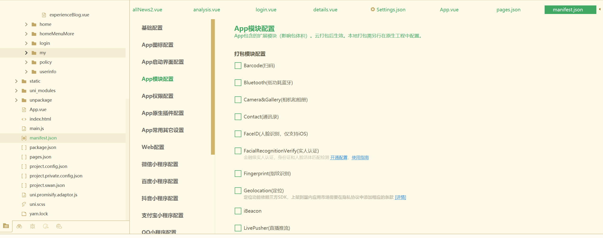
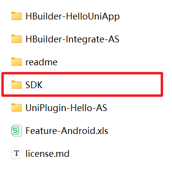
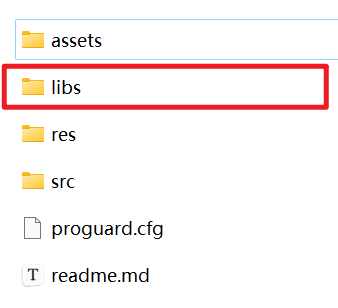
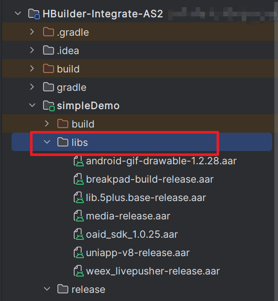
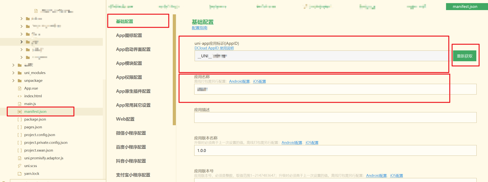

# Uni-App通过AndroidStudio打包成APK步骤

## 相关文献

[Android证书签名生成](https://blog.csdn.net/qq_44693047/article/details/125089245)

[Android证书签名生成2](https://blog.csdn.net/csdn_yuan_/article/details/107728043)

[报错处理-1](https://blog.csdn.net/qq_42257666/article/details/135067230)

[报错处理-2](https://blog.csdn.net/qq_42257666/article/details/130725656)

[uniapp项目打包apk（推荐）](https://blog.csdn.net/zxczero/article/details/126624787)

[uniapp项目打包apk-2](https://blog.csdn.net/weixin_44120523/article/details/129378237)

## 前言

### 本次打包用到的工具：

1. 代码开发工具：HbuilderX
2. APK打包工具：Android Studio
3. 用于APK打包的SDK：Android离线SDK（下载地址：[Android离线SDK](https://nativesupport.dcloud.net.cn/AppDocs/download/android)）
4. 签名证书生成工具：*jdk1.8*（网上说只要装jre就行，但jdk里包含jre，所以直接装jdk吧，jdk装完要配置环境变量，[jdk环境变量](https://so.csdn.net/so/search?q=jdk环境变量&spm=1001.2101.3001.7020)的配置可以看这个：[jdk环境变量配置](https://www.bilibili.com/read/cv14139888)）**【电脑中已有java可忽略此步骤】**
5. Appkey生成网站：Dcloud开发者中心（网址：[开发者中心](https://dev.dcloud.net.cn/#/pages/app/list)）

## 一、本地打包前配置

### 1. 确保应用所有功能开发完毕，能够正常使用

### 2. 在manifest.json中配置内容

2.1.1 在manifest.json - App模块配置 中勾选需要用到的模块（比如需要用到扫码功能，则需要勾选Barcode），如果使用到的模块未勾选，会导致后续在App中使用该功能时发生错误

2.1.2 勾选模块后，打开下载的[Android SDK](https://nativesupport.dcloud.net.cn/AppDocs/download/android.html)，进入 /SDK/libs  文件夹，将需要用到的模块对应的aar文件找到，并将其放置到AndroidStudio项目中的simpleDemo中的libs下。

 

2.2.1 在manifest.json - 基础配置 中，确保uni-app应用标识（AppID）为已填写状态，若为空，点击右侧按钮进行获取；确保应用名称不为空，应用名称为自定义设置。

## 二、本地打包步骤

## 三、下载SDK

## 四、生成本地密钥

## 五、