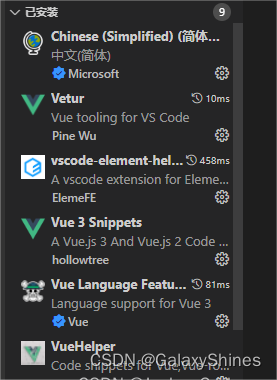

@[TOC](UsingHelper)
# Vue使用基础教程
@[TOC](VUE脚手架创建指南)
# 1.网址清单
[Vue2官网](https://v2.cn.vuejs.org/)
[Vue3官网](https://cn.vuejs.org/guide/introduction.html)
[Vue-Route-v4.x官网](https://router.vuejs.org/zh/)
[Vue-Route-v3.x官网](https://v3.router.vuejs.org/zh/)
[Node.js官网](https://nodejs.org/en/download/current)
[vsCode国内下载镜像(下载后需要在内部更新)](https://vscode.cdn.azure.cn/stable/78a4c91400152c0f27ba4d363eb56d2835f9903a/VSCodeUserSetup-x64-1.43.0.exe)
# 2.操作步骤
## 2-1 前往[Node.js官网地址](https://nodejs.org/en/download/current)下载Node.js
## 2-2 作者使用VsCode环境，下载地址在【1】中
2-2-1 接受协议，下一步
2-2-2 选择路径，下一步
2-2-3 下一步
2-2-4 全部勾选，下一步
2-2-5 安装完成
## 2-3 执行`Win+R`，输入`cmd`后，`Ctrl+Shift+Enter`以管理员身份启动
## 2-4 输入命令下载`yarn`
```
npm install -g yarn
```
## 2-5 执行Win+R，输入powershell后，Ctrl+Shift+Enter以管理员身份启动
## 2-6 输入命令修改权限
```
Set-ExecutionPolicy RemoteSigned
```
弹出询问后输入 Y

__请注意！VScode或Idea需要重启后才能使用npm指令！__
## 2-7 在管理员身份vscode资源管理器中，在想要创建脚手架的文件夹上右键选择“在集成终端中打开”
## 2-8 输入命令npm i -g @vue/cli
## 2-9 创建vue脚手架，执行：vue create 项目名
1. 输入Y
2. 箭头选择Vue2
3. 选择Use yarn
# 3.可选操作
1. 下载vue-router，进入脚手架文件夹中，执行命令`yarn add vue-router`
2. vscode插件配置：


# 4.其他操作
## a.发布
1、在命令行中进入项目根目录，执行以下命令进行打包：
`npm run build`
2、打包完成后，会在项目根目录下生成一个`dist`文件夹，里面包含了打包后的所有文件。

3、将dist文件夹中的所有文件复制到一个新的文件夹中，例如命名为`my-website`。

4、在`my-website`文件夹中创建一个`index.html`文件，并将以下代码复制到文件中：

 ```html
<!DOCTYPE html>
<html lang="en">
  <head>
    <meta charset="utf-8">
    <meta name="viewport" content="width=device-width, initial-scale=1">
    <title>My Website</title>
  </head>
  <body>
    <div id="app"></div>
    <script src="./js/chunk-vendors.js"></script>
    <script src="./js/app.js"></script>
  </body>
</html>
 ```
__注意__：上述代码中的js文件路径需要根据实际情况进行修改。
## b.修改项目使用的端口：
在项目根目录下寻找`vue.config.js`文件，添加如下代码：
```javascript
module.exports = {
  devServer: {
    open: true,
    port: 8081
  }
}
```
> 需要注意的是，其中的8081可以替换成你希望使用的端口号，但需要注意不要与其他的端口产生冲突（例如MySQL使用的是3306端口）